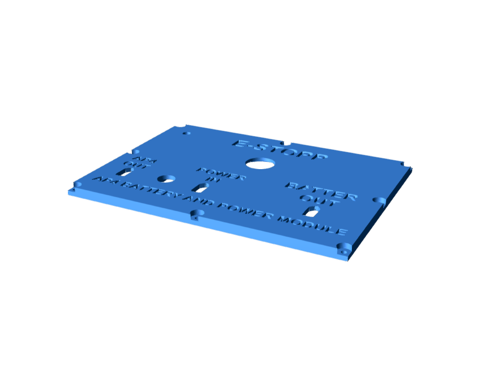
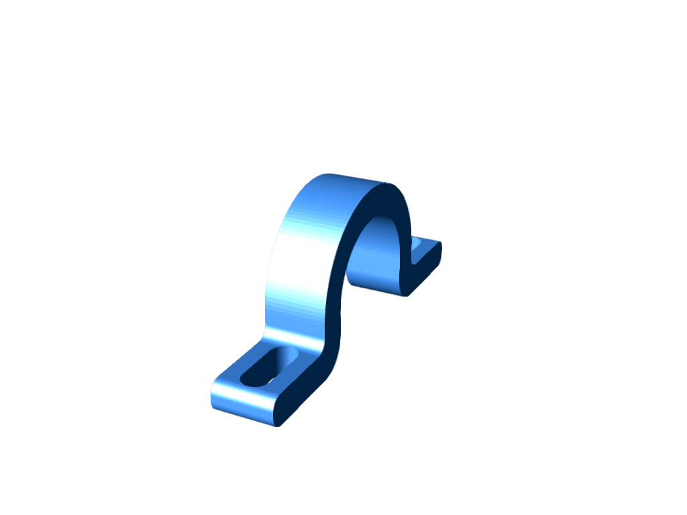

# CAD Appendix

<!---  AUTOMATICALLY GENERATED FILE. DONT EDIT THIS FILE DIRECTLY. EDIT thumbnail.sh INSTEAD --> 

STL files can be opened using any 3D printer slicer software, at Infotiv we use 'Ideamaker'. [Download here](https://www.raise3d.com/ideamaker/). Use a slicer configuration for an 'Raise3d E2' 3d printer. PLA material choice is fine if you don't leave autonomous platform in a hot car during the day. A base slicer profile for the Raise3D E2 can be found in the CAD profile. It is a nice starting point.

./Limitswitch_steering_holder/limittswitch_bottom_holder.stl:

{ width=70% }

./Limitswitch_steering_holder/limitswitch_holder_top.stl:

{ width=70% }

./Limitswitch_steering_holder/sensor_holder.stl:

{ width=70% }

./camera_sensor_mount/camera_holder.stl:

{ width=70% }

./Speed_Sensor_Back/Holder_base.stl:

{ width=70% }

./Speed_Sensor_Back/Sensor_Holder.stl:

{ width=70% }

./Speed_Sensor_Back/Holder_ajustable.stl:

{ width=70% }

./Battery_BOX/x60_clamp.stl:

{ width=70% }

./Battery_BOX/Holder.stl:

{ width=70% }

./Battery_BOX/Top.stl:

{ width=70% }

./Battery_BOX/Battery_charger_holder.stl:

{ width=70% }

./Battery_BOX/din_rail_psu_holder.stl:

{ width=70% }

./Node_Box/Termination_Resistor_Bottom.stl:

{ width=70% }

./Node_Box/cable_out_clamp.stl:

{ width=70% }

./Node_Box/ecu_nametag.stl:

{ width=70% }

./Node_Box/xt60_clampdown.stl:

{ width=70% }

./Node_Box/HW_Node_Bottom_Box.stl:

{ width=70% }

./Node_Box/Termination_Resistor_Bottom_Top.stl:

{ width=70% }

./Node_Box/HW_Node_Top_Cover.stl:

{ width=70% }

./Node_Box/STM32_bluepill_holddown.stl:

{ width=70% }

./Cable_Management/small_spiral_sleve_holder.stl:

{ width=70% }

./Cable_Management/Cable_management_v2.stl:

{ width=70% }

./Cable_Management/big_spiral_holder_1.stl:

{ width=70% }

./Cable_Management/files/Cable_management2.0_2.stl:

{ width=70% }

./Cable_Management/files/Cable_management2.0.stl:

{ width=70% }

./Cable_Management/files/Cable_management2.0-4.stl:

{ width=70% }

./Cable_Management/files/Cable_management2.0-4.2.stl:

{ width=70% }

./Cable_Management/files/Cable_management2.0-3.stl:

{ width=70% }

./laptop_holder/laptop_left_holder.stl:

{ width=70% }

./laptop_holder/laptop_holder_hole_board.stl:

{ width=70% }

./laptop_holder/laptop_right_holder.stl:

{ width=70% }

./Steering_Node_Box/sabertooth_holder.stl:

{ width=70% }

./Steering_Node_Box/limittswitch_bottom_holder.stl:

{ width=70% }

./Steering_Node_Box/limitswitch_holder_top.stl:

{ width=70% }

./wifi_router_holder/xt60_holder.stl:

{ width=70% }

./wifi_router_holder/left_holder.stl:

{ width=70% }

./wifi_router_holder/right_holder.stl:

{ width=70% }

./Speed_sensor_holder/hole_wheel_speed_sensor.stl:

{ width=70% }

./Speed_sensor_holder/front_holder.stl:

{ width=70% }

./Speed_sensor_holder/front_sensor_holder_lmitswitch.stl:

{ width=70% }

./Speed_sensor_holder/front_speed_sensor_disc.stl:

{ width=70% }

./front_win_grid/front_wing_grid.stl:

{ width=70% }

./USB_Hub_clampdown/power_connection_holddown.stl:

{ width=70% }

./USB_Hub_clampdown/hub_clampdown_bottom.stl:

{ width=70% }

./USB_Hub_clampdown/hub_clampdown_power.stl:

{ width=70% }

./USB_Hub_clampdown/hub_clampdown_top.stl:

{ width=70% }

./Back_plate_holder/holder_under.stl:

{ width=70% }

./Back_plate_holder/holder_top.stl:

{ width=70% }

./portable_screen_holder/Screen_holder.stl:

{ width=70% }

./Arduino_Mega_holder/bottom_nut_holder.stl:

{ width=70% }

./Arduino_Mega_holder/adapter.stl:

{ width=70% }

./Mounting_Plate/plate_holder.stl:

{ width=70% }
