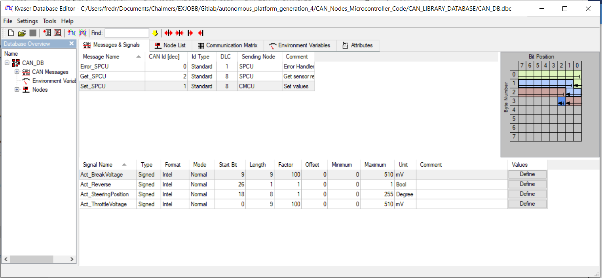

### Controller Area Network Database

The way of working with CAN database for AP Gen 4 is illustrated below. Using a database in dbc format being parsed through the script from howerj repo (see below), that is producing a csv file and cpp file with functions to use to encode and decode messages. Thereafter it is included to all control units that is communicating over the CAN buss system.


### dbc editor

There are several different softwares that can be used. One example is https://kvaser-database-editor.software.informer.com/2.4/, which is free to download. It is very intuitive to use and build up dbc files, a example can be seen below. Where the frames and signals is defined for the Steering, Propulsion control unit (SPCU). To the right the bit's position in the messages is illustrated, however one important note is that the editor don't check if some signals overwrite each other!



Below is an detailed description of the commands used.

### How to use DBC to C library

The dbc to c (dbcc) repository is added as a submodule.

If the dbc_to_c folder does not show up as a directory, init and update repository submodules with

```bash
git submodule init
git submodule update
```

Link to repository for documentation: https://github.com/howerj/dbcc

Make sure the library is built using 'make'
move into the c_to_dbc directory and write

```bash
make
```

If 'make' does not work, try running the following two commands first to make sure that it is installed.

```bash
sudo apt update && sudo apt upgrade -y
sudo apt install -y make
```

The command 'make' also requires the GNU C compiler (gcc) to be installed. Run the following command to install the compiler/to confirm that it is installed.

```bash
sudo apt install gcc
```

If make has run properly, a new file called dbcc, should then appear inside the dbc_to_c folder.

Lastly, simply exit the dbc_to_c folder and run the .sh file as following:

```bash
./create_database_from_dbc_script.sh
```

For additional debugging:

- Parse ex1.dbc to a .c and .h file to a directory called output_dir:

```bash
./dbcc -v -o output_dir ex1.dbc
```

In output_dir two new files should appear, ex1.c and ex1.h

- Parse ex1.dbc to csv file to a directory called output_dir:

```bash
./dbcc -C -v -o output_dir ex1.dbc
```

A ex1.csv file should appear in the output_dir
