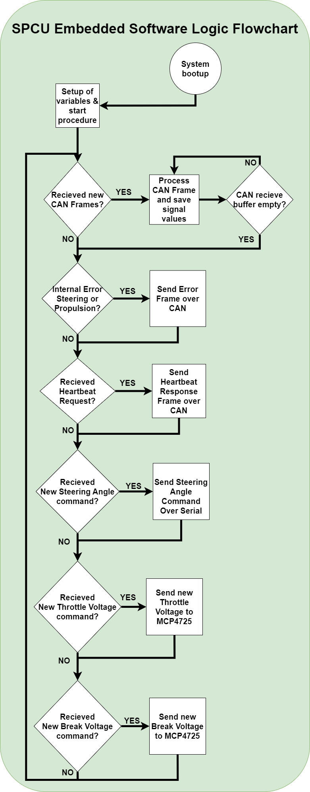

## Steering Propulsion Control Unit (SPCU) 

The implemented SPCU follows the structure and base mentioned in previous chapters. In the figure below is the circuit and schematic of the components used. Each module has a designated sw library located at: */Shared_HW_Node_Libraries*. Below is a table of specific added modules for SPCU.

|        **Component**         |                                          **Purpose**                                          |         **Documentation Repo Paths**         |
| :--------------------------: | :-------------------------------------------------------------------------------------------: | :------------------------------------------: |
|           MCP4725            | Translates PWN voltage signals to Analog. In order to simulate the pedal voltages (0.8-4.3 V) | `*\Documentation\Segway_Propulsion\Manuals*` |
|    Sabertooth Kangaroo x2    |  Serial communication to send motor commands. SI interface and utilizes the limit switches.   |  `*\Documentation\Steering_Motor\manuals*`   |
| Sabertooth dual motor driver |  Motor driver to control the DC motor used for steering, feedback with the built in encoder.  |  `*\Documentation\Steering_Motor\manuals*`   |

Above is a rendered illustration of the SPCU, with its corresponding modules used for steering and propulsion. Down is a flowchart of the software used for the SPCU. The median run-time of the main-loop is 3 ms. Thus passing the requirement of 20ms for real-time systems.

