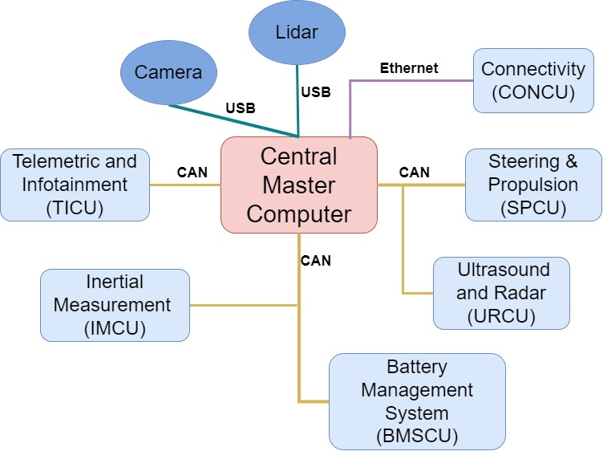
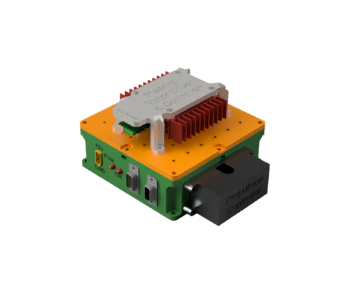
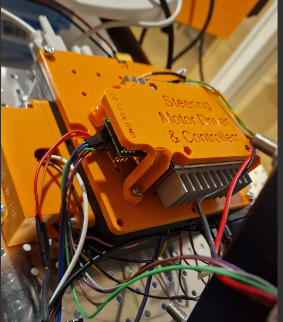
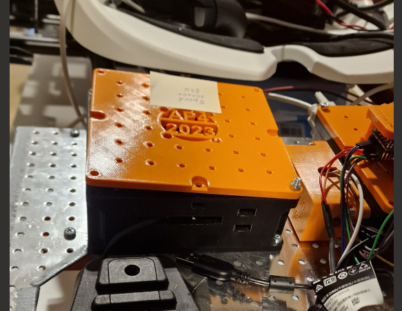
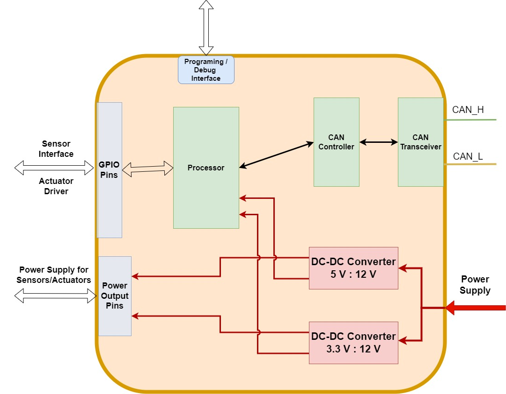
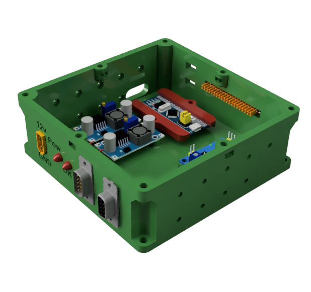
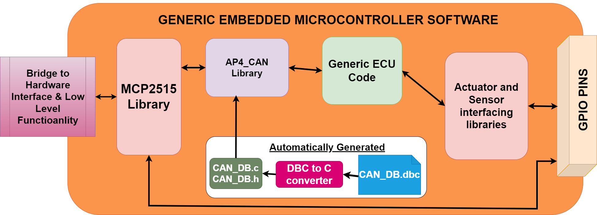
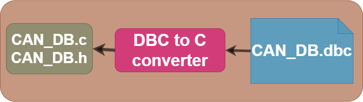
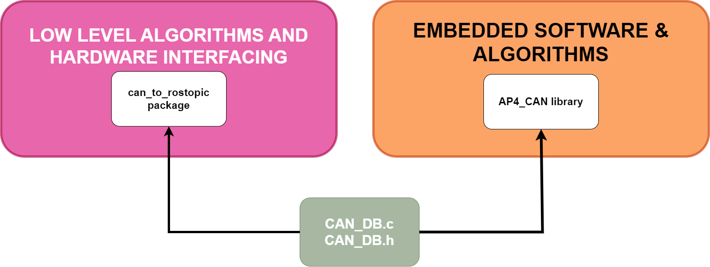

# Embedded Software and Hardware (CAN nodes)

## Introduction

This document aims to describe how the embedded software layer is built in software and hardware, what purpose embedded software serves, highlight the design principles and how to extend functionality.

Keep in mind, this directory contains the software for several different ECUs mounted to autonomous platform generation 4.

### Prerequisites 

These are useful topics, skills and softwares to have some understanding of in order to work with the embedded software, hardware and CAN database

Recommended softwares to have installed:

- PlatformIO VSCode extension + ST-Link v3 Windows drivers
- KVASER CAN database editor
- Fusion360 (If you have to MODIFY existing CAD files)

Versions used when developing AP4 spring 2023:

- Visual Studio Code, version: 1.79.0 (user setup)
- Platform IO: version core: 6.1.7
- Kvaser Database Editor: version 2.4, [link to download](https://kvaser-database-editor.software.informer.com/2.4/)

### Introduction 

This directory contains several software components that is run in an embedded environment on ECUs mounted to the autonomous platform. There can be many different ECUs running at the same performing different tasks. All the code is contained in this directory in separate sub directories. This directory also contain the unified CAN database files which describes how data and information is sent between the different ECUs and the Hardware Interface Low Level software running on the Raspberry Pi 4b.

ECU functionality can be split up in several ways, for example by functionality. Software related to controlling the autonomous platform can be implemented on one ECU. Then on another ECU software for measuring speed can be run. It can also be split up by when certain functionality was added, instead of adding functionality to an existing ECU it can be easier, software wise, to create a new ECU with new software.

The new generation of Autonomous Platform is designed with the centralized Electrical / Electronic (E/E) architecture in mind.

`HOW_TO_EXTEND.md`: The process of constructing a new generic ECU base from scratch

`HOW_TO_PROGRAM_A_BLUEPILL.md` : The flashing procedure (Upload New Software Into ECU)

### Centralized E/E Architecture Principles

The E/E Architecture of autonomous platform generation 4, developed during a thesis spring 2023 by Erik Magnusson and Fredrik Juthe. Currently (june 2023) only central master computer, CONCU and SPCU are implemented.

A proposed system architecture can be seen below, where the "Central Master Computer" is consists of the Raspberry Pi 4b and development laptop. Every light blue rounded box would then be a separate ECU split by functionality. The specific ECU nodes are not set in stone and was more of a suggestion long term goal for future work during the spring 2023 thesis. What different ECUs are actually implemented are described further down below.

[Paper on approaches to centralized hardware can be found here.](https://semiengineering.com/technical-and-structural-approaches-to-centralize-automotive-e-e-architectures/). The main points to keep in mind when developing software and hardware for a centralized E/E architecture are:

- No Heavy computations inside ECUs
  - Only serve as an INTERFACE with hardware
  - Minimal number of computations and instructions in each ECU to keep the run-time-cycle short and enable real-time capabilities
  - Main loop should not exceed 20ms in runtime
  - Read actuator commands from central master computer and actuate actuators
  - Read sensor data from hardware and send back to central master computer
  - Heavy computations are done in Central master computer and its High level algorithms
- Communication between ECUs and Hardware Interface and Low Level Software shall be done through CAN bus protocol
  - Due its robustness
  - Scalable
  - Standards, possible to use 3rd party softwares and tools to analyze behavior

### Embedded ECUs

This section describes the embedded ECUs present on autonomous platform generation and what function they serve. As of august 2023 there are two ECUs implemented.

### HW_Node_SPCU : Steering and Propulsion Control Unit

Developed by Fredrik Juthe and Erik Magnusson spring 2023.

This ECU is responsible for actuating the propulsion and steering of autonomous platform generation 4. It also sends measurement of the current stearing angle back to the hardware interface low level software.

The code is located in `HW_Node_SPCU` folder.

Specific CAD and stl files for front and back speed sensors are located in `autonomous_platform\CAD\Speed_sensor_holder`.

More about this ECU, development processes and documentation can be found in `Propulsion_Steering.md`, `Shared_HW_Node_Libraries/SteeringMotorInterface/documentation_and_research/README.md` and
`Shared_HW_Node_Libraries/PropulsionInterface/documentation_and_research/README.md` markdown file located in this directory.

#### Additional Components

Compared to a generic ECU on autonomous platform, the SPCU ECU has some extra components:

- Kangaroo x2 Controller + Sabertooth 2x50 DC motor driver
- MCP4725 DAC converter

The kangaroo x2 controller board is connected to the sabertooth 2x50A DC motor driver. It is a closed loop controller for the steering wheel motor. The kangaroo card can be controlled through a serial connection from the ECU. The current steering angle can be read from the kangaroo card. A custom library was created in order to control the steering angle.

To control the propulsion of autonomous platform generation 4, it was decided to send out analog voltages to the gokart pedals to spoof the pedals being pressed. (Throttle + Break). This is done by wiring a Digital to Analog Converter (DAC) to each pedal in parallel. The gokart has an internal controller black box mounted in the front nose, this will interpret the pedal presses and actuate the electric motor driving the platform forward. A brake pedal press will always override a accelerator pedal press due to how the black box works. This is a useful feature, when an operator is sitting on the gokart he or she can always stop the platform by applying the brakes.

### HW_Node_SSCU : Speed Sensor Control Unit

Developed by Seamus Taylor and Alexander Rydeval summer 2023.

This ECU is responsible for relaying the current velocity of the autonomous platform to the hardware interface and low level software. One speed sensor was mounted to the front right wheel on the hardware platform and it was showed that the velocity could be read from one wheel by measuring how fast the wheel turned.

There exists CAD files for the remaining three speed sensors (one for every wheel).

The code is located in `HW_Node_SSCU` folder.

Specific CAD and stl files for front and back speed sensors are located in `autonomous_platform\CAD\Speed_sensor_holder`.

More about this ECU can be found in `Speed_Sensor.md` markdown file located in this directory.

#### Additional Components

Compared to a generic ECU on autonomous platform, this ECU has some extra components:

- MCP4725 - Speed Sensor

### Generic ECU Hardware and Software

The first version of the generic ECU was developed by Fredrik Juthe and Erik Magnusson spring 2023.

Every ECU present on autonomous platform generation 4 shall be based on the same base hardware and software. Onto this base features specific to the function of a ECU can be added. By having a standardized base ECU it will be easier to understand how previous functionality was added, and it will be easier to add future functionality as much information can be transferred from previous ECUs.

A problem on autonomous platform generation __3__ was that is was unclear how previous functionality was implemented. There were more than three types of microcontroller used on the platform and every solution was custom made. As the people who implemented this left the project it was very unintuitive for new project members to understand how functionality was implemented. Many functions were hardcoded on unknown hardware.

As an improvement to this, on autonomous platform generation 4 the idea was therefore to standardize how embedded hardware and software implemented. If one chooses a suitable microcontroller with a lot of performance overhead, in theory any embedded sensor or actuator could be connected to it. The hardware for each embedded system could therefore use the same microcontroller. And to simplify things further, the most used components could be constructed as a finished hardware package. The software and connection for a specific function could be configured.

That was how autonomous platform generation 4 ended up with a **generic ECU base**. A hardware template on which to connect any sensor or actuator to a powerful microcontroller. Any future ECU should follow this standard of implementing functionality on top of a ECU base.

## Generic ECU Template

The generic ECU has predefined set of hardware. It was designed with future proofing in mind so that it could be used for future work as well.

A high level schematic of the components present in the generic ECU base can be seen below. For any new embedded functionality (Input or output), these components would be needed. Therefore it might as well be assembled into a module.

A rendered illustration of the ECU can be seen below. The top cover is not illustrated.

### Key Components of Generic ECU

- __Microcontroller__ :
  The microcontroller was Chosen to be STM32F103C8T6, often referred to as an STM32 bluepill. It has plenty of I/O, a fast processor and there exists very much documentation and resources for this microcontroller.
  The official documentation can be found for the STM32F103C8T6, can be found [here](https://stm32-base.org/boards/STM32F103C8T6-Blue-Pill.html).

- __CAN Reciever and Controller__:
  The ECU needs to be connected to the Hardware Interface and Low Level Software through a CAN bus, therefore the generic ECU needs a CAN bus interface. The MCP2515 / TJA1050 board was choosen as it combines a CAN controller and a CAN tranciever on a single PCB. There exists many arduino libraries for this.
  The datasheet for MCP2515 / TJA1050 can be found [here](https://www.electrokit.com/uploads/productfile/41017/MCP2515-Data-Sheet.pdf) and [here](https://www.electrokit.com/uploads/productfile/41017/TJA1050-Data-Sheet.pdf).

- __DC-DC Converters__ :
  The components inside the generic ECU needs to be powered using 3.3v and 5v. And any additional sensor or actuator may need to be powered as well. Therefore, the generic ECU base has two DC-DC voltage step down converters. The LM2596 DC-DC converter was deemed suitable. It can output a maximum of 3 A of current which is well above what any embedded sensor would use.
  Datasheet for the LM2596 dc-dc converter can be found [here](http://tpelectronic.ir/datasheets/20150123144301750.pdf).

- __Inputs and Outputs__:
  The generic ECU node has a predefined set of Input and Outputs. This allows the connection between various ECUs and the Raspberry Pi 4b hardware interface and low level software to be standardized. The CAN communication on AP4 uses a D-Sub 9 pin connector. The generic ECUs can be chained together with D-Sub 9 pin cables to create a CAN bus network. In the same way the power distribution of autonomous platform generation 4 can be standardized, power is supplied to the generic ECU through an XT60 connector. This one can also be chained between nodes, providing 12v input to each generic ECU.

|          **Component**          |                                                    **Purpose**                                                     |                                                                                    **Documentation**                                                                                     |
| :-----------------------------: | :----------------------------------------------------------------------------------------------------------------: | :--------------------------------------------------------------------------------------------------------------------------------------------------------------------------------------: |
|    STM32-F103C8T6 "Bluepill"    |                                        Programable processor and GPIO pins                                         |                                         [Datasheet](https://www.alldatasheet.com/datasheet-pdf/pdf/201596/STMICROELECTRONICS/STM32F103C8T6.html)                                         |
|         Logic converter         | To step down voltage to SMT32-F103C8T6 logic levels (3.3 V). Important at the CAN module interfacing with bluepill |                              [Bought at](https://www.elfa.se/sv/dubbelriktad-omvandlare-av-logisk-spaenningsniva-sparkfun-electronics-bob-12009/p/30145425)                              |
|         DC-DC converter         |                                 LM2596, possible to manually change voltage levels                                 |                                                              [Datasheet](https://www.onsemi.com/pdf/datasheet/lm2596-d.pdf)                                                              |
| CAN controller and Transeciever |                        MCP2515, to interface with CAN network, decode and encodes messages                         |                                 [Datasheet](https://ww1.microchip.com/downloads/en/DeviceDoc/MCP2515-Stand-Alone-CAN-Controller-with-SPI-20001801J.pdf)                                  |
|             PC Fan              |                                       Fan to cool each component in the ECU                                        | [Bought at](https://www.elfa.se/sv/axialflaekt-dc-40x40x10mm-12v-13-9m-sunon-ee40101s1-1000u-999/p/30129654?trackQuery=axialfl%c3%a4kt+DC+40&pos=7&origPos=7&origPageSize=50&track=true) |
|            DB9 Male             |                                          Outlet for CAN bus communication                                          |                                                                                                                                                                                          |
|            XT60 Male            |                                              Outlet for power supply                                               |                                                                                                                                                                                          |

### Software Template and Setup

In the same way as the hardware as been standardized, work has been done to standardize the software development and deployment on autonomous generation 4 embedded hardware.

The idea is that basic software needed for every generic ECU base should already be implemented and setup. A developer should not have to start from scratch and rewrite the basic interfaces has already been used on other generic ECU nodes.

An illustration of what software components are needed for every generic ECU can be seen above.

When developing a new ECU with new functionality, the developer only has to think about the green and purple code blocks, the main loop code and what libraries to add.

Therefore, a template ECU code directory has been created, `HW_NODE_CODE_TEMPLATE`, this is a PlatformIO project that have been configured with the correct path variables to find the custom CAN library or any other custom made library. Microcontroller and other configuration variables have been set in the `platformio.ini` file. To create software for any new future ECU one simply has to make a copy of this directory to get a basic software running on the ECU node.

Just as the Arduino IDE, PlatformIO has a library for almost any sensor or actuator. You can search the project library [here](<>). To include an existing library into a PlatformIO project one simply has to include it under __lip deps__ tag in the platformio.ini file.

### Bill of Material for Generic ECU

The complete bill of materials for a generic ECU base can be found below.

|           Component Name           |                                    Function                                     | Quantity |                                                 Datasheet/ Manual                                                  |                                                                                                                 Product Buy Link                                                                                                                 | Estimated price (SEK) |
| :--------------------------------: | :-----------------------------------------------------------------------------: | :------: | :----------------------------------------------------------------------------------------------------------------: | :----------------------------------------------------------------------------------------------------------------------------------------------------------------------------------------------------------------------------------------------: | :-------------------: |
|      STM32F103C8T6 "Bluepill"      |                       Microcontroller - Runs embedded SW                        |    1     |                         [Link](https://stm32-base.org/boards/STM32F103C8T6-Blue-Pill.html)                         | [Link](https://www.amazon.se/AZDelivery-mikrokontroller-STM32F103C8T6-utvecklingskortmodul-M3-processor/dp/B07TSKNWQQ/ref=sr_1_2?crid=1VXZR6SWKM2IQ&keywords=stm32%2Bblue%2Bpill&qid=1683275190&sprefix=stm32%2Bbluepill%2Caps%2C89&sr=8-2&th=1) |          100          |
|              MCP2515               |                          CAN controller / transceiver                           |    1     | [Link](https://ww1.microchip.com/downloads/en/DeviceDoc/MCP2515-Stand-Alone-CAN-Controller-with-SPI-20001801J.pdf) |                     [Link](https://www.amazon.se/ZkeeShop-CAN-bussmodul-mottagare-kompatibel-utvecklingskort/dp/B07SYH9BXS/ref=sr_1_7?crid=21S3Z2NTHVYQX&keywords=mcp2515&qid=1683275295&sprefix=mcp2515%2Caps%2C299&sr=8-7)                     |          50           |
|       Logic Level Converter        | Converts MCP2515 5V signals to 3V which makes it compatible with STM32 Bluepill |    1     |                       [Link](https://www.elfa.se/Web/Downloads/_t/ds/BOB-12009_eng_tds.pdf)                        |                                                            [Link](https://www.elfa.se/sv/dubbelriktad-omvandlare-av-logisk-spaenningsniva-sparkfun-electronics-bob-12009/p/30145425)                                                             |          40           |
|              LM2596S               |                            Converts 12V to 5 & 3.3V                             |    2     |                             [Link](https://www.makershop.de/download/um_lm2596_d.pdf)                              |                                                                       [Link](https://www.amazon.se/gp/product/B07DP3JX2X/ref=ppx_yo_dt_b_asin_title_o00_s00?ie=UTF8&psc=1)                                                                       |          50           |
|         DB9 Breakout Board         |          Exposes individual pins on DB9 Connector to Connect wires to           |    2     |                                                        ---                                                         |               [Link](https://www.amazon.se/SIENOC-RS232-D-SUB-terminalkontakt-signalmodul/dp/B01M8JRDN0/ref=sr_1_29?keywords=DB9+Breakout+Board+DB9+RS232+Serial+Male+to+Terminal+Block+10P+Adapter+5+Pack&qid=1683275078&sr=8-29)               |          130          |
|        40x40x10 mm 12V Fan         |                    Cool Down Internal Components in ECU base                    |    1     |                                                        ---                                                         |                               [Link](https://www.elfa.se/sv/axialflaekt-dc-40x40x10mm-12v-13-9m-sunon-ee40101s1-1000u-999/p/30129654?trackQuery=axialfl%c3%a4kt+DC+40&pos=7&origPos=7&origPageSize=50&track=true)                                |          52           |
| Breadboard Jumper Wires Pack of 10 |                         Wire Internal Components of ECU                         |    2     |                                                        ---                                                         |                   [Link](https://www.elfa.se/en/jumper-wire-female-to-female-pack-of-10-pieces-150-mm-multicoloured-rnd-components-rnd-255-00011/p/30115109?trackQuery=jumper+wire&pos=1&origPos=2&origPageSize=50&track=true)                   |          20           |
|      Biltema Mini Fuse Holder      |                            Internal ECU Fuse holder                             |    1     |                                                        ---                                                         |                                                                            [Link](https://www.biltema.se/bil---mc/elsystem/sakringar/sakringshallare-mini-2000016466)                                                                            |          33           |
|            Mini Fuse 3A            |                                       ---                                       |    1     |                                                        ---                                                         |                                                                   [Link](https://www.biltema.se/bil---mc/elsystem/flatstiftssakringar/flatstiftssakring-mini-10-st-2000016468)                                                                   |          25           |
|        XT60 Connector Male         |                         Connect to AP4 12V Power System                         |    1     |                                                        ---                                                         |                                                                            [Link](https://www.conrad.se/p/reely-1399717-batterikontakt-xt60-foergylld-20-st-1399717)                                                                             |          21           |
|     (Optional) XT60 Y Splitter     |                  Splits one XT60 Connecting in Y configuration                  |    1     |                                                        ---                                                         |                                                                         [Link](https://www.conrad.se/p/adapterkontakt-2x-xt60-1x-xt60-parallellt-ansluten-reely-1373227)                                                                         |          70           |
|             Green LED              |                   @Future work Indicate System Status of ECU                    |    1     |                                                        ---                                                         |                                            [Link](https://www.elfa.se/sv/led-565nm-groen-mm-kingbright-7113lgd/p/17510192?trackQuery=cat-DNAV_PL_020103&pos=37&origPos=37&origPageSize=50&track=true)                                            |           2           |
|              Red LED               |                    @Future work Indicate Power Status of ECU                    |    1     |                                                        ---                                                         |                                            [Link](https://www.elfa.se/sv/led-627nm-roed-mm-kingbright-7113lid/p/17501464?trackQuery=cat-DNAV_PL_020103&pos=35&origPos=35&origPageSize=50&track=true)                                             |           2           |
|           M3x10mm Screw            |                         Screw Down Internal Components                          |    16    |                                                        ---                                                         |                                                  [Link](https://www.elfa.se/sv/skruv-uttagskapa-sexkant-mm-m3-10mm-paket-med-100-delar-bossard-bn-610-m3x10mm/p/30071964?queryFromSuggest=true)                                                  |          ---          |
|            M3x10mm Nut             |                         Screw Down Internal Components                          |    14    |                                                        ---                                                         |                 [Link](https://www.elfa.se/sv/hex-nut-m3-m3-4mm-foerzinkat-stal-bossard-m6m-m3/p/14800070?trackQuery=cat-DNAV_PL_170102&pos=5&origPos=17&origPageSize=50&filterapplied=filter_G%c3%a4ngstorlek%3dM3&track=true)                  |          --           |

### Interfacing with Hardware Interface and Low Level Software

The embedded software can interface with the hardware interface and low level software. Physically, this is done through a CAN bus network (D-Sub 9 connector between nodes). Software wise, a custom encoding and decoding CAN library has been implemented in C language. Onto this custom library, two software libraries have been created for autonomous platform generation 4.

The data sent over the CAN bus needs to be available on ROS2 topics in order for ROS2 nodes to be able to use the data in computations in the hardware interface and low level software. In the same way, actuator commands sent from ROS2 nodes on ROS2 topics need to be sent to the ECUs over CAN.

The CAN frames sent over the CAN network must be encoded and decoded correctly and in the same way on both the hardware interface and embedded ECUs. Therefore a unified CAN database file has been constructed for autonomous platform generation 4. A helper library is used to convert the CAN database file into a set of C-style data structs.

Two custom made libraries have then been implemented, one in the embedded software and one in ROS2 in hardware interface and low level software.

How to extend this functionality with new CAN frames and signals is explained in detail in `Hardware_Interface_Low_Level_Computer\HOW_TO_EXTEND.md`. (The parts that are relevant to change in hardware interface and low level software is documented here). How to extended the software for the embedded ECUs is described in `CAN_Nodes_Microcontroller_Code\HOW_TO_EXTEND.md`.

### Unified CAN Database

A unified CAN database has been created for autonomous platform generation 4. It uses the standardized .dbc file format and can be read/written to using commonly available softwares. I.e [Kvaser DBC editor](https://kvaser-database-editor.software.informer.com/2.4/).

The CAN library database file is located in `\CAN_Nodes_Microcontroller_Code\CAN_LIBRARY_DATABASE\CAN_DB.dbc`.

Every CAN bus frame and signal present on autonomous platform is defined in this file. This means when adding a new signal to the platform, it only has to be defined in one single file.

With an external library (added as a git submodule to this repository) standardized C code can be automatically generated. A simplified interface to encode and decode CAN frames and signals is created. The library used can be found [here](https://github.com/howerj/dbcc). How to use it is described in `\CAN_Nodes_Microcontroller_Code\CAN_LIBRARY_DATABASE\README.md`

This CAN_DB.dbc (and autogenerated code from this file) can then be linked to various software components on autonomous platform generation 4. This is illustrated below.

