## Propulsion Control of Ninebot

```bash
  Segway_Propulsion
 ┣  Images
    Pictures of results/used for documentation
 ┣  Manuals
    User Manuals for all hardware mentioned/used
 ┣  Test_Rig
    Arduino code for reading pedals
    Arduino code for running the test rig set up    
```

### Analysis on Ninebot Gokart kit

In order to develop an appropriate propulsion method for the next generation, it was needed to analyse the gokart kit and understand how it works. The pedals are connected to the kit-cricuit and sends analog readings to it. Then the kit-circuit convert these pure voltage reading and sents it through a 2 wires that makes up the serial communication between the kit and segway hoverboard.

The hall sensor under the pedals. It is connected through \[GND,V_in,V_out\].

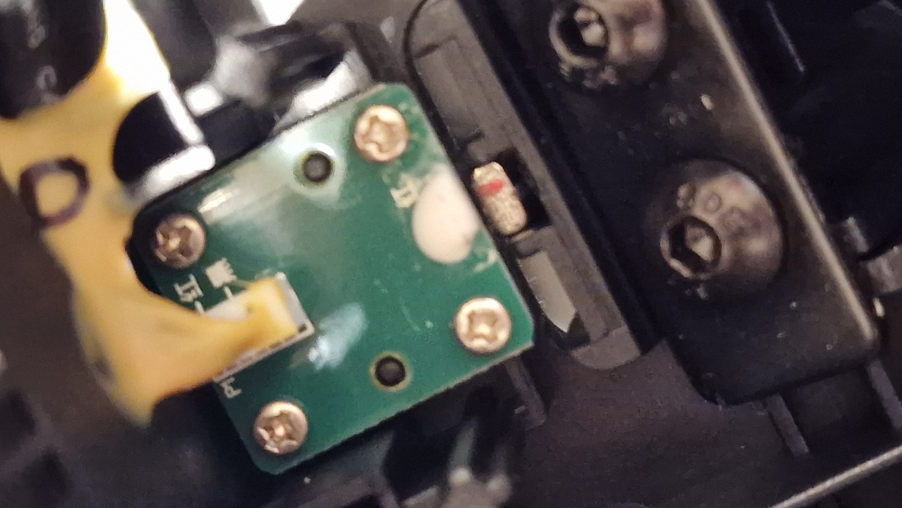

| Accelerate Pedal              | Brake Pedal                        |
| ----------------------------- | ---------------------------------- |
| GND (black)                   | GND (black)                        |
| V_in (red)                    | V_in (red)                         |
| V_out (white) \[0.82-4.35\] V | V_out (brown)      \[0.84-4.33\] V |

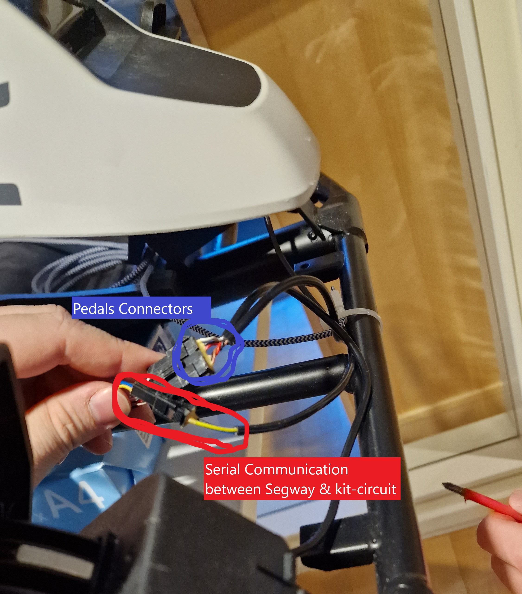

From these cables we managed to hotwire in order to read the pedals sensor readings through using a arduino nan  (Arduino code can be found in *\\Segway_Propulsion\\Test_Rig\\ReadBrakePedals*) and according to the setup illustrated below:

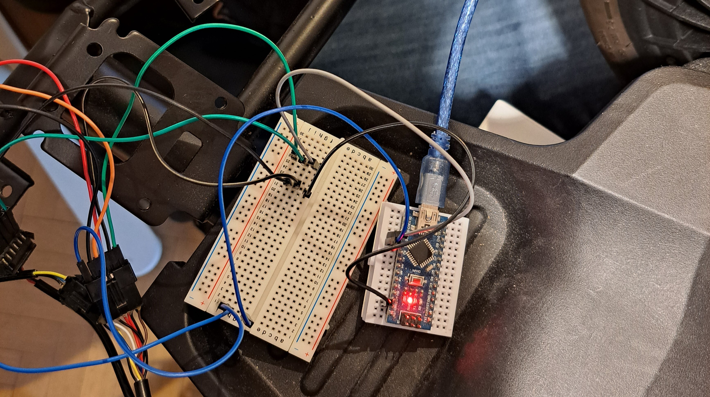

Even tough a bit blurry but it can be seen how the sensor readings look like. Where the blue line correspond to the accelerator and red to the brake pedal.

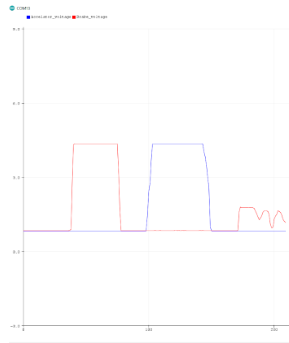

### Additional Finds

- If the kit circuit starts to beep and blinks yellow, replace the batteries inside the gokart kit
- If for some reason, nothing in the kit seems to work and the kit beeps and blinks most likely it is because the ground between the gokart kit and segway has lost connection
- If everything seems to be correct put together and is not related to anything mentioned above, it is probably a connector in the gokart kit circuit that is loose. See picture below

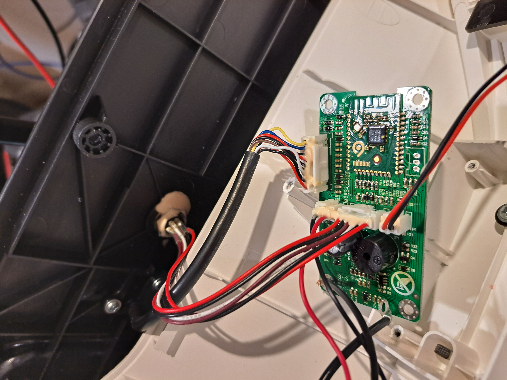

### How to use on the next Generation Platform

From previous analysis on Generation 3 Platform, they simple bypassed the pedals by wiring in a circuit in parallel with the pedals. Thereby having the functionality still left in the pedals. This is a solution that seems to work good enough, however a couple of things could be improved such as more intuitive program and also implementing a reverse function.

Another approach could be to use the serial communication to read and send signals on the bus. This method was found to be poorly approach because when we analyzed the communication (see specific folder) it was concluded that without a protocol it would simple just take to much time to decode the data sent.

Hamid: Future work: Decode the protocol and read the speed data from there instead of separate speedsensor.

### Proof Of Concept

It was assumed that we just could reverse the pins from the setup whilst reading the pedals (see section Analysis on Ninebot). However since arduinos analog outputs are simplified thourgh PWM signals, the gokart circuit started to complain about the input signals.

In order to debug the problem and verify that it was the PWM signals that caused the error, a *National Instrument Controller* that can output pure analog signals. Then it was verified that the issue was because of the arduinos PWM approximation and the gokart could move and pedals still worked along the instrument, [Demo Video](https://drive.google.com/file/d/1D2tYhCP_eQu2Ao0KFW6zust-HcUzTzyf/view?usp=sharing). It also proofs the concept of using analog signals to control the propulsion and maintaining the pedals function.

Then by using a Digital-To-Analog converter (DAC) it would be possible to accurately control the propulsion through any type of micro-controller.

### Test Rig To Verify Functionality

In order to simply test the functionality of the propulsion control a simple local test rig was set up.

### Set Up and Hardware

| Component          | SW Library                                   | Manual Path                                 |
| ------------------ | -------------------------------------------- | ------------------------------------------- |
| mcp4725-12-bit-dac | https://github.com/adafruit/Adafruit_MCP4725 | `~\Documentation\Segway_Propulsion\Manuals` |

|                                                         |
| :-----------------------------------------------------: |
| 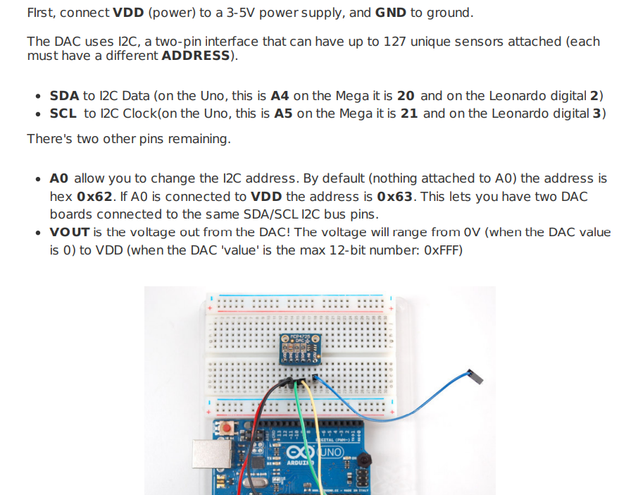 |
|               Fig: From manual on MCP4725               |

DAC also has the capability to easily add one more board in parallel, so a total of 2 boards can be used on the same IC^2 bus. The additional MCP4725 library also needs the Adafruit busIO, the later one manage the bus communication easily and userfriendly. So the only neccesary pseudo code in order to operate the MCP4725 DAC becomes:

```c
#include <Wire.h>
#include <Adafruit_MCP4725.h>
Adafruit_MCP4725 dac1; // instance of the class Adafruit_MCP4725 for one board
Adafruit_MCP4725 dac2; // instance of the class Adafruit_MCP4725 for second board
void setup() {
  Serial.begin(9600);
  dac1.begin(0x62); // communication addres for dac1, using same I2C bus!
  dac2.begin(0x63); // communication addres for dac2, using same I2C bus!
}
void loop() {
   dac1.setVoltage(some_value, false); // sets the reference voltage on dac1
   dac2.setVoltage(some_value, false); // sets the reference voltage on dac2
}
```

Operating voltage is 2.7-5.5 V which is determined by the supply voltage V_DD. Since the DAC's reference value is set by 12 bits, resulting in a resolution on 4096 relative gnd and V_DD. The relationship can be described accordingly:

$$ V\_{out} = { V\_{DD} \\cdot D\_{ref} \\over 4096 } $$

Where $D\_{ref}$ is a value from 0 up to 4096. The equation then can be rewritten, to make the code more intuitive and user-friendly and the pass by value to use in *DAC.setVoltage* function will then be:

$$ D\_{set} =  V\_{set}   \\frac{4096}{V\_{DD}} = V\_{set} D\_{dac-scaling}$$

Other components was a available Arduino Mega and a oscilloscope to measure the signals. The setup consist of 2 different rigs.

1. **DAC rig**, measuring the DAC output voltage using the oscilloscope.
1. **Ninebot rig**, using the DAC boards in parallell to the Ninebot pedals.

|              **DAC Rig**  Wiring              |                   **Ninebot** Wiring                    |
| :-------------------------------------------: | :-----------------------------------------------------: |
| 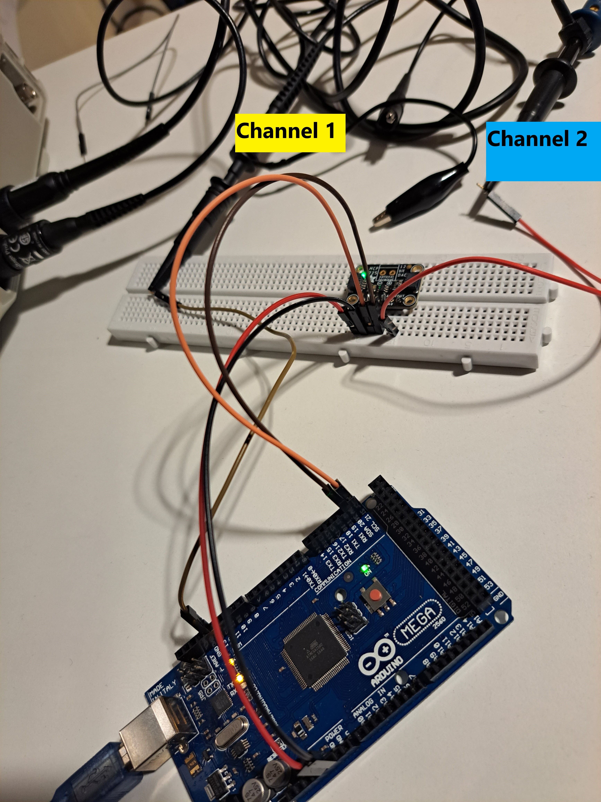 | 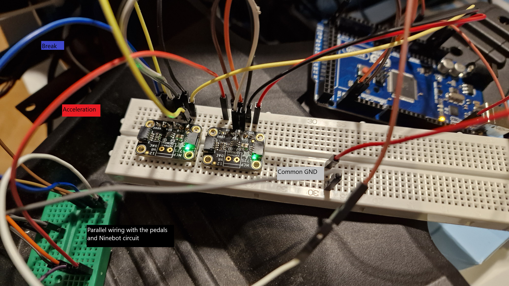 |

### Results

The test rigs software can be found in `~\autonomous_platform\Documentation\Segway_Propulsion\Test_Rig`.

|                                                           DAC Rig Results                                                           |
| :---------------------------------------------------------------------------------------------------------------------------------: |
|                                          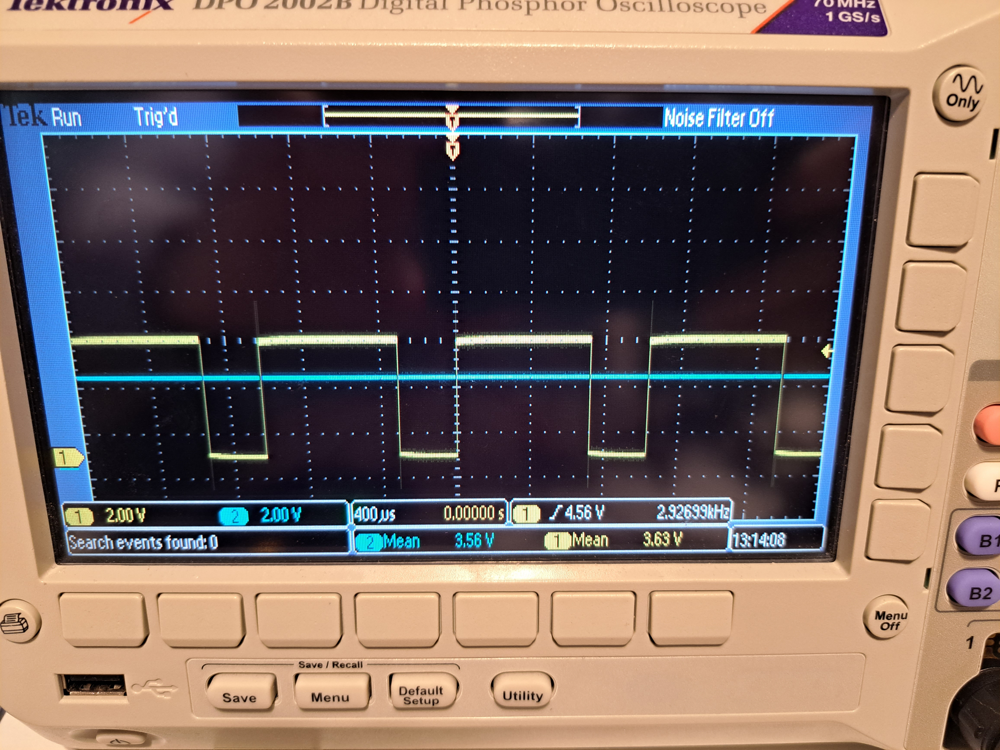                                          |
| **Fig**: Comparison between the regular digtal output pin (yellow on Channel 1) and the output voltage from the DAC (blue channel 2 |
|                                                                                  |
|            **Fig**: It is also possible to generate complex signals such as a triangle wave. Now DAC output on channel 1            |
|                                              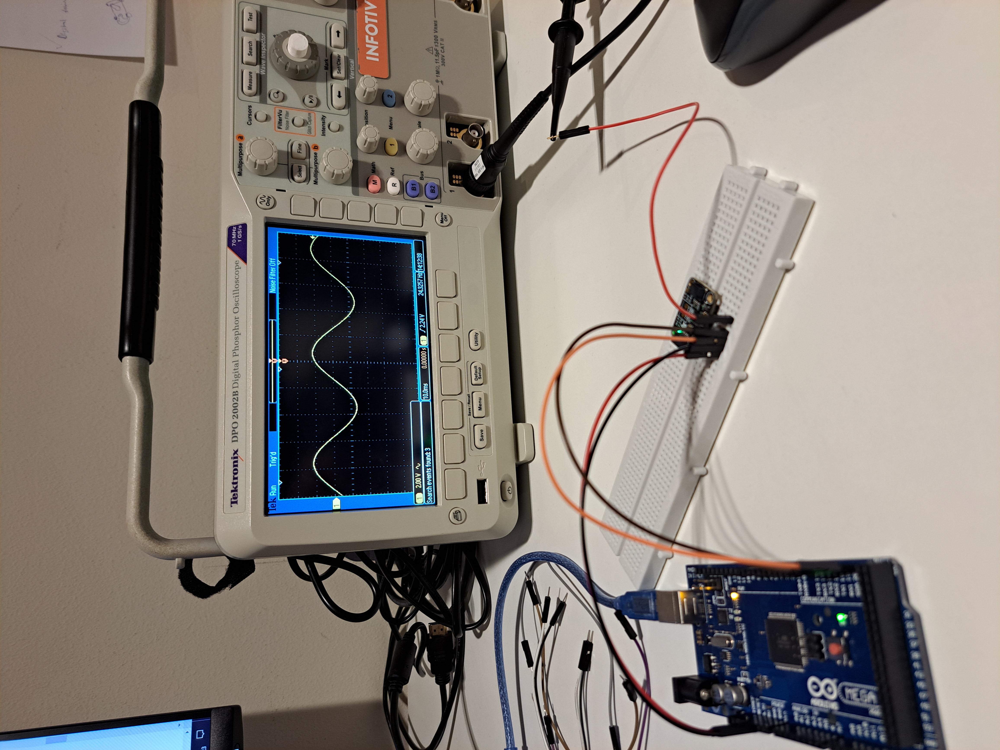                                              |
|                              **Fig**: Furthermore it is also possible to generate sinusoidal signals.                               |

As the ninebot circuit needs pure analog voltages and not the PWM approximations, the solution whilst using a DAC seems suitable. One other thing noted is that the arduino's analog pin output, cant be controlled in the same manner, as it can only be 0V or 5V. Furthermore with DAC board, arbritary microcontroller can be used.

|                                                                                                                                                                                                Ninebot Rig Results                                                                                                                                                                                                 |
| :----------------------------------------------------------------------------------------------------------------------------------------------------------------------------------------------------------------------------------------------------------------------------------------------------------------------------------------------------------------------------------------------------------------: |
|                                                                                                                                                                                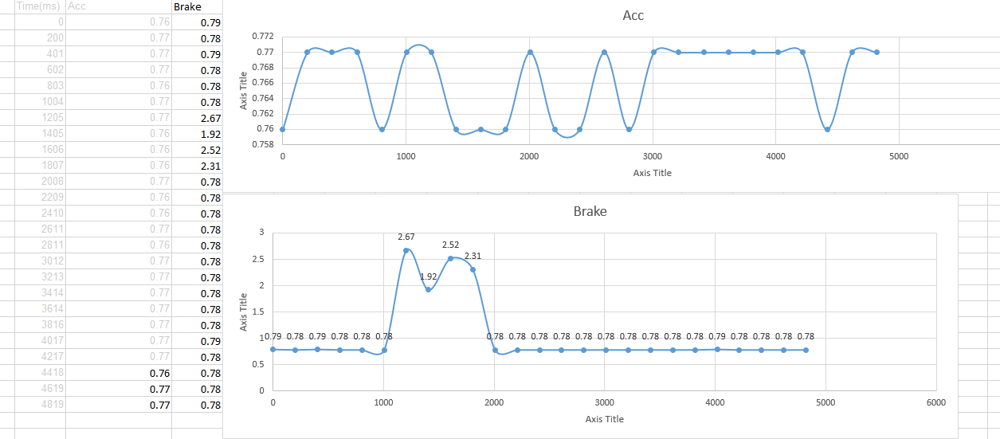                                                                                                                                                                                 |
| **Fig:** Whilst doing the testing on DAC with ninebot, we also measured the voltages in each cable, the x-axis in scaled over milli seconds (ms). In order to define the reverse algorithm, it was simply set up to measure signals whilst pressing the pedals manually (2 times rapidly to go into reverse mode). Making it possible to approximate the time constant needed between the presses, $\\tau=200$ ms. |
|                                                                                                                                                                                                                                                                                                                                                                                                                    |
|                                                                                                                 [Demo video, demostrating the functionality to control the propulsion using the DAC board.](https://drive.google.com/file/d/1FeQGeAu96iMUcdyh7bQluNmk0nlNBufs/view?usp=share_link)                                                                                                                 |
|                                                         **Comments:** In the video it is demostrated how the ninebot can accelerate, break and go into reverse mode whilst only controlling the DAC board. Further simple algorithms that has been implemented consist of ramping up the speed from 0 to max and respectively ramping down from max to 0.                                                          |
|                                                                                                                                                                                                                                                                                                                                                                                                                    |
|                                                                                                              [Demo video, demostrating the functionality to use the pedals at the same time as the DAC board](https://drive.google.com/file/d/1LnbnqobhJgI2CLCRH9k_zDKZqvCopJJC/view?usp=share_link)                                                                                                               |
|                                                                                                                                           **Comments:** In the video it is demonstrated how it is still possible to use the pedals to break whilst the DAC are engaged.                                                                                                                                            |

### Conclusion and future work

The test rigs was a great success and validates the proposed solution to simply generate analog voltages in order to control the velocity of the Ninebot.

Future development is to implement accurate and robust speed sensors in order to have a feedback system or even some kind of PI-controller. Also to finalize the local code for the node, with some more features. Furthermore also when the first physical modular node has been developed/printed implement the propulsion control on the bluepill and connect to the node with CAN bus to send/read signals.
