# Steering Motor Documentation

Documentation regarding the investigation around the steering motor to be used on autonomous platform.

## Hardware Related To Motor Steering

The steering hardware setup was reused from Autonomous Platform Generation 3 due to its simplicity and it is proven to work already.

| Component                                | Function                                                                        | Product Manual     | Bought where?                                                     |
| ---------------------------------------- | ------------------------------------------------------------------------------- | ------------------ | ----------------------------------------------------------------- |
| EMG49                                    | DC Motor with preattached gearbox and encoder                                   | see manuals folder | was already in infotiv's inventory                                |
| SABERTOOTH DUAL 2X25A/6-24V MOTOR DRIVER | Motor Drive board to control an DC motor                                        | see manuals folder | https://www.mybotshop.de/Sabertooth-Dual-2x25A-6-24V-Motor-Driver |
| Sabertooth Kangaroo x2                   | Motor controller board, automatic tuning and feedback capability                | see manuals folder | https://www.mybotshop.de/Sabertooth-Kangaroo-x2_1                 |
| Limitswitches (2 of them)                | Sense maximum and minimum turning angle. Wired in normally closed configuration |                    |                                                                   |

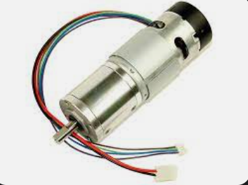

This is the EMG49 dc motor used. It has the following cables connected to it:

- (red) +12v
- (black) GND
- (purple) Hall Sensor B Vout
- (blue) Hall Sensor A Vout
- (green) Hall Sensor Ground
- (brown) Hall Sensor Vcc

The 12V and GND from the motor should be connected to M1+ and M1- on the sabertooth board.
The purple, blue, green and brown cables should be connected to the kangaroo x2 board.

(see illustrations later down for clarification)

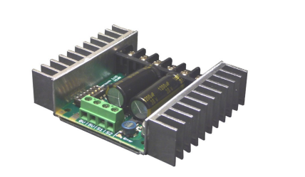

This is the Sabertooth driver board. Different settings can be configured with the dip switches (see more in manual).

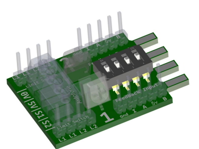

Kangaroo x2 board.
The Kangaroo x2 board eceives power from the Sabertooth driver board and connects to the 4 screw terminals in front of the sabertooth board. Different settings can be configured with the dipswitches (see more in manual).

## Available Software

There are some available and ready to use software to controll the Kangaroo x2 motor controller board.
[Here one can download](https://www.dimensionengineering.com/info/arduino) the Kangaroo Arduino library and/or access example code.

## Offline Test Rig - Tuning The Motor (initial setup and configuration)

To verify and test functionality, a test rig was setup.

Some additional hardware was used in order to test the system offline.

| Component        | Function                                                 | Product Manual | Bought where? |
| ---------------- | -------------------------------------------------------- | -------------- | ------------- |
| 12v Power Supply | Supply power to the sabertooth driver board 12v 4.5 Amps |                |               |
| Wires            | signals and power                                        |                |               |

### The Setup

This was the hardware wiring setup during the tuning procedure of the motor.

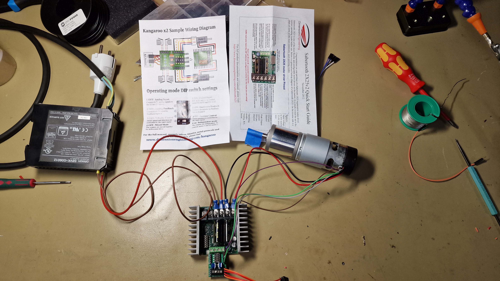

Whilst tuning, in order to stabilize the motor, it was mounted in a vice grip.

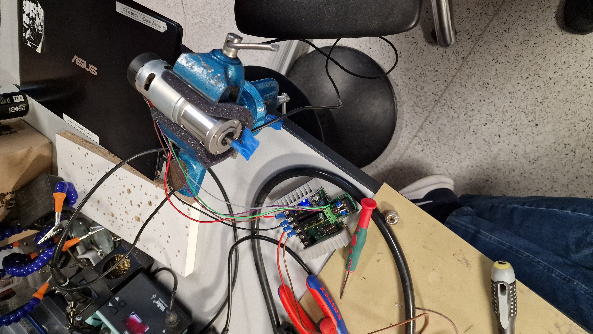

### How To Tune The Kangaroo x2 controller board (Autotuning)

In order to use the kangaroo x2 controller board it needs to be configured once. This is referenced in the Kangaroo x2 manual as 'Autotuning' at page 16. There are several modes. Whilst testing we  choose mode 1, Teach Tune, since it was the simplest and we wanted to verify that the components worked.

Autotuning Modes

- 1: Teach Tune
- 2: Limit Switch Tune
- 3: Crash Limit Tune
- 4: Input Calibrate Mode

The teach tune mode let us manually move the motor left and right to indicate the maximum and minimum turning positions. Please read the kangaroo x2 manual for in depth description how to do the autotuning procedure.

### Results from Offline Test Rig - Tuning The Motor (initial setup and configuration)

Once we manually moved the motor to its maximum and minimum position, it performed an autotune procedure. It did some moves on its own and calibrated the steps using the built in encoder in the motor. This defines the range of motion for the motor.

In the future when the motor is installed in the gokart, it should to be tuned in mode 2, 'Limit Switch Tune'.

## Offline Test Rig - Sending Commands To Kangaroo x2

MAKE SURE YOU HAVE PERFORMED AN AUTOTUNE OF THE MOTOR AS DESCRIBED ABOVE BEFORE TRYING TO COMMUNICATE WITH THE KANGAROO BOARD!!!

### Communication Options Kangaroo x2

There are several ways in which to controll the position and or speed of the motor using the kangaroo x2 controller according to the manual. (Described in depth at page 10 in kangaroo x2 manual)

Available options are:

- Analg Inputs
- Radio Control Input
- Serial Input
- Simplified Serial Input
- Packet Serial

Out of these options the 'Simplified Serial' was deemed to be the simplest solution since there is only need for controlling one single motor.

### Simplified Serial Communication Protocol

This is described in depth in the kangaroo x2 manual at page 11. Here are the contents as images:

According to the manual:
Kangaroo supports plain text TTL level simplified serial input. The default serial settings to use this mode are 9600 baud, 8N1. All commands follow the same format. Spaces are ignored and can be added for readability. All commands consist of a channel number, followed by a comma, the command and a newline (Enter key)

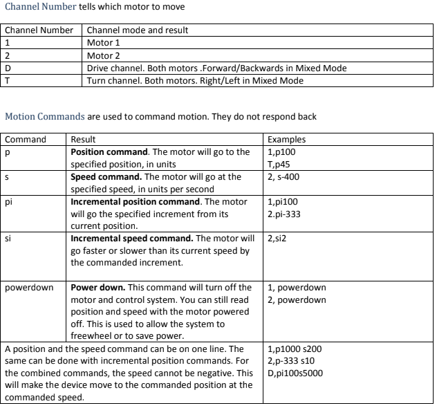

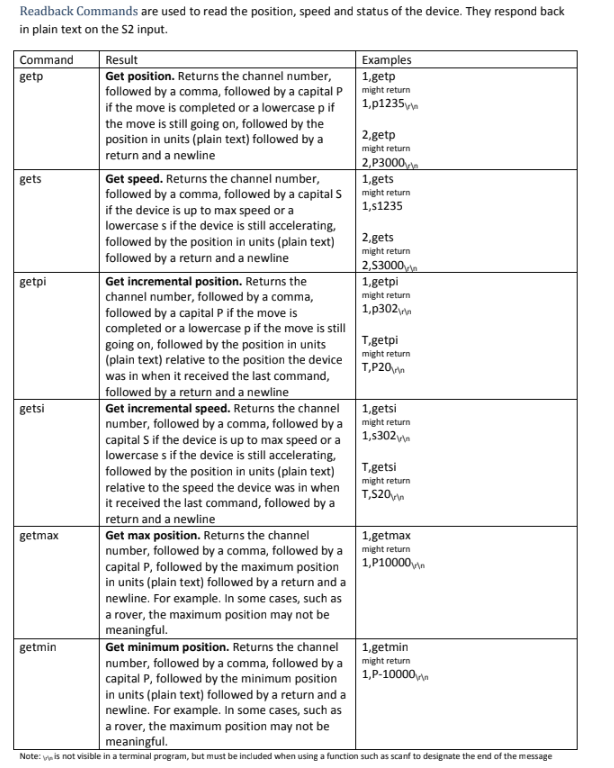

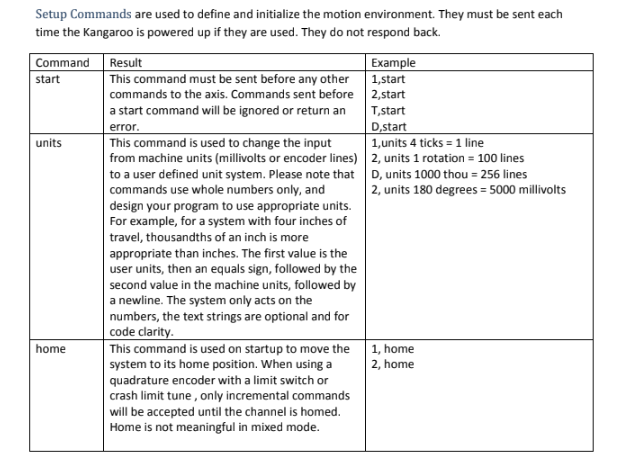

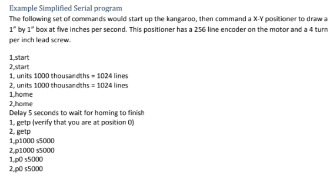

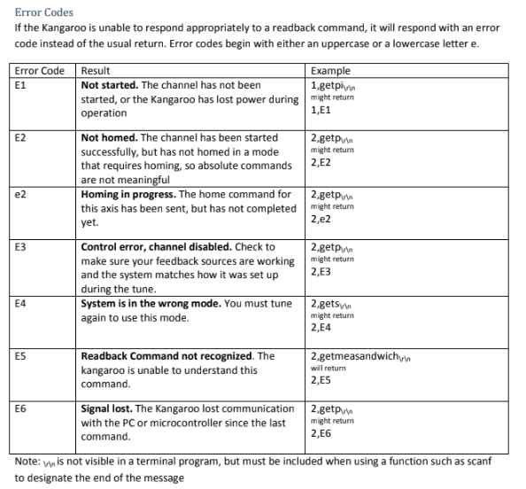

### Wiring Setup

Some additional hardware was used in order to test the system offline.

| Component        | Function                                                                                                                             |
| ---------------- | ------------------------------------------------------------------------------------------------------------------------------------ |
| 12v Power Supply | Supply power to the sabertooth driver board12v 4.5 Amps                                                                              |
| Wires            | carry signals and power (duh)                                                                                                        |
| Arduino Mega     | Has multiple Serial ports. Can communicate with Arduino serial monitor and send serial commands to the kangaroo board the same time. |

Here is the general wiring setup when connecting the Kangaroo x2 to a microcontroller.

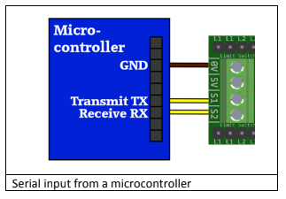

### Serial Passthrough Test Setup

This test case was setup to begin with. The idea is to passthrough serial data from the Arduino IDE serial monitor to the kangaroo x2 controller board. Both the transmitting signal and receiving signal. The kangaroo x2 communicates at a baud rate 9600 which means the Arduino IDE serial monitor needs to be set to 9600 as well. This was done on an Arduino Mega as it has multiple serial ports. The

Wiring

| Wire Name           | Arduino Mega Pin | Kangaroo x2 Pin | Function                                                                                                                 |
| ------------------- | ---------------- | --------------- | ------------------------------------------------------------------------------------------------------------------------ |
| USB                 | USB type B port  | -               | Supplies power to Arduino Mega and transmitts/receive data from arduino Mega to the Arduino IDE serial monitor on laptop |
| Ground              | GND              | 0V              | Connects the ground of the Arduino Mega to the ground of Kangaroox 2                                                     |
| Serial wire (green) | TX1- 18          | S1              | Serial Transmitt from Arduino Mega to Serial Recieve on Kangaroo x2                                                      |
| Serial wire (blue)  | RX1 - 19         | S2              | Serial Transmitt from kangaroo to Serial Recieve on Arduino Mega                                                         |

Here are images of the setup. Note how the DIP switches are configured on the sabertooth and kangaroo board.

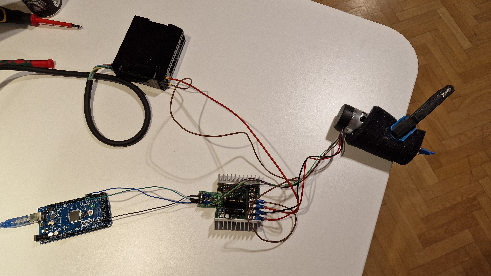

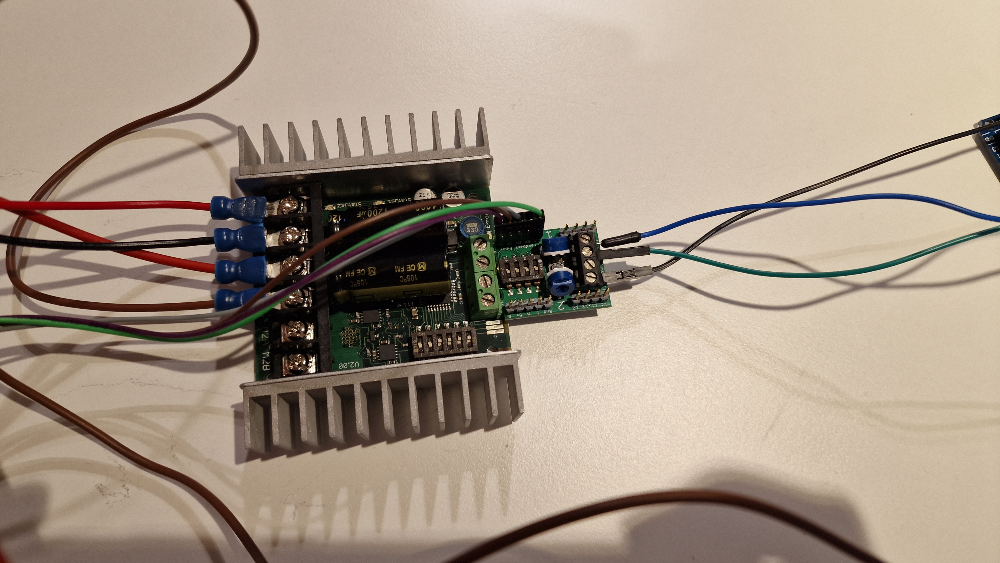

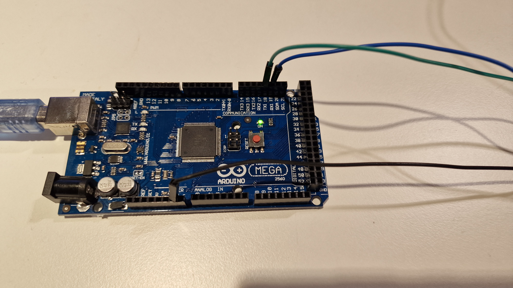

The Arduino Code for this is very short and simple, the code as taken from: https://docs.arduino.cc/built-in-examples/communication/SerialPassthrough

```c
void setup() {

  Serial.begin(9600);

  Serial1.begin(9600);
}

void loop() {

  if (Serial.available()) {      // If anything comes in Serial (USB),
    
    Serial1.write(Serial.read());   // read it and send it out Serial1 (pins 0 & 1)

  }

  if (Serial1.available()) {     // If anything comes in Serial1 (pins 0 & 1)
    
    Serial.write(Serial1.read());   // read it and send it out Serial (USB)

  }
}
```

### Serial Passthrough Test Result

The test was a success. We could send simplified serial commands as described in 'Example Simplified Serial Communication'. After starting the motor with '1,start' and homing with '1,home' the motor could be controlled with commands through the arduino IDE serial monitor. We could set positions and velocities, retrieve positions and retrieve the minimum and maximum position in an arbitrary format.

### Simplified Serial Commands Sent by Arduino Test

A script to test sending simplified serial commands from an arduino was created. Saved in 'Code' folder named as 'simplified_serial_arduino_mega_test'.

The wiring setup is the same as for Serial Passthrough.

The idea for this script is to send simplified serial commands straight from the arduino mega board, such as '1,p100', 1,s100' etc etc in a controlled mannor. Whilst also continously reading the measured position.

### Results Simplified Serial Commands Sent by Arduino Test

The test was successfull. Some revelations from this experiment was:

- A positional command such as '1,p100' only needed to be sent once.
- Reading values could be done continously, I.e after setting a positional value once, we could read the position in real time whilst the motor turned to the desired position.
- The kangaroo x2 board needs to handshake with the arduino before any commands can be sent to it or any values read from it. We had to restart the arduino mega a few times sometimes in order for our code to run successfull. (pressing the red button on it)
- If a command cannot be executed on the kangaroo board, an error will be returned according to the list of errors in the kangaroo manual. It would be nice to handle these errors automatically in the future, i.e if connection failed to establish automatically establish connection again.

To test functionality we first send the handshake commands, '1,start' and '1,home' in the arduino setup function. In the the loop function that runs continuously on arduino we do the following

1. Read the maximum and minimum encoder positions (these were set when we tuned the motor)

- '1,getmin' -> returns -> 1,Pxxx
- '1,getmax' -> returns -> 1,Pyyy

2. Send a positional target position '1,p80' over Serial1
1. Continously read the actual position of the motor whilst it is moving to the target position. Wait 1 ms between reading values. From Serial1
1. Write the target position and current position and write to terminal (Serial)
1. Create plots using serial plotter

Below: Target pos = 50 and -50. Max speed.

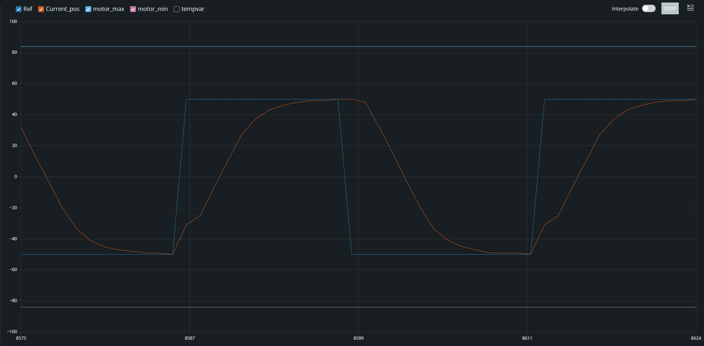

Below: Target pos = 80 and -80. Max speed.

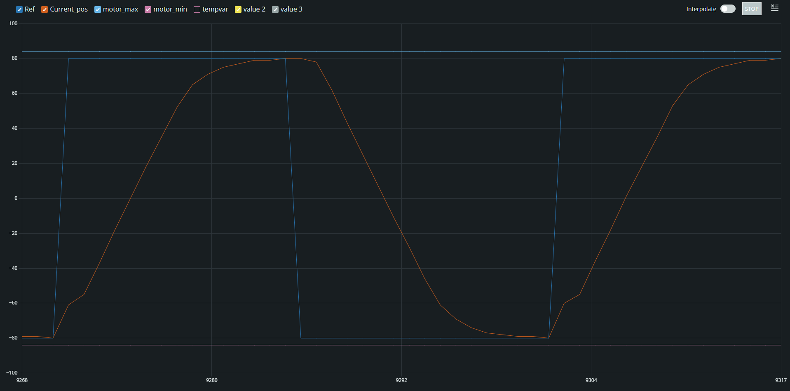

Below: Target pos = 80 and -80. Lowered speed.

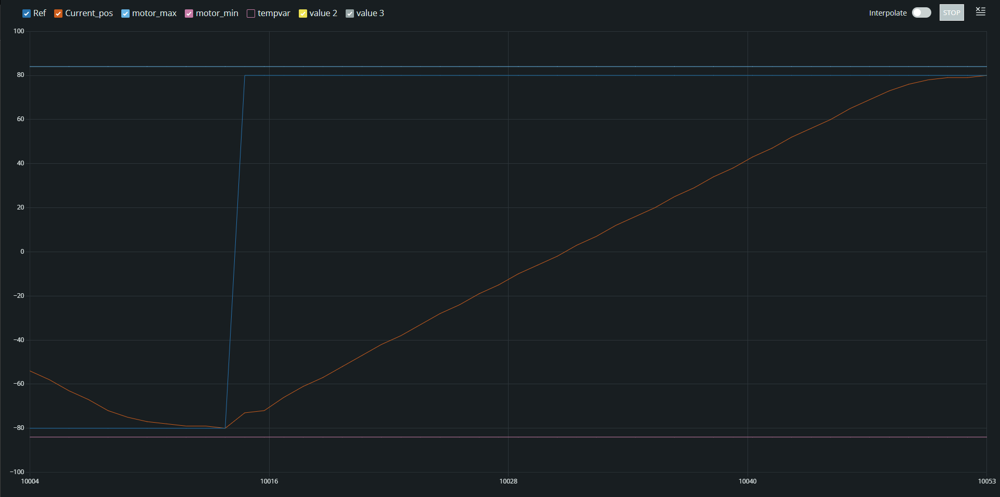

The velocity of the motor could be controlled by turning a potentiometer on the kangaroo x2 controller board. It is the blue potentiometer next to the encoder pins. It has to be changed before a new move-to-position command is sent for it to take affect. This would affect the Time constant of the system. Aka the time for it to reach the target position. Which seems reasonable.

It is yet unclear of how setting a speed command affects the behavior of the grap. I.e by sending '1,s1000' vs '1,s10'.

#### Code

The Code for this test can be found in the 'code' directory, named as 'simplified_serial_arduino_mega_test.ino'.

## Features to add from this investigation onto autonomous platform generation 4:

From this investigation there are a few takeaways with respect to what functionality should be added onto the autonomous platform 4 steering node.

We need to decide if we want to control the velocity of the motor or the position of the motor. Only sending positional commands would be simpler but having a cascade controlle that controlls the velocity would probably be more relevant for a thesis work within controls?
