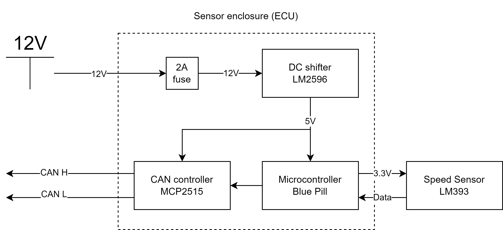

## Speed Sensor ECU

These are diagrams that describe the physical wiring of the speed sensor module. The design files are in the
[diagrams](../Documentation/Speed_Sensor/diagrams) directory and can be edited. The diagram tool is diagrams.net, while the circuit diagram is made with EasyEDA online.

### Functional block diagram

### Wiring overlay

This is an overlay of the components in the circuit.

### Circuit diagram

This is a complete representation of the how the ECU and its components are wired internally.

