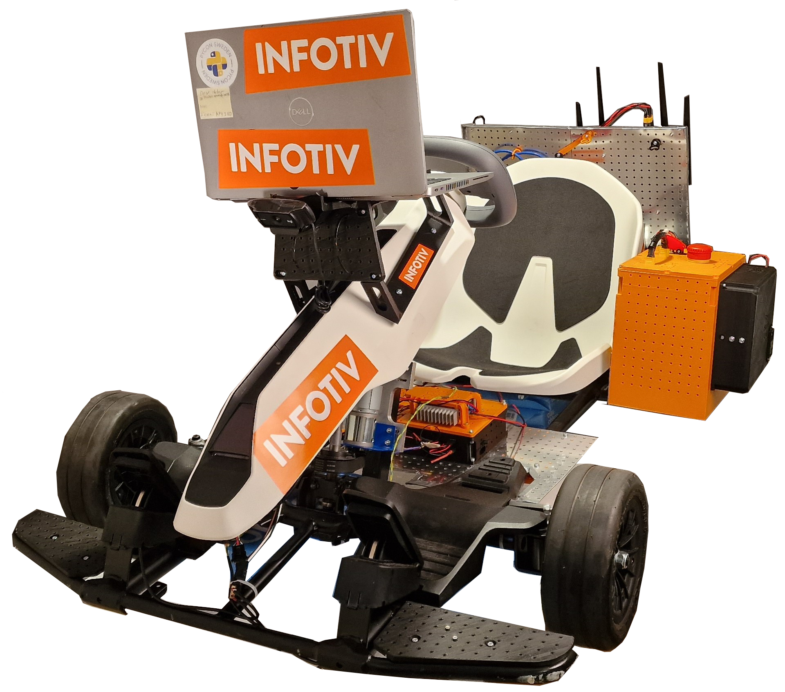
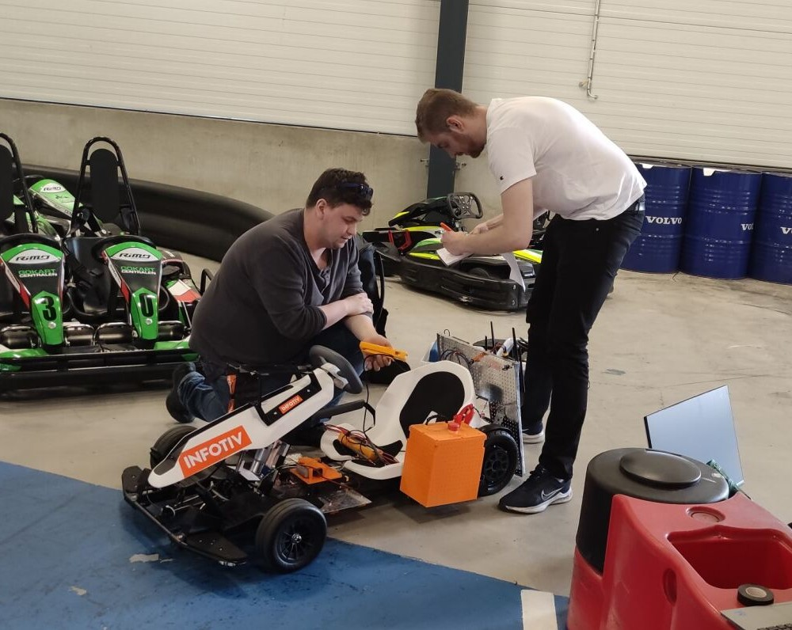
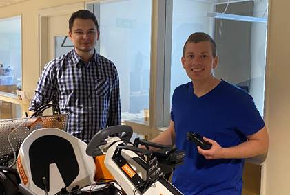

### Generation 4 - changelog

Autonomous Platform Generation 4 was started by Fredrik Juthe and Erik Magnusson for their master's thesis during spring 2023. Since then Alexander and Seamus and continued working on it.

AP4 was meant as a fresh start for the autonomous platform project, removing the development issues that occurred with AP3 over time. AP4 was designed from the beginning to be a long time project with clear requirements and better development processes.

Another goal with AP4 is to make it more modular then previous versions. Previous versions had many propriety and hardcoded solutions for a specific problems. These could later on affect the development process by making the previous implementations hard to follow.

A new concept which is trialed on AP4 is the concept of "Centralized" Electrical / Electronic (E/E) and software architecture. In short this means that the heavy computations are performed on a centralized computing unit and the ECUs are only responsible for relaying information to and from the computing unit.

It is built on an electric segway gokart platform. Starting from scratch on a new gokart.

### Version 4, June 2023

AP4 was created by Fredrik Juthe and Erik Magnusson as part of a master thesis at Chalmers University of technology spring 2023. Supervisor: Hamid Ebadi

### Version 4.1, July 2023

Improving documentation and adding speed sensor by
Seamus Taylor, Alexander Rydevald.  Supervisor: Hamid Ebadi

### Version 4.1.1 August 2023

Improving documentation, Solving comments left in README files. Refactored repository, removed old/unused files, and made it more clean.
by Erik Magnusson and Seamus Taylor. Supervisor: Hamid Ebadi

### Version 4.2, May 2024

The implementation of the software pipeline for Imitation Learning for achieving autonomous driving using both behavioral cloning (BC) and Human Gated Dataset Aggregation (HG-DAgger) is done by Arvid Petersén and Johan Wellander  as part of a master thesis at Chalmers University of technology spring 2024. Supervisor: Hamid Ebadi

