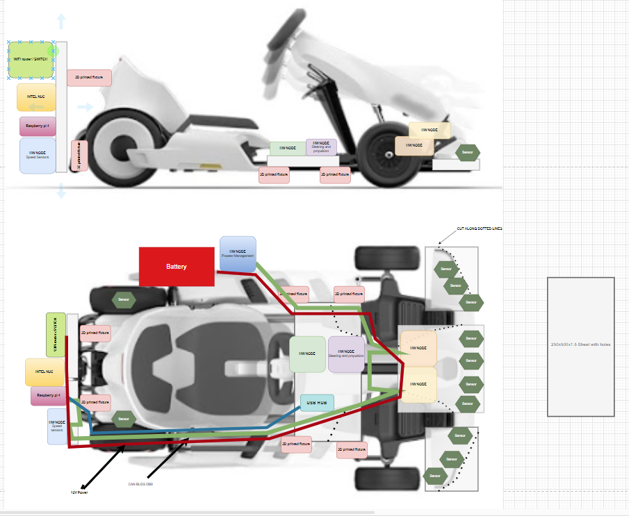
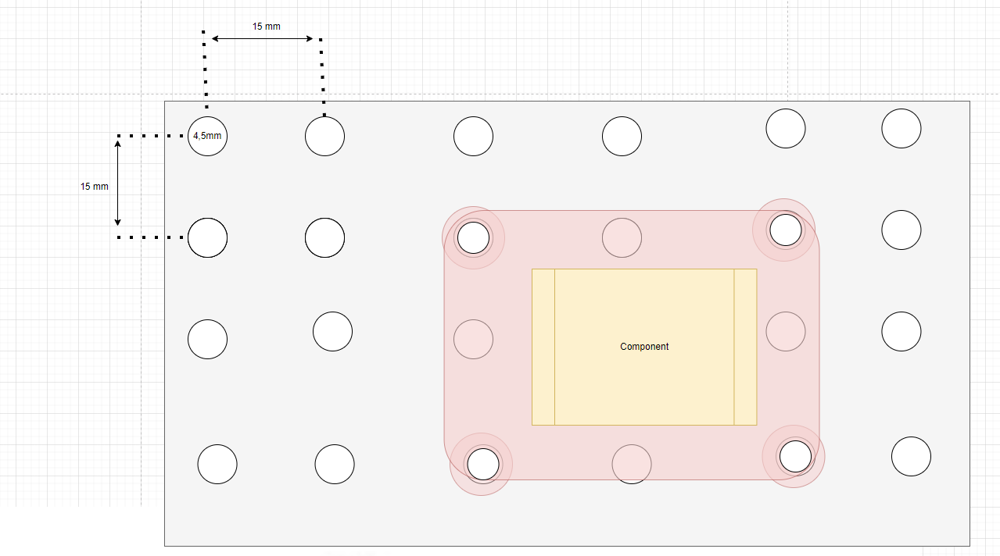
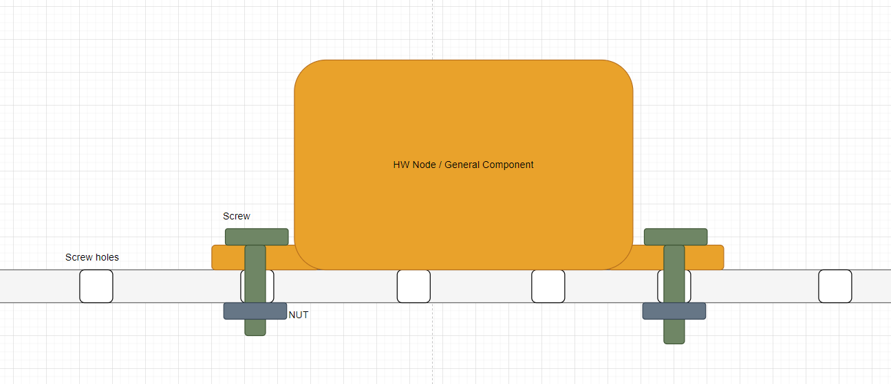
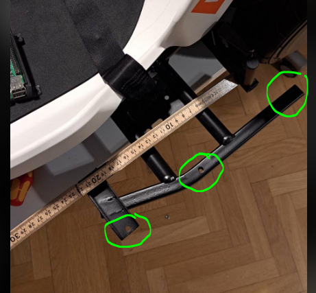
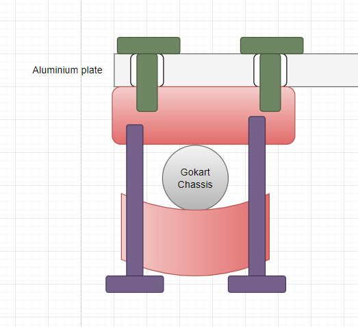
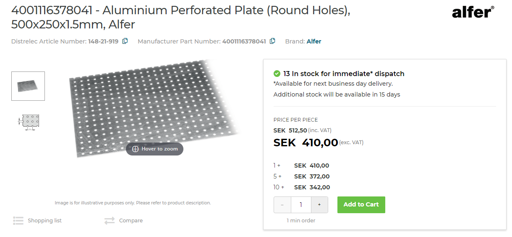
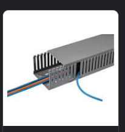
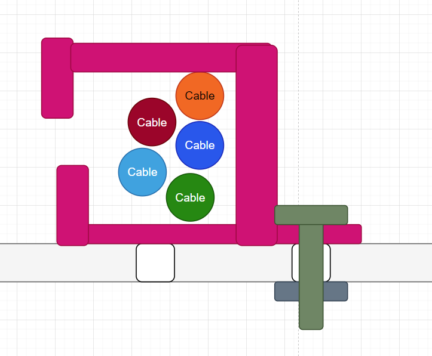
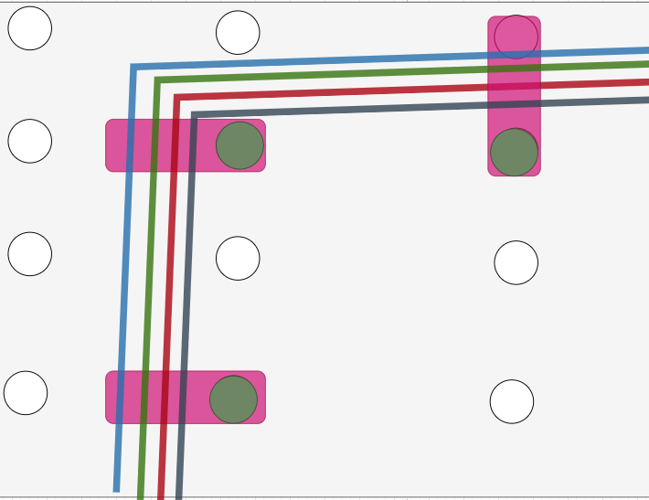

## Hardware Design Principles

This document aims to collect the design principles for any new hardware added. Hardware may need to be added for different software layers, hence they can be summarized here.

See `HOW_TO_EXTEND.md` for general design principles. These should always be kept in mind.

### Modular Mounting of Components

This document is supposed to collect our thought about how sensors, hardware and components should be mounted on autonomous platform in order to make it as modular and adaptable as possible for future use.

### General idea

Use a metal sheet with pre fabricated metal holes as a base for mounting components. Create 3D printed fixtures to connect Hardware Nodes, Raspberry Pi 4 and other major components.

Using the prefabricated holes one can then create 3d printed fixtures in a standardized way to mount hardware anywhere along the sheet.

Specific solutions for this needs to be CADed later on.

### Mounting the aluminum plates to the frame

One can either use the pre existing mounting holes on the gokart chassis and screw directly into the chassis.

Or one can create 3d printed fixtures to mount the plates, I.e:

### Component list

- Aluminum metal sheet with be fabricated holes: Aluminum Lochblech blank 250x500x1.5mm article nr:  148-21-919 OR 4001116378041  https://www.elfa.se/en/aluminium-perforated-plate-round-holes-500x250x1-5mm-alfer-4001116378041/p/14821919 Holes are spaced 15 mm apart, hole diameter 4.5 mm

- M4 machine screws
- M4 nuts

One can either use pre existing cable routing hardware as in the image below

or can 3d print simple cable holders such as this image

