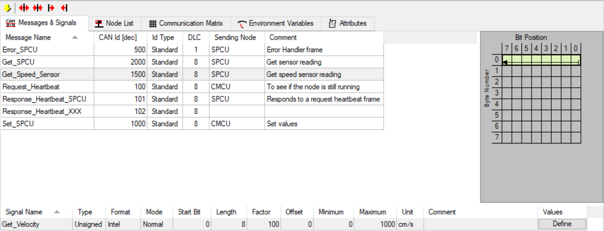
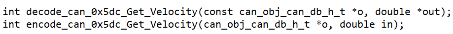
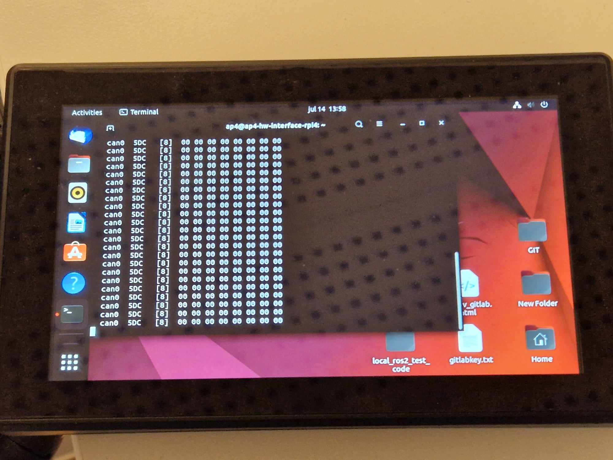
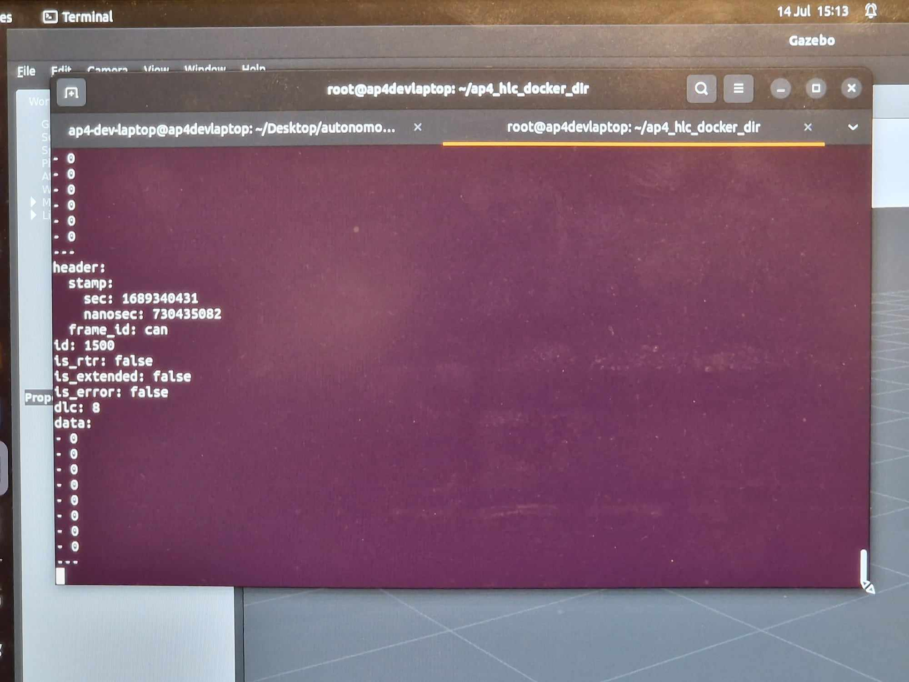

## Onboarding Procedure

This document is meant to structure the introduction of Autonomous Platform Generation 4 (AP4) to new members. If you feel something was unclear after you read through this, please add to this document to make it easier for future team members!

The goal of this document is for new team members to have a basic understanding of what Autonomous Platform Generation 4 is and how get working within a reasonable amount of time.

It will describe what prerequisites are required to follow along, how to read through the provided documentation and how to get going continuing the development of the autonomous platform project.

This document does not specify any development tasks - It is up to the supervisor and you to define the goal for the given time period.

### Schedule

Here follows a quick step by step procedure on how to get familiar with the project. You DO NOT need to understand everything, the most important thing is that you get a good overview of the project and get an understanding of where YOU can apply your experience and knowledge to contribute.

Remember, you have a supervisor, be sure to ask for clarifications whenever something is unclear.

These should be the goals for a new team member. These are simply a guideline and are not set in stone. Talk with your supervisor what parts may be relevant for you or what time plan is suitable.

#### Week 1

- Understand the purpose of the Autonomous Platform project
- Have a feeling of where certain parts of the project are located at within the repository
- Cloned the repository to your work computer
- Started up the physical AP4 platform by following the startup procedure documentation.
- Read through the major documentation files - Presented in "Where can I find What" Don't expect do understand everything that is mentioned.
- Install needed software (Git, Docker, VSCode, PlatformIO)

#### Week 2

- Start playing around with existing software (preferably on a new git branch to not brake existing functionality). Try to start different components and see if you can get expected output.
- Try and read sensor information from platform and display in terminal. I.e steering angle. Does it change when the wheels are moved?
- Try to control the actuators through command line. Can you set the steering angle?
- Find something that is lacking within the documentation and can be improved upon
- __Decide upon a project which you can perform within a reasonable time frame - Talk with your supervisor what may be suitable for you.__
- Lay out a plan on how to make your project possible. Do you know where in the code to make changes?
- Start internal educations if applicable. (CAN)
- Start external educations if applicable. (Git, Docker, ROS, Linux, etc)

#### Week 3

- Work on your proposed project - Keep your supervisor in the loop
- Continue internal educations if applicable. (CAN, Embedded Development, etc)
- Continue external educations if applicable. (Git, Docker, ROS, Linux, etc)

#### Week 4

- Finished internal educations if applicable. (CAN, Embedded Development, etc)
- Finished external educations if applicable. (Git, Docker, ROS, Linux, etc)
- Work on your proposed project - Keep your supervisor in the loop
- End of week 4: Present the results of your small scale project to some Infotiv members.

## Useful skills/software knowledge

You do not need to be familiar with every software or concept mentioned below.

- Linux Basics and be able to flash OS images to SD cards & USB drives
- Docker containerization basics
- Infotiv AB CAN internal bus education
- Robot Operating System 2 (ROS2) introduction
- Embedded Software Development Introduction

An unpublished copy of the Master's Thesis report is available to read in the repository.

## Extend AP

The process of extending the three specific software components are described in detail in the following documents:

- `CAN_Nodes_Microcontroller_Code/HOW_TO_EXTEND.md`
- `Hardware_Interface_Low_Level_Computer/HOW_TO_EXTEND.md`
- `High_Level_Control_Computer/HOW_TO_EXTEND.md`

### Design Principles

Follow KISS principles:

- "keep it super simple"
- "keep it short and simple"
- "keep it simple and straightforward"
- "keep it small and simple"
- "keep it stupidly simple"

Make subsystems modular, plug-and-play, and independent of each other.
According to Murphy's Law, " Anything That Can Go Wrong, Will Go Wrong", so in other word, things will go wrong in any given situation, if you give them a chance. Make modules that can be replaced and keep each part small and modular.

### Software

- Emphasize code modularity by utilizing Docker containers.
- Instead of writing installation documents, create a build script (e.g., Makefile) for streamlined setup.
- Include at least one unit test for each module to ensure functionality and reliability.
- Create test scripts to address specific issues and automate the debugging process. For example:
  - For wireless communication issues, implement a bash script that performs ping tests with other nodes.
  - Automate the debugging of CAN communication by utilizing candump in a simple bash script.
- Integrate these tests into your system, running them before executing components for comprehensive validation.
- Ensure well-written and clean code, prioritizing meaningful variable and function names over excessive documentation.
- Be mindful of the side effects of premature optimization and consider them while making performance improvements.

### Hardware

- Utilize standard power sockets and ensure compatibility with standard CAN and power cables/connectors.
- Adhere to standard color coding for wires to ensure consistency and ease of identification.
- Conceal all wires and protect them from accidental disconnection. (assume a kids going to use the gokart)
- Avoid hard wiring between different physical modules/nodes. - Use detachable cables for connections between modules.
- Design all components to be easily opened, inspected, and replaced when necessary.
- Ensure quick and efficient component replacement, similar to the swift tire changes performed during a Formula 1 racing car pit stop. Don't do a Ferrari and make your pit stop more difficult than necessary.

### Documentation:

- Begin by documenting the "what" and "why" aspects of the project or concept. The focus should be on understanding the purpose and reasoning behind it and "How" is usually not important.
- Begin by documenting the high-level idea or overview before delving into low-level details
- Use markdown format. It is faster, easier and convertible to other more complex format such as LaTeX, HTML and PDF.

### Prerequisite Software & Skills <a name="Prerequisite-Software-&-Skills"></a>

In order to understand the implemented architecture, software and hardware here are some general useful resources:

- Linux Basics and be able to flash OS images to SD cards & USB drives
- Docker containerization basics
- Infotiv AB CAN internal bus education
- Robot Operating System 2 (ROS2) introduction
- Embedded Software Development Introduction

### Adding Wheel Speed Sensor<a name="Adding-Wheel-Speed-Sensor"></a>

This is an example procedure on speed sensors should be added onto the platform.

This is an overview of how Fredrik and Erik would have done it but you are free to make your own decision if you follow the principles.

There are supposed to be four wheel speed sensors on the platform.
The front wheel speed sensors are mounted but not wired.
The back wheel speed sensors need to be 3d printed again.
The wheel speed sensor models can be found in `CAD\Speed_Sensor_Back\`, import stl files into `Ideamaker` 3d printing slicing software, slice model to G-code and print!

The wheel speed sensor hardware, is located in the see-through plastic bin on the platform.

[link to wheel speed sensor hardware](https://www.conrad.se/p/utbyggnadsmodul-sen-speed-arduino-banana-pi-cubieboard-raspberry-pi-pcduino-1646891?gclid=CjwKCAiAl9efBhAkEiwA4TorihlTGZ_dIJLAiQAbS-_ulWIuD9HBy1EnvJ-Y1B5eGMD_G9lwljViWBoCnqEQAvD_BwE&utm_campaign=shopping-feed&utm_content=free-google-shopping-clicks&utm_medium=surfaces&utm_source=google&utm_term=1646891&vat=true)

The project would be split up in smaller parts (we would start with low level )

0. Set up repository and SW applications
1. Create Embedded-SW close to hardware
   1.1 Create test rig
1. Get hardware sensor working
1. Wire up new ECU base
1. Adjust CAN database & Generate new CAN_DB.c/h files
1. Adjust Low-level Hardware interfacing ROS2 code
   5.1 Adjust can_msgs_to_ros2_topic_pkg package
   5.2 Adjust vehicle controller

So in detail:

- Install docker
- Clone repository
- Create new personal gitlab branch to work in, Only working code should be added to the main branch.
- Learning how to use PlatformIO and st-link v2 to flash Bluepill microcontroller in VSCode editor
- (look at Infotiv sharepoint internal educations Edu: Get your first LED blinking on STM32)
- (look in `CAN_Nodes_Microcontroller_Code\HW_NODE_CODE_TEMPLATE\src`)
- Make sure things compile properly and can be uploaded to bluepill microcontroller
- Researching how the speed sensor works
- Create a small local solution test rig, (breadboard and jumper wires, Bluepill and speed sensors)
- Wire Components, Speedsensor
- Some work has been done on this already see the following code (Note:!! not up to date GPIO-pin wise with the standard ECU wiring)
  `CAN_Nodes_Microcontroller_Code\HW_NODE_DEV_Speed_Sensor_Lib\src`
  `CAN_Nodes_Microcontroller_Code\Shared_HW_Node_Libraries\SpeedSensorInterface\src`
- Read the velocity using bluepill board and print result over serial such that one can observe behavior
- Investigate how ECU base is wired (see existing code / documentation)
- CAD files for ECU base are located at `\CAD\Node Box`
- Wire a ECU base, Bluepill, MCP2515, Logic-level-converter, DC-DC converters, ...
- Connect ECU to CAN network, send some dummy data
- understand how to setup linux socket can interface - look into how it is automatically started on raspberry pi
- verify that dummy data shows up on linux cansocket candump
- Adjust CAN database CAN_DB.dbc (dbc file) using kvasar located at `\CAN_Nodes_Microcontroller_Code\CAN_LIBRARY_DATABASE`
- Add new frame(s) for speed measurements
- Generate new C code, CAN_DB.c and CAN_DB.h, see documentation for procedure.
- Compare new vs old CAN_DB.c/.h to see that the changes have been made
- Use the Template code for a ECU and add the speed-sensor-library functionalities
  Make a copy of `\CAN_Nodes_Microcontroller_Code\HW_NODE_CODE_TEMPLATE`
- Create a library in `CAN_Nodes_Microcontroller_Code` for the speed measuring ECU
- Transfer code from test-rig into new created library
- Instead of printing to serial, send velocity over CAN bus
  - See how throttle voltage / steering angle was sent over CAN bus in SPCU library
- Verify that velocity measurements show up on linux socketcan candump
- Append newly created measurement CAN frame (&signals) into the ROS2 can_msgs_to_ros2_topic_pkg source code.
  Located at `Hardware_Interface_Low_Level_Computer\ap4_hwi_code\ap4hwi_ws\src\can_msgs_to_ros2_topic_pkg\src`
  create publishers, subscribers, callback functions, add new switch cases
- rebuild can_msgs_to_ros2_topic_pkg package (colcon build)
- Start the can translator node from can_msgs_to_ros2_topic_pkg
- (It is automatically started if restarting the raspberry pi docker container) or run ROS2 launch file manually
- Use speed measurements for feedback control of velocity in vehicle controller node.
- (Make a copy of `Hardware_Interface_Low_Level_Computer\ap4_hwi_code\ap4hwi_ws\src\xbox_controller_feed_forward_ctrl_pkg`)
- Rename package and add feedback PID/PIDf control theory logic
- Adjust launch file to start the new vehicle controller when docker container is spun up
  See how is currently implemented `Hardware_Interface_Low_Level_Computer\ap4_hwi_code\ap4hwi_ws\src\launch_hwi_software_pkg\launch`

#### Get familiar with the sensor (blink and print)

A good first step is to get familiar with the sensor and understand how to read measurements from it. (Some of these steps could be skipped if experienced working with VScode and programming microcontroller)

1. Clone the AP4 repository and create a new personal gitlab branch to work in.

NOTE: Do not work in main branch until you know things work.

2. Download VSCode editor, install and learn how to use the Platform IO extension.

1. Make a simple blink script using microcontroller (bluepill, Arduino etc.) connected to a ST-link v2 (used for programming microcontroller). Necessary downloadable software for the ST-link v2 found [here](https://www.st.com/en/development-tools/st-link-server.html). If unsure how to create blink script, refer to the Infotiv sharepoint education: [Get your first LED blinking on STM32](https://infotiv.sharepoint.com/sites/Educations/Delade%20dokument/Forms/AllItems.aspx?id=%2Fsites%2FEducations%2FDelade%20dokument%2F1%2E%20Educations%20for%20internal%20use%2F%21Under%20utveckling%2FGet%20your%20first%20LED%20blinking%20on%20STM32%2FEdu%5F%5FGet%5Fyour%5Ffirst%5FLED%5Fblinkning%5Fon%5FSTM32%2Epdf&viewid=d1ecff9d%2Daeb3%2D4513%2D85a9%2D7c290464e7a2&parent=%2Fsites%2FEducations%2FDelade%20dokument%2F1%2E%20Educations%20for%20internal%20use%2F%21Under%20utveckling%2FGet%20your%20first%20LED%20blinking%20on%20STM32). Make sure things compile properly and can be uploaded to the microcontroller.

1. Research how the sensor works (pin ports, operating voltage etc.).

1. Create a small local solution test rig and wire components (breadboard, jumper wires, microcontroller, ST-Link v2, USB-mini and sensor).

1. Read the sensor measurement using the test-rig board and print the result over the serial monitor in VSCode.

#### Adding a new CAN frame

It is recommended to have completed the [internal Infotiv CAN education course](https://infotiv.sharepoint.com/sites/Educations/Delade%20dokument/Forms/AllItems.aspx?csf=1&web=1&e=3eIo8b&cid=b2cfcb9d%2Dd0f8%2D41ae%2D9bcb%2Dc9c87495657e&FolderCTID=0x0120000F106F66BCB5DD46BBB1F409C3C6A464&id=%2Fsites%2FEducations%2FDelade%20dokument%2F2%2E%20Educations%20approved%20for%20external%20customers%2FCAN%20communication%2FStudent%20Material%2FCourse%20Material&viewid=d1ecff9d%2Daeb3%2D4513%2D85a9%2D7c290464e7a2) beforehand.

1. Adjust the existing CAN_DB.dbc (dbc file) located under `/CAN_Nodes_Microcontroller_Code/CAN_LIBRARY_DATABASE`. It is recommended to use KVASER database editor for this, as it provides a simple interface for adding frames and signals. Download link to Kvaser database editor found [here](https://kvaser-database-editor.software.informer.com/2.4/). A video explaining how to use it found [here](https://www.youtube.com/watch?v=mAL1Xo2G9-4). More specific information related to AP4 found in README.md under [`CAN_Nodes_Microcontroller_Code`](CAN_Nodes_Microcontroller_Code).

1. Add new frame(s) and signal(s) for sensor measurements similar to figure below.



NOTE: Use Linux PC for next step (step 3). Push updated CAN_DB.dbc file to git repo. and git pull main branch on Linux PC.

1. Generate new C code: CAN_DB.c and CAN_DB.h, documentation how this is done found under [CAN_LIBRARY_DATABASE](CAN_Nodes_Microcontroller_Code/CAN_LIBRARY_DATABASE).

1. Compare new vs old CAN_DB.c/.h to see that the changes have been made.

NOTE: Push changes to git repo and git pull main branch on a Windows PC.

#### Code Sensor to CAN message

1. Use the ECU template code found under [`CAN_Nodes_Microcontroller_Code/HW_NODE_CODE_TEMPLATE`](CAN_Nodes_Microcontroller_Code/HW_NODE_CODE_TEMPLATE). Check the comments inside the source code and get an overall understanding of the different steps.

1. Extend the code with CAN message decode/encode and sensor functionality.

TIP: Check previous ECU codes (SPCU and Speed_sensor ECU) located under [`CAN_Nodes_Microcontroller_Code`](CAN_Nodes_Microcontroller_Code) to see which additions need to be made.

In short, what needs to be added to the ECU template are:

- Inclusion of any additional library.
- Specify global variables.
- Specify configurations such as input/output pin ports and baud rate.
- can_interface.AddPeriodicCanSend(CAN_ID,time) inside setup() function.
- Sensor algorithm, decode and encode CAN frame inside loop() function.
  The format of the decode and encode messages can be found inside the generated CAN_DB.h file, example from another sensor can be seen below.



1. Make sure the code is buildable and upload the code to the microcontroller.

#### Build an ECU

1. Extended the test-rig built in *Get familiar with your sensor* and add a CAN module.

NOTE: Look through the specifications of the components to understand each pin port, operating voltage and how to connect everything.

2. Connect a DB9 connector between the CAN module test-rig and the Raspberry Pi mounted on AP4. Update the files on the Raspberry Pi by powering on AP4 using the flip switch, navigate on the display using the wireless mouse and keyboard (labeled Infotiv 3) and git pull the repo.

#### Raspberry Pi 4b 4gb

3. Verify that sent CAN messages from the microcontroller show up on the Linux cansocket candump. On the Raspberry Pi this is done by opening a new terminal and running the command:

```bash
candump can0
```

Below you can see an output example from candump. It shows which channel the message is being transmitted on (can0), the ID (5DC), the frame size \[8 bits\] and the data bits (00 00 ...).



#### CAN to ROS communication

1. Append newly created measurement CAN frame (&signals) into the ROS2 [can_msgs_to_ros_2_topic_pkg source code](Hardware_Interface_Low_Level_Computer/ap4_hwi_code/ap4hwi_ws/src/can_msgs_to_ros2_topic_pkg/src/can_msgs_translator_interface.cpp). This procedure is pretty straight forward and a detailed description can be found under [Hardware_Interface_Low_Level_Computer](Hardware_Interface_Low_Level_Computer).

1. Git push the changes and git pull repo on the development laptop (Linux).

#### Development laptop

1. Rebuild can_msgs_to_ros2_topic_pkg package (colcon build). The procedure is described under [Hardware_Interface_Low_Level_Computer](Hardware_Interface_Low_Level_Computer).

NOTE: For the next step it is important that both the Raspberry Pi and the Development laptop are connected to the same wifi/ethernet. This can be double checked using a simple "Ping test", which tests their communication.

Restart the Raspberry Pi and Development laptop and use the following commands in a new terminal on respective device:

#### On the Raspberry Pi

- Enter the existing docker container

```bash
docker exec -it ap4hwi bash
```

- Source variables

```bash
source /opt/ros/humble/setup.bash
```

- Start the CAN translator node

```bash
ros2 launch ros2_socketcan socket_can_bridge.launch.xml
```

#### On the Development laptop

- In the terminal, navigate to `/High_level_Control_Computer`
- Build the docker container

```bash
docker-compose build
```

- Disable the access control (necessary in order to start the container)

```bash
xhost +
```

- Start the docker container

```bash
docker-compose up
```

The Gazebo environment should start up, ignore this for now.

- Double check that the docker container is up and running

```bash
docker ps
```

- Open a new terminal window and enter the docker container

```bash
docker exec -it ap4hlc bash
```

- Source variables

```bash
source /opt/ros/humble/setup.bash
```

- View topics on the ROS network

```bash
ros2 topic list
```

- If everything works, the sensor message should appear under the topic named /from_can_bus. This can be viewed by running the following command:

```bash
ros2 topic echo /from_can_bus
```


