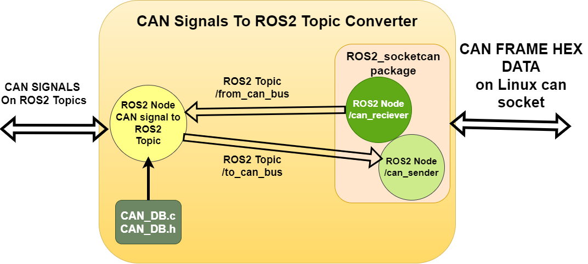
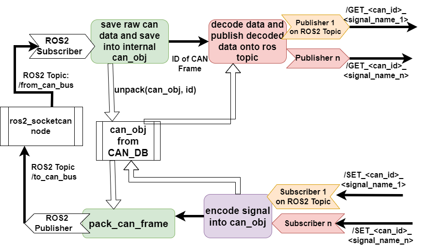

## Extend Hardware Interface and Low Level Software

This document aims to describe to process of how to extend the hardware interface and low level software.

Before starting to develop and adding code to the low level control software you need to first make sure you need to add something here.

If you;

- Want to add a new sensor to autonomous platform
- Want to process sensor information
- Want to design hardware specific interfaces (I.e specific to the electric gokart)

Then you are in the right spot!!

If not, take a look at `High_Level_Control_Computer` or `CAN_Nodes_Microcontroller_Code`, maybe you intended to add functionality there!

### Prerequisites

In order to start adding functionality it is recommended to have a basic understanding of:

- C++ OR Python development
- docker containers (How to start, stop, restart and configure)
- Linux - The container software environment is mainly navigated in through a terminal
- Robot Operating System 2
- CAN bus

Software wise, you need to have the following installed:

- docker
- git
- VSCode (recommended but any IDE may be suitable)

Hardware wise, it is recommended you have:

- Linux based x86 host computer

### How to Add New Functionality

First of all make sure you have read the general design principles document for autonomous platform located at `autonomous_platform/HOW_TO_EXTEND.md`. This document takes precedence over anything written in this document in order to unify the development process across all software layers.

This section is split up into two parts;

- [Software Functionality](<>)
- [Sensors](<>)
  - [USB Based Sensors](<>)
  - [Embedded Microcontroller Sensors](<>)

### Software functionality

If the sensor information already exists and you need to add new software functionality the general implementation steps are:

### Sensors

Sensors can be split up into two groups, sensors with a USB interface and sensors that require an embedded (microcontroller) interface. Integration of sensors that require them to be connected to the embedded ECU. How to add these on the ECU level is described in `CAN_Nodes_Microcontroller_Code/HOW_TO_EXTEND.md`.

### USB Based Sensors

If a sensors with a USB interface is to be added to autonomous platform then this can be done solely in `Hardware_Interface_Low_Level_Computer` without touching the embedded software. The general procedure would be.

1. Mount the sensor hardware on platform
1. Connect USB to AP4 USB hub.
1. Make sure new device is detected
1. Find suitable existing ROS2 package that fits the given sensor. (Hint: Google)
1. Add ROS2 package installation command into dockerfile
1. Manually start the ROS2 package and see if sensor data is outputted as expected (Hint: ros2 run ${package name} ${node name} OR ros2 launch ${package name} ${launch file name}). Look into package document to see what is available.
1. Configure parameters. Some packages require software to start with certain parameters, if so create a new ROS2 package and save the configuration parameters in this.
1. Configure package dependencies in order to access the downloaded package API
1. Create a launch file, in the newly created ROS2 package, add a launch directory and create a launch file to start the required ROS2 nodes for the USB sensor.
1. Add a `documentation_and_research` folder in the ROS2 package. Write down the steps taken and purpose with package. Document what you have done, if it works as expected etc...
1. Call the newly created launch file for the USB sensor in the main launch file for hardware platform `autonomous_platform\Hardware_Interface_Low_Level_Computer\ap4_hwi_code\ap4hwi_ws\src\launch_hwi_software_pkg\launch\launch_hwi_ros_software.launch.py`
1. Restart platform, everything should start as configured and new sensor information should be available on a topic.

### Embedded Microcontroller Sensors

Once these sensors have been implemented in the ECUs as embedded code and transmitted over the CAN bus network then some development needs to be done in the `Hardware_Interface_Low_Level_Computer` code in order to decode the CAN frame and make the sensor information available on a ROS2 topic.

Once raw CAN bus messages are sent over the CAN bus network and received in the hardware interface low level computer the messages needs to be processed. The general procedure for adding new CAN signals can be seen below:

#### Before you begin

Make sure that that the CAN bus message you want to decode is received over the CAN bus from an embedded ECU. On the Raspberry Pi 4b, perform a candump and analyze it. In a new terminal:

```bash
candump can0
```

The expected output would be similar to:

```bash
  can0  7D0   [8]  00 00 00 00 00 00 00 00
  can0  7D0   [8]  00 00 00 00 00 00 00 00
  can0  7D0   [8]  00 00 00 00 00 00 00 00
  can0  7D0   [8]  00 00 00 00 00 00 00 00
  can0  7D0   [8]  00 00 00 00 00 00 00 00
```

How to analyze; The candump is structured as follows. Each row is a separate CAN frame message consisting.

```bash
<can socket id in HEX format> <Frame ID> <length of CAN frame in Bytes> <Value of bytes in HEX>
```

Meaning;

- can0 : On which CAN socket the CAN bus frame was read from
- 7D0 : The Frame ID (specified in the CAN dbc file)
- \[8\] : Length of CAN frame.
- 00 00 00 00 00 00 00 00 : The data sent over CAN bus in HEX

If you see your frame ID that you just added in the embedded software you can continue. If not, go back and look into your newly developed embedded software. Make sure the data is sent as expected, either periodically or when a certain event is triggered. It is not trivial to read and understand the raw hex data, hence we need to programmatically decode this in order to use the data later on.

#### General procedure

A unified standard for the CAN Frames sent across the platform makes the flow of information more intuitive, signal names will have the same name in embedded SW as in ROS2 SW.

When adding a new CAN bus Frame/Message onto AP4 hardware interface there are a few steps to take:

HE: ???

<!-- 
1. **Edit the CAN database file** (.dbc) located at `CAN_Nodes_Microcontroller_Code\CAN_LIBRARY_DATABASE  
CAN_DB.dbc` can be opened using kvaser software. Write over the existing file. 
[Simple explanation of CAN dbc file.](https://www.autopi.io/blog/the-meaning-of-dbc-file/#:~:text=DBC%20files%20are%20basic%20text,(i.e.%2C%20CAN%20IDs).) Push to gitlab.  
Note: Editing the database with kvaser has only been tested on Windows 10. 

2. **Generate new CAN_DB.c/h files.**
On a linux host computer, pull down the latest CAN_DB.dbc file. 
Follow the procedure in `CAN_Nodes_Microcontroller_Code\CAN_LIBRARY_DATABASE` README file. Run the "create_database_from_dbc_script.sh". in a terminal.  
Expected output: CAN_DB.c/h in /src/ should be overwritten. (one can delete the existing CAN_DB.h / CAN_DB.c and re run the script to verify that it works)  
Push changes to gitlab.  
Note: Frame names / Signal names are generated according to a standard. Keep this in mind when trying to access a specific signal programmatically later on.
...<Frame_ID>_<Signal_name>...

3. **Create embedded software in ECU.**
See step by step documentation in `CAN_Nodes_Microcontroller_Code`
-->

4. **Update CAN HW Signal to ROS2 TOPIC converter** with new signals.\
   Meaning, update the code in can_msgs_to_ros2_topic_pkg. Located at:\
   `Hardware_Interface_Low_Level_Computer\ap4_hwi_code\ap4hwi_ws\src\can_msgs_to_ros2_topic_pkg\src\can_msgs_translator_interface.cpp`

To describe what does software does in short, this package spawns one ROS2 node which listens to / publishes to,  two topics /from_can_bus and /to_can_bus. These two topics come from the ros2_socketcan ROS2 library.

An illustration for the behavior can be seen in the two figures below:





So therefore, for every CAN signal, there has to be a ROS2 publisher and subscriber.

For every **NEW** CAN signal added in the CAN database file there are five actions which must be taken inside this source file. (can_msgs_translator_interface.cpp)

NOTE: Signal type is defined in DBC file, choose a suitable type in ROS2. (i.e if Signal in CAN dbc is defined as 8 bit integer, choose Int8 in ROS2). A reference for data type conversion standard between C++ and ROS can be found [here (2.1.1 Fieldtypes)](https://docs.ros.org/en/foxy/Concepts/About-ROS-Interfaces.html).

These ROS2 data types have to be included as message type headers in the top of the file before being able to be used. Example:

```c
#include "std_msgs/msg/string.hpp"
#include "std_msgs/msg/float64.hpp"
#include "std_msgs/msg/int8.hpp"
#include "std_msgs/msg/int16.hpp"
#include "std_msgs/msg/u_int8.hpp"
#include "std_msgs/msg/u_int16.hpp"
...
```

Below:

- \< FRAME ID > should be replaced with the frame ID specified in Kvaser in base 10.
- \<SIGNAL NAME> should be replaced with the signal name outputted into the DBC file from KVASER

The five steps are:

1. Add publisher and subscriber object definitions. (private variables)

Define the class object variables, publisher and subscribers, for EVERY new CAN signal added. Frame ID should be the CAN frame ID set in KVASER, and signal name should be the generated name in CAN_DB file.

```c
// Frame ID XXX publisher
    rclcpp::Publisher<std_msgs::msg::UInt16>::SharedPtr publisher_frame_<FRAME ID>_<SIGNAL NAME>_;

```

```c
// Frame ID XXX subscriber
    rclcpp::Subscription<std_msgs::msg::UInt16>::SharedPtr subscriber_frame_<FRAME ID>_<SIGNAL NAME>_;

```

2. Init publisher and subscriber objects inside class constructor TranslatorCANtoROS2Node()

```c
// Frame ID XXX publisher 
        publisher_frame_<FRAME ID>_<SIGNAL NAME>_ = this->create_publisher<std_msgs::msg::UInt16>("/GET_<FRAME ID>_<SIGNALA NAME>", 10);
```

Each subscriber will have a callback function, when a new ROS2 message is received on a topic and read by the Node, it will call this function to process the message sent over the topic. This definition will come later, as for now, follow the standard and add a callback function according to the naming standard.

```c
// Frame ID XXX subscriber
        subscriber_frame_<FRAME ID>_<SIGNAL NAME> = this->create_subscription<std_msgs::msg::UInt16>("/SET_<FRAME ID>_<SIGNAL NAME>", 10, std::bind(&TranslatorCANtoROS2Node::Callback_frame_<FRAME ID>_<SIGNAL NAME>, this, std::placeholders::_1));

```

3. Add to PublishIncomingDataOnRosTopics()

The switch case should be appended with a new case for every NEW FRAME added. The general idea is to publish every SIGNAL inside a frame onto a unique ROS2 topic, using the publisher objects created above. See the code for inspiration. The structure is the same for every frame. Remember to do this for every SIGNAL in a FRAME.

```c
  switch(frame_id)
        {
            case CAN_ID_REQUEST_HEARTBEAT:
            {
                /*
                publish every can signal contained in frame with id = 100
                */

                /* 
                General procedure for each signal in can frame 
                1: decode data into variable
                2: publish data
            
                */    
                uint64_t temp_data;
                decode_can_0x064_Sig_Req_Heartbeat(&can_storage_container, &temp_data);
                std_msgs::msg::Float64 send_data; 
                send_data.data = temp_data;
                publisher_frame_100_Req_Heartbeat_->publish(send_data);

                break;
            }

            case NEW_FRAME_ID:
            {
                ...
                break;
            }
        }

```

4. Create CALLBACK functions for every ROS2 subscriber.

Example:

```c
// Callbacks for signals in Frame with ID = 1000
    void Callback_frame_1000_Act_BreakVoltage(const std_msgs::msg::UInt16 msg)
    {
        encode_can_0x3e8_Act_BreakVoltage(&can_storage_container, msg.data);
        PublishCanFrameToCanNetwork(CAN_ID_SET_SPCU);
    }
```

```c
// Callbacks for signals in Frame with ID = 1000
    void Callback_<FRAME ID>_<SIGNAL NAME>(const std_msgs::msg::UInt16 msg)
    {
        encode_can_<FRAME ID>_<SIGNAL NAME>(&can_storage_container, msg.data);
        PublishCanFrameToCanNetwork(<FRAME ID>);
    }
```

For every new subscriber created in 1. Create a callback function with the general logic described above.

5. Build the ROS2 Software package.

To check that everything has been setup, try to compile the software. (whilst inside the docker container environment)

- Navigate to ap4hwi_ws directory
- source environment variables

```bash
source /opt/ros/humble/setup.bash
```

Build the ROS2 package

```bash
colcon build
```

Expected output; package built successfully, no errors.

If nothing else has been changed, push changes to git and pull on the Raspberry Pi 4 on the platform. Restart platform and system should be up and running.

#### How to verify that CAN messages are read and translates properly to a ROS2 topic

Make sure that the platform has the latest code version and that the packages can be built inside the docker container running on the Raspberry Pi 4b.

1. Start up the physical platform
1. Wait for system to boot up
1. Connect display to Raspberry Pi 4b
1. Enter the docker container

```bash
docker exec -it ap4hwi bash
```

Container NOT started? Look in `TEST_DEBUGGING.md` for solutions.

5. Enter correct directory and source environment variables

```bash
cd ap4hwi_ws
source install/setup.bash
ROS_DOMAIN_ID = 1
```

6. Look at what ROS2 topics are available

```bash
ros2 topic list
```

Are there no topics available? Look in `TEST_DEBUGGING.md` for solutions.

In the terminal your newly added ROS2 topic should show up (along with many other topics)

```bash
...
/GET_<FRAME_ID>_<SIGNAL_NAME>
/SET_<FRAME_ID>_<SIGNAL_NAME>
...
```

The information sent over the newly topic can be listen to in the terminal

```bash
ros2 topic echo /GET_<FRAME_ID>_<SIGNAL_NAME>
```
