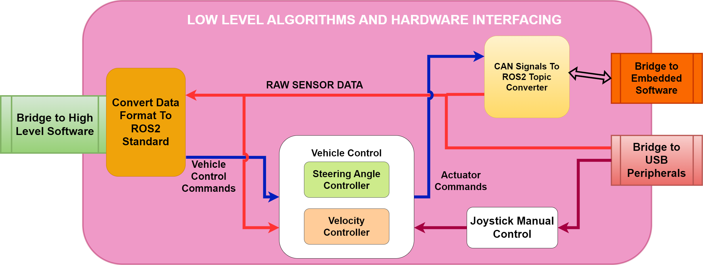
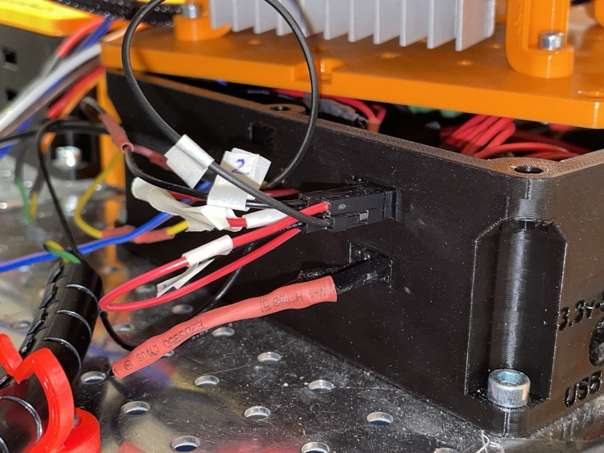
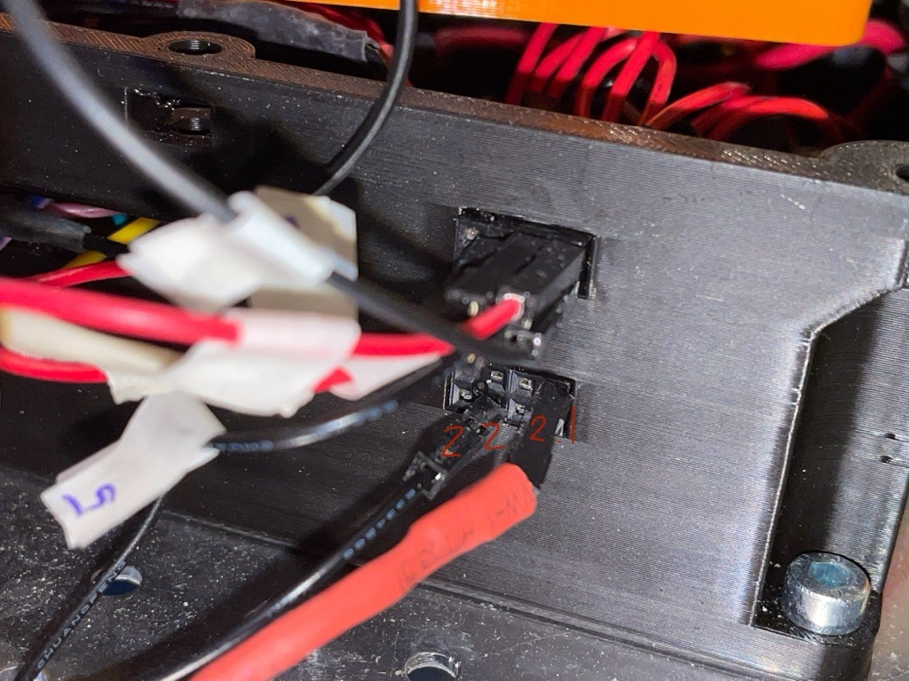
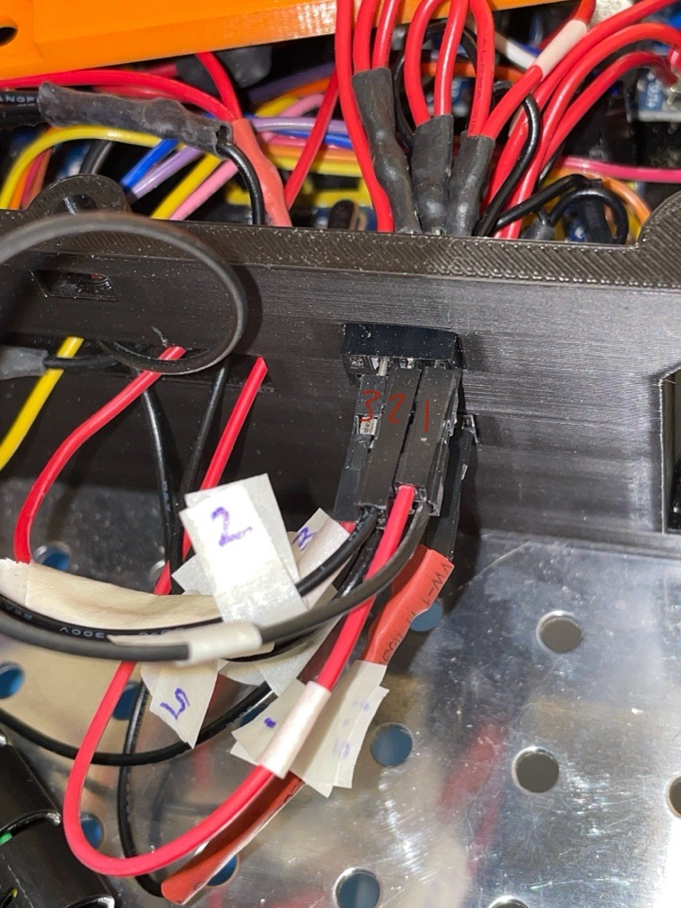
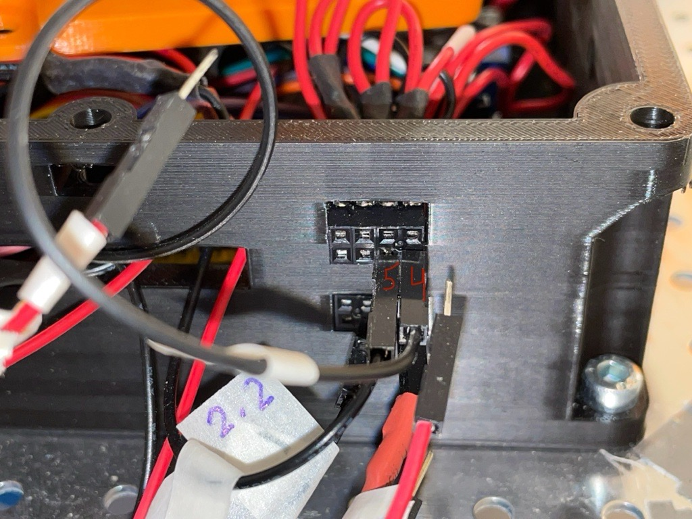

# Low-level Control & Hardware

## Introduction

This directory contains the software stack running on the Raspberry Pi 4b mounted to the hardware platform. It also aims to describe how each software component is designed / implemented.

In summary, the Low-level Control & Hardware Interface SW & HW is Hardware specific. It shall be run on the platform, connected to the embedded SW, CAN busses etc. It works as a bridge between high-level control software and the embedded ECU code which controls actuators / reads sensor data.

Below an illustration of the low level and hardware interfacing software can be seen.

The software itself is implemented using the ROS2 framework, this software is then run inside a docker container. It is only meant to run on the Raspberry Pi 4b mounted onto autonomous platform and is very hardware specific.

In the diagram above, four ROS2 packages are illustrated as rounded rectangles. These are;

## CAN Signals To ROS2 Topic Converter

This is a custom made ROS2 package made spring 2023. The purpose of it is to be a software translation of the CAN bus data from the embedded software layer to useful information available on ROS2 topics.

This abstracts the transfer of information between low level software and embedded software running on ECUs in the CAN network.

It uses the unified CAN bus database file (.dbc) for autonomous platform in order to decode the information sent on the CAN network. This database file is located at `autonomous_platform\CAN_Nodes_Microcontroller_Code\CAN_LIBRARY_DATABASE\CAN_DB.dbc`. A custom application is then written that maps a specific CAN signal onto a specific ROS2 topic. This means that every data signal sent over the CAN network can be used in algorithms located in the hardware interface and low level software. In the same way, ROS2 topics can be used to set the value of certain signals, meaning commands can be sent from the hardware interface and low level software to the various ECUs mounted onto autonomous platform.

### Vehicle Control

This is a custom made ROS2 package to control the steering angle and velocity of the hardware on a low level. It receives a desired velocity and steering angle on the `/cmd_vel` ROS2 topic and uses a controller gain to scale the values. The values have to be processed and rescaled in order for the embedded ECUs to actuate correctly.

I.e to control the velocity, the embedded software in the SPCU expects a desired voltage to be sent on the CAN bus. Therefore the desired velocity needs to be converted into a desired voltage that should be applied on the accelerator pedal.

**More advanced control behavior can be implemented later on, I.e some sort of feedback from the velocity sensors. As of now it is open loop controlled**

### Joystick Manual Control

This is a set of ROS2 packages which enables a joystick to be connected to autonomous platform. The output will be in the form of a velocity commands on the `/cmd_vel` ROS2 topic. This output can then be read in vehicle control to control the gokart.

### Convert Data Format To ROS2 Standard

**This is not implemented yet for every data input**

The software layer connected to the hardware interfacing software layer expects input and output to be on specific ROS2 topics and uses standard ROS2 interfaces. I.e velocity commands to the platform will come to the hardware interfacing and low level software on the topic `/cmd_vel`, it is then up to this ROS2 package to convert it to a format which the lower level algorithms can use.

This can be as an abstraction layer.

The rectangular squares in the diagram above can be seen as input and outputs to the hardware interface and low level software layer. Higher level commands to the platform will come from the high level software. In the same way, this software layer will interface with the CAN network and USB peripherals for input and output.

### Low-Level Control & Hardware Interface - Software / Hardware Requirements 

In terms of hardware, the low-level control software and hardware interfacing software is run on a Raspberry Pi 4b 4Gb. A RS485 CAN hat has been installed onto the GPIO pins. Power (5V,3A) is supplied from the platform using an LM2596 DC-DC converter to step down the platforms 12V power supply to 5V. A 32GB micro SD card is all the storage available. The hardware should be connected to the CAN network on Autonomous Platform Generation 4 (DB9 Connector) and to the wifi router/switch through an ethernet cable.

- [Raspberry Pi 4b Specifications](https://www.raspberrypi.com/products/raspberry-pi-4-model-b/specifications/)
- [RS485 CAN HAT Specifications](https://www.waveshare.com/w/upload/2/29/RS485-CAN-HAT-user-manuakl-en.pdf)
- [LM2596 Specifications](https://www.ti.com/lit/ds/symlink/lm2596.pdf)

Software wise, it uses a base installation of Ubuntu 22.04. A detailed guide on how to setup the software on a new fresh Raspberry Pi 4b can be found [here](#Installing-Base-Software-on-Fresh-Raspberry-Pi-4b).

When developing code for the low-level software it is possible to open the low-level software docker container on any linux based computer. It can be useful to have access to a proper IDE and not have to write code in notepad. Note: the CAN bus interfacing libraries will throw errors due to not being connected hardware wise. But once software compiles changes can be pushed and then pulled to the raspberry pi 4b.

### USB Devices Connected

There exists a USB hub mounted to the autonomous platform. This is connected to the Raspberry Pi 4b.

The following devices are connected

- Wireless keyboard and mouse
- Xbox Wireless Adapter

**Currently the USB hub is not mounted**

### Interfacing With Embedded ECUs 

The hardware interface and low level software can communicate with the embedded ECUs. Physically this is done through a Controller Area Network (CAN) bus with a D-Sub 9 connector. Software wise, a custom solution has been implemented for autonomous platform. The data sent over the CAN bus needs to be available on ROS2 topics in order for ROS2 nodes to be able to use the data in computations. In the same way, actuator commands sent from ROS2 nodes on ROS2 topics need to be sent to the ECUs over CAN.

The CAN frames sent over the CAN network must be encoded and decoded correctly and in the same way on both the hardware interface and embedded ECUs. Therefore a unified CAN database file has been constructed for autonomous platform . A helper library is used to convert the CAN database file into a set of C-style data structures.

Two custom made libraries have then been implemented, one in the embedded software and one in ROS2 in hardware interface and low level software.

How to extend this functionality with new CAN frames and signals is explained in detail in `Hardware_Interface_Low_Level_Computer\HOW_TO_EXTEND.md`. (The parts that are relevant to change in hardware interface and low level software is documented here). How to extended the software for the embedded ECUs is described in `CAN_Nodes_Microcontroller_Code\HOW_TO_EXTEND.md`.

### Interfacing with High Level Control Software 

The hardware interface and low level software can communicate with the high level control software running on an external computer. (I.e linux laptop- or intel NUC) This is done through an ethernet communication. A Wifi router is mounted to autonomous platform which means this can be done wirelessly.

Once an ethernet connection has been established, the two distinct ROS2 software networks (one on raspberry pi and one one on laptop) will be able to detect each other. This means that the two smaller ROS2 networks of nodes will become one large network with distributed computing power.

Network SSID and password is noted down in main `README.md` file of repository.

An important note, the ROS_DOMAIN_ID has to be configured to the value of 1 on both ROS2 networks.

### Adding New Functionalities 

How to add new functionality to the hardware interfacing software and low level algorithms is explained in `Hardware_Interface_Low_Level_Computer\HOW_TO_EXTEND.md`.

### Automatic Startup of Software 

Once the Raspberry Pi 4b boots up it will automatically start the hardware interfacing and low level algorithm software. This is done using linux services that run on boot-up which in turn call the script "testing.bash".

If you need to change what is done during boot-up, edit the `testing.bash` script.

If the software does not automatically start, see **Software container not started?** in  `TEST_DEBUGGING.md` located in this directory.

### Installing Base Software on Fresh Raspberry Pi 4b 

See section in `SETUP_OF_RASPBERRY_PI.md`

## Wiring

The ECU controlling the steering consists of a lot of loose cables connected with Dupont connectors. These cables should be extended since they now are very short and connected in a better way to avoid loosing the control over the gokart while driving. If the cables would come loose they have been marked with a number between 1-5 for the upper ones and 2.1-2.2 for the lower ones which can be seen in the following figures.

