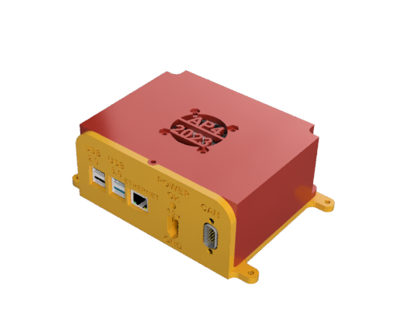
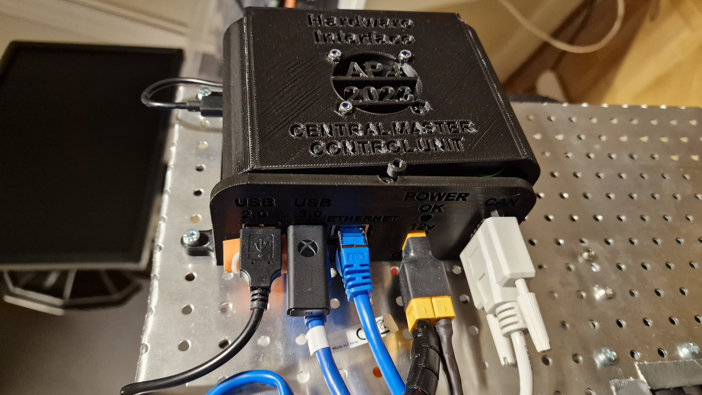

## Setup Hardware Interface Low Level Code (Raspberry Pi)

This document aims to describe how to configure a fresh Raspberry Pi to run the low level software on the autonomous platform.

In theory this should not have to be done again as the raspberry pi mounted on the platform is already configured. But this document can be useful for future reference if the raspberry pi decides to die.
The end result of following this document should look something like:






### Required Hardware

This is the required hardware to get the hardware interface low level computer up and running from scratch.

**Components to buy:**

- Raspberry Pi 4b [Link to purchase](https://www.webhallen.com/se/product/358177-Raspberry-Pi-4-Starter-Kit-4-GB?channable=0131c3696400333538313737fa&gclid=CjwKCAjwoqGnBhAcEiwAwK-OkR7Kb7OAyCWfNSrVWeYGPSvvuk2D-oU-9344fEnozMqV5NG7pTxzBxoCyawQAvD_BwE) Recommended 4 or 8 GB RAM version.
- Micro SD card from reputable brand. Minimum recommended size 32GB. 64 is recommended.
- RS485 CAN hat [Link](https://www.amazon.se/CAN-kontroll-SPI-gr%C3%A4nssnitt-s%C3%A4ndtagare-SN65HVD230-l%C3%A5ngdistanskommunikation/dp/B09JKJCMHN/ref=asc_df_B09JKJCMHN/?tag=shpngadsglede-21&linkCode=df0&hvadid=599309679274&hvpos=&hvnetw=g&hvrand=10497608513565125136&hvpone=&hvptwo=&hvqmt=&hvdev=c&hvdvcmdl=&hvlocint=&hvlocphy=1012511&hvtargid=pla-1650294466241&psc=1)
- Mini-HDMI to HDMI M-M cable
- LM2596 DC-DC converter
- 40x40x10 12v fan
- XT60 female connector
- DB9 Female connector
- Biltema fuse holder
- 3 A mini fuse
- USB C cable to slice
- M3 nut and bolts
- M4 nut and bolts

**Components to 3D print:**

- Top
- Bottom
- XT60 holder

A computer that can flash a micro sd card is required.

### Installing Base Software on Fresh Raspberry Pi 4b <a name="Installing-Base-Software-on-Fresh-Raspberry-Pi-4b"></a>

- Raspberry Pi 4b, 32 GB micro SD card
- Download Raspberry pi imager v1.7.3 and select Ubuntu 22.04
- Insert micro SD card (recommended minimum size 32gb)
- Connect display cable, mouse, keyboard
- Plug in power - Raspberry Pi should boot up
- Follow the standard linux installation process presented on screen
- Raspberry pi system configuration
- Name: ap4-hardware-interface
- Computer Name ap4-hw-interface-rpi4
- Username: find it in the main README.md
- Password: find it in the main README.md

Now you can install any new software updates

```bash
sudo apt-get update && sudo apt-get upgrade
```

Restart Raspberry Pi. Can bus hardware setup can be found in
`autonomous_platform\Documentation\Raspberry_Pi_canbuss_research` directory.

The canbuss communication socket speed can be set using (has to done once every boot-up) (is currently done automatically in startup script)

```bash
sudo apt install can-utils
```

```bash
sudo ip link set can0 up type can bitrate 1000000
```

Docker [installationsguide](https://www.ricmedia.com/tutorials/install-docker-on-raspberry-pi-with-ubuntu)

Install can-utils

```bash
sudo apt-get update && sudo apt-get upgrade
```

### Install GPIO library on raspberry pi running ubuntu

If running a ubuntu distribution on raspberry pi, make sure libraries for controlling the gpio are installed.

```bash
sudo apt install python3-lgpio
```

### Install can-utils library

In order for linux to be able to handle can messages, install can uttils

```bash
sudo apt-get install can-utils
```

### Raspberry pi 4 configuration

There are some software configurations to do in order to enable a can interface using the mcp2515 board. Once configured, the can0 should show up as an available interface when using the command 'ifconfig'

Here is a guide we follow in order to do so: https://www.youtube.com/watch?v=fXiOIUZtV10 and here is a different guide in written format https://harrisonsand.com/posts/can-on-the-raspberry-pi/

The MCP2515 module we have is has a clock of 8 Mhz. This is important because it may vary depending on supplier. (The clock frequency should be printed on the clock module on the mcp2515.)

Here is the procedure as described more in detail in the above resources:

1. Update the system

```bash
sudo apt-get update
sudo apt-get upgrade
```

2. Enable SPI bus and load kernel modules:

Using nano editor

With a raspberry pi 4 running on ubuntu 22.04 this file was located at /boot/firmware/config.txt

hence the command becomes

```bash
sudo nano /boot/firmware/config.txt
```

In this file, append, where 12000000 is the clock frequency of the RS485 hat

```bash
dtparam=spi=on
dtoverlay=mcp2515-can0,oscillator=12000000,interrupt=25 
dtoverlay=spi-bcm2835-overlay
```

3. Reboot raspberry pi

If everything is setup as it should, running the following command should not throw an error

```bash
ifconfig can0
```

### Setting the CAN speed

The canbuss communication speed can be set using

```bash
sudo ip link set can0 up type can bitrate 125000
```

Where 125000 is the speed of the connected canbuss

### Fixing problems with GPIO pins on raspberry Pi

The MCP2515 CAN controller and the TJCxxx tranciever can operate at different voltages. (But are mounted on the same board refered to as MCP2515)

Raspberry Pi GPIO pins are ONLY 3.3V tolerant, meaning the MCP2515 board had to be modified in order for the logic signals from the card to be understood by the raspberry pi. The CAN tranciever MUST be powered from 5V since the CAN is a 5V network.

### Setting up automatic start of software upon boot-up

It is very useful for the software running on the raspberry pi 4b to start when booting up.

This can be done using linux services. The service will call a bash script "testing.bash" located in this directory.

The full procedure can be read [here](https://www.shubhamdipt.com/blog/how-to-create-a-systemd-service-in-linux/).

The steps are summarized below.

in /etc/systemd/system add a new service file. Name it:

```bash
startup_lowlevel.service
```

With the following contents:

```bash
[Unit]
Description=description about this service
After=network.target
StartLimitIntervalSec=0

 
[Service]
Type=oneshot
User=root
WorkingDirectory=/home/ap4/Desktop/GIT/autonomous_platform/Hardware_Interface_Low_Level_Computer
ExecStart=/home/ap4/Desktop/GIT/autonomous_platform/Hardware_Interface_Low_Level_Computer/testing.bash

[Install]
WantedBy=multi-user.target
```

Reload linux service file to include the newly created service.

```bash
sudo systemctl daemon-reload
```

Start the newly created service

```bash
sudo systemctl start startup_lowlevel.service
```

To enable the service to run on boot, enter

```bash
sudo systemctl enable startup_lowlevel.service
```

The status of the service can be observed using

```bash
sudo systemctl status startup_lowlevel.service
```

After this the bash script will execute upon boot-up. And the docker container will always run on startup.

### Testing and debugging (system level)

Here is a list of things to test and verify

- Does it receive CAN messages?
- Can the docker container be started
- Does the docker container start automatically on boot-up?
- Can raspberry pi 4 be pinged from a computer on the same network?

verify that CAN works expected

## Testing and verifying basic functionality

The Raspberry Pi was set up as a CAN sniffer onto the Infotiv CAN lab kit (CAN Education course - Excersise 2). First the kit was setup to run exercise 2 and send temperature over the can bus. The two nodes could send and eceive. Thereafter the raspberry pi was connected onto the CAN bus.\
Some errors occurred such as:

- Make sure the CAN speed is set up right
- The oscillator frequency is set to 8Mhz (NOT 20!!)
- Common ground over the complete CAN system, (GND was connected from lab kit to rasberry pi)
