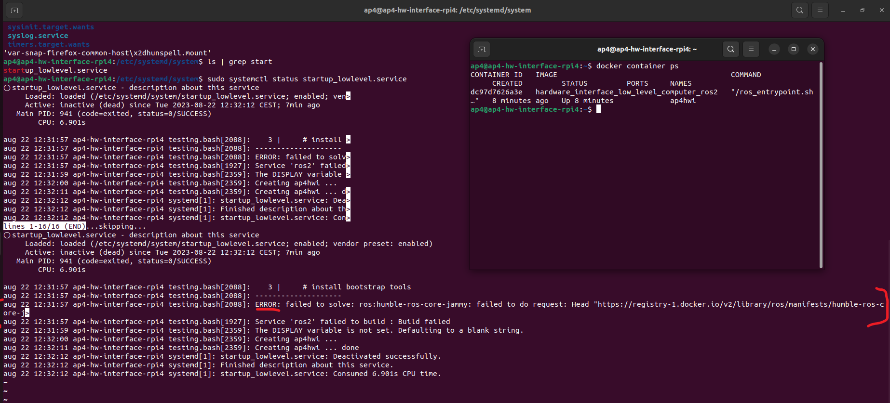

## Test and Debugging of Hardware Interface Low Level Computer

This document aims to describe how to test and debugg the low level software if any error occours. If you stumble upon a new error which has been been described below, please add it to the documentation and how you resovled it. It will help future project members.

### Raspberry Pi 4b Bootup failed

The Raspberry Pi 4b can fail to boot-up if there are corrupted files on the micro SD card or if the micro SD card has run out of empty storage. The docker temporary files can grow very large in size.

This is a known issue and is noted down in `ISSUES_AND_FUTURE_WORK.md`.

Connect a display, mouse and keyboard and resolve issues presented in terminal. You probably have to clean something in the filesystem.

If this fails, there is a backup micro SD card containing a copy of the system availible [here](https://infotiv.sharepoint.com/sites/AutonomousPlatform/Delade%20dokument/Forms/AllItems.aspx?id=%2Fsites%2FAutonomousPlatform%2FDelade%20dokument%2FGeneral%2FBackups&viewid=dfe2fcef%2Dde52%2D4cb2%2D9cb5%2Da3f10ac871e4) for download. Make sure you have permission to access this project on Infotiv sharepoint. If this does not work, the procedure of setting up a fresh Raspberry Pi 4b is described in `SETUP_OF_RASPBERRY_PI.md` located in this directory.

### Software container not started?

Has the Raspberry Pi 4b booted up without automatically starting the low level software docker container?

There could be several causes for this, some of them are;

- Linux startup service did not run during boot-up
- docker container could not be built due to;
  - Lack of Internet connection
  - Errors in dockerfile configuration
- Corrupted files on micro SD card.

First, check if the container is running or not using the following command.

```bash
docker container ps
```

If the docker container is running, the expected output would be:

```bash
CONTAINER ID   IMAGE COMMAND CREATED STATUS PORTS NAMES

xxxx   hardware_interface_low_level_computer_ros2   xxxx   10 seconds ago   Up 10 seconds             ap4hwi
```

If the docker container is not running there could be two causes:

- The container is still being built (Can take up to 10 minutes when building from scratch)
- The container failed to build

Either of these alternatives can be verified by looking at the status of the startup service.
In a terminal check the status of the serive.

```bash
sudo systemctl status startup_lowlevel.service
```

output:


In the terminal it would explicity say if something has failed and the service did not start properly. It will also explain exactly what failed. Note that it says ERROR in the screenshot above. Something is therefore wrong! Resolve any issues if present and reboot Raspberry Pi 4b.

### No ROS2 topic shows in terminal

The following command shall display what topics are active on the ROS2 network.

```bash
ros2 topic list
```

The expected output would be similar to:

This section describes how to troubleshoot no topic showing up at all. If some topics show up but not the one you expected, look at `ROS2 Node did not start when starting container` section in this documentation file.

Firstly, make sure you have configured the ROS_DOMAIN_ID environemnt variable

```bash
export ROS_DOMAIN_ID=1
```

If no ROS2 topic still doesn't show up

### ROS2 Node did not start when starting container

First make sure that only a specific node does not start up, if other nodes have started up but not the one you are looking for you need to look in the launch file that starts up the hardware interface software.

Make sure it is configured to automatically start by looking in the launch hwi software package `autonomous_platform\Hardware_Interface_Low_Level_Computer\ap4_hwi_code\ap4hwi_ws\src\launch_hwi_software_pkg\launch`
