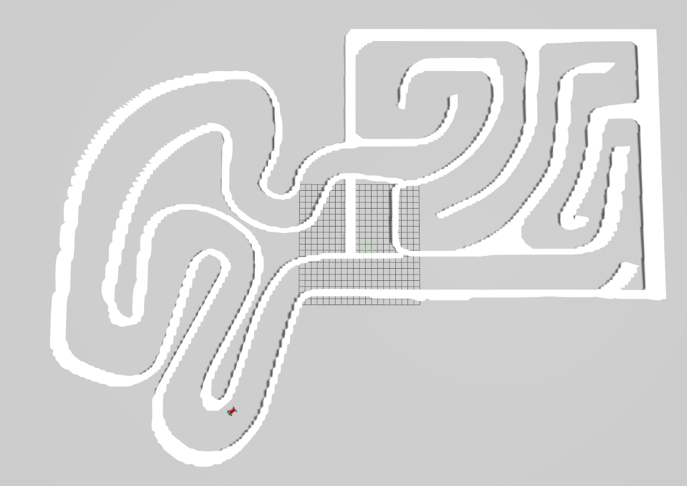
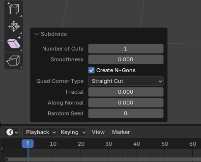
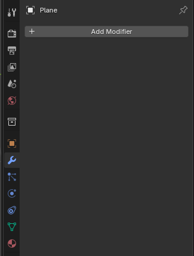

### Digital Twin

<a name="Digital-Twin"></a>
A simplified digital twin has been implemented as of August 2023. This digital twin were improved in march of 2025.

An important part of the high level software control is the digital twin. It is a completely different component then the autonomous driving stack and should be agnostic to what AD stack is used. This means that any AD stack should be able to be tested on the digital twin. This is accomplished by using standard ROS2 topics as interfaces as briefly described in the previous section. Inputs to the digital twin would be sent over the `/cmd_vel` ROS2 topic, in the same way outputs (vehicle state and sensor readings) would be sent from the digital twin simulation over standard ROS2 topics. I.e "/odom" for vehicle state.

As of August 2023 the digital twin is run using the Gazebo Physics Simulator. [Link official gazebo documentation.](https://gazebosim.org/docs) It is a software that integrates seamlessly with ROS2 and has been used for a long time to simulate robots in complex environments.

In March 2025 the digital twin were improved and Gazebo Classic was changed to Gazebo Ignition Fortress in order to keep the software updated during Gazebo and Ros 2 updates. In addition to that a replica of the GoKart track at Gokartcentralen in Kungälv were created as a Gazebo world to allow "Real life" AD algorithm testing in the simulation.

The code structure for the digital twin is as follows:
A ROS2 package has been created, autonomous_platform_robot_description_pkg, which contains the digital twin.

```
 ┣  High_Level_Control_Computer
 ┃ ┣  ap4_hlc_code
 ┃ ┃ ┗  ap4hlc_ws
 ┃ ┃   ┗  src
 ┃ ┃      ┗  autonomous_platform_robot_description_pkg
 ┃ ┃         ┣  config
 ┃ ┃         ┣  launch
 ┃ ┃         ┣  maps
 ┃ ┃         ┣  rviz
 ┃ ┃         ┣  src
 ┃ ┃         ┃  ┗ description
 ┃ ┃         ┃     ┣  ap4_robot_description.urdf.xacro
 ┃ ┃         ┃     ┣  control_simple_digital_twin.xacro
 ┃ ┃         ┃     ┣  simple_digital_twin.urdf.xacro   
 ┃ ┃         ┃     ┣  lidar.xacro                
 ┃ ┃         ┃     ┗  inertia_macros.xacro
 ┃ ┃         ┗  worlds
 ┃ ┃
 ┃ ┣   Dockerfile
 ┃ ┣   docker-compose.yaml
 ┃ ┗   README.md <-- You Are Here !!!
```

### Design Of Digital Twin

The digital twin of autonomous platform is created using Universal Robot Description Files (URDF) and xacro files. The digital twin is described in an xml type format and are located in `autonomous_platform\High_Level_Control_Computer\ap4_hlc_code\ap4hlc_ws\src\autonomous_platform_robot_description_pkg\src\description\`.

These files describe everything from the physical platform properties to what sensors are simulated. How the platform is controlled can also be configured. The end result can be seen below, a simplified gokart platform with wheels that can be controlled.


### Sensor plugins

An important aspect of using Gazebo is the concept of plugins. Plugins allows for new functionality to be added to the digital twin. For example different vehicle movement controllers or virtual sensors.

As of August 2023 no sensors have yet to be added. Future sensors to add could be:

- [Camera](https://classic.gazebosim.org/tutorials?tut=ros_gzplugins)
- [Lidar](https://classic.gazebosim.org/tutorials?tut=ros_gzplugins)
- [Radar](https://classic.gazebosim.org/tutorials?tut=ros_gzplugins)
- [IMU](https://classic.gazebosim.org/tutorials?tut=ros_gzplugins)
- [Ultrasonic short range sensor](https://classic.gazebosim.org/tutorials?tut=ros_gzplugins)

In 2025 a Lidar was implemented to the Gokart digital twin using the Gazebo Ignition fortress plugin for Lidar.

### Gazebo worlds

In the same way as the digital twin could be configured, the simulated environment itself can be configured. This allows a developer to create interesting scenarios in which to place the autonomous platform.

Worlds can be created using the Gazebo graphical application and saved into the `worlds` directory. The digital twin can be configured to start in a specific world by configuring the launch file located in `launch` directory.

In 2025 a replica of the gokartcentralen track for Gazebo was created and added to the `worlds` directory.



### Software Control Switch

<a name="Software-Control-Switch"></a>

The idea of having a software control switch is for the autonomous driving stack algorithms to EITHER control the physical platform or the digital twin. And be able to switch seamlessly between them. The autonomous driving stacks could be quickly tested on a digital twin to make development faster and when the algorithms are in a mature state they could be tested on the physical platform.

It is therefore very important that the digital twin and physical platform have the same output (sensor readings / vehicle state). I.e on the same ROS2 topics. In the same way, the digital twin and the physical platform should be controlled in the same way in the high control software on `/cmd_vel` topic.

For future reference this switching of control could be actualized using [namespaces](https://docs.ros.org/en/foxy/Tutorials/Intermediate/Launch/Using-ROS2-Launch-For-Large-Projects.html#namespaces) or configuring different [ROS2 domain IDs](https://docs.ros.org/en/foxy/Concepts/About-Domain-ID.html). By setting the ROS2 DOMAIN ID for the AD nodes to the same ID as the physical platform commands would be forwarded to the low level software control. And by setting a different domain one could ensure that the commands are only sent between the digital twin and AD algorithms. ROS_DOMAIN_ID is specifically developed to prevent cross talk between different domains.

### Digital Twin Software Package Structure

The software for the digital twin is located in `autonomous_platform_robot_description_pkg`. Below follows a quick guide on what each subdirectory contains:

- config - Contains config files for Nav2, SLAM and the gazebo-ros bridge
- launch - Contains launch files
- rviz - Contains a parameter file which can be inserted into Rviz to show useful information upon startup
- worlds - save gazebo simulation environments (worlds) to be run later.
- maps - Contains maps for the simulation in order to get Nav2 to work
- /src/description: Contains the xacro and urdf files which describes how the digital twin is built up.

The launch file launch_digital_twin_simulation.launch.py launches the following nodes

- robot_state_publisher
- Rviz
- gazebo_node
- spawn_entity_node
- Nav2 node
- Slam_toolbox

The robot state publisher node, takes the robot description files and broadcasts them over the ROS2 network. The Gazebo physics simulator is then launched with a corresponding ROS2 node. A spawn entity node is created, which spawns the digital twin inside the gazebo simulation using the information on the robot state publisher information topic. The Nav2 and slam_toolbox node allows the digital twin to navigate autonomously around the world and avoiding obstacles.

The digital twin is defined inside the description folder, it is built in modules with the ap4_robot_description.urdf as a base. Onto this base. The simple_digital_twin.urdf.xacro describes the kinematics and dynamics of AP4. control_simple_digital_twin.xacro describes how an ackermann drive plugin is used to control the joints of AP4 and lidar.xacro describs the Lidar and import the Lidar Gazebo plugin in order to use it in the simulation.

Future sensors, such as the camera, should be added as xacro modules and included in the ap4_robot_description.urdf file.

### How to Connect to Physical Platform

<a name="How-to-Connect-to-Physical-Platform"></a>

The high-level control software is meant to be run in two modes; connected to the autonomous platform and completely detached.

The long term goal is that the high level control software should be able to interface with the low level control software running on the Raspberry Pi 4b. This is done through an ethernet connection, meaning it could be done both wirelessly and by wire. The two docker containers for high level software and low level software should therefore be started from devices located on the same network.

In 2025 this were achieved by doing the following steps.

- Connect the development laptop to the AP4-ROUTER_2.4Ghz network (Or make sure that the development laptop and the Raspberry Pi are connected to the same network). ssid and pw credentials can be found in root directory README file.
- Make sure the two docker containers are started
- Make sure high level software is running on ROS_DOMAIN_ID=1

This should be sufficient for the underlying ROS2 Data Distribution Service (DDS) to find ROS2 nodes available on the same network and same ROS_DOMAIN_ID.

### How to verify

If any error occurs, `TEST_DEBUGGING.md`, for troubleshooting.

### High Level Control Underlying Software Components <a name="High-Level-Control-Underlying-Software-Components"></a>

This section will describe what software components are used to construct the high level software and how they are used.

### Containerization <a name="Containerization]"></a>

An overview of containerization and how it works is explained in `SOFTWARE_DESIGN.md` located in root directory.

Note: Docker can be run on Windows, but certain commands/parameters used on AP4 are linux specific. I.e passing graphics to and from the container. It is has therefore only been tested and guaranteed to work on linux host computers.

Docker enables software to be collected and run from a virtual environment, similar to a virtual machine but with much less performance overhead compared to a virtual machine. Docker allows the virtual environment to be configured, i.e what operating system should be run and what software should be installed.

The environment in which the high level software is run in is described inside the `Dockerfile` located in this directory. In this file the virtual environment is configured as a base version of Ubuntu 22.04 with relevant linux packages installed. Robot Operating System 2 - Humble is installed.

The container is started using a set of configuration parameters, these are located in `docker-compose.yaml` in this directory. Configuration parameters can be for example to pass through graphical elements from the container to the host computer desktop.

### Robot Operating System 2 (ROS2) <a name="Robot-Operating-System-2-(ROS2)"></a>

Robot Operating System 2 (ROS2) is a framework / middleware developed to create very complex robotic software. This framework is used to split up computations into separate executions using "nodes".

For an in depth explanation of Robot Operating System 2 (ROS2) and how it works see `SOFTWARE_DESIGN.md` in root directory.

The following subsection will describe how the high level software control is designed using the Robot Operating System Framework.

The idea with using ROS2 framework is that computational applications can be split up into smaller components that perform very specific tasks. I.e software related to taking a joystick input and outputting a desired velocity should have the minimum amount of dependencies as possible and not break any other dependencies for other software applications.

ROS2 package has to be created for this functionality. A package collects all the resources and dependency configurations for a specific function. I.e the package for the digital twin `autonomous_platform_robot_description_pkg` should be as standalone as possible. When adding future functionality, the digital twin package should be left as is, and instead a new package for the new specific functionality should be added.

### Add python librarys to ROS

To add a new python library to ROS the file `package.xml` needs to be changed.

1. Find the rosdep keys for the library you want in (https://github.com/ros/rosdistro/blob/master/rosdep/python.yaml) or look at (https://docs.ros.org/en/humble/Tutorials/Intermediate/Rosdep.html) for more options.

1. Add the key to `package.xml`

1. Start the docker container and enter ap4hlc_ws folder (Follow How To Start)

1. If this is the first time using rosdep, it must be initialized via:

```bash
sudo rosdep init
rosdep update
```

This will initialize rosdep and update will update the locally cached rosdistro index. It is a good idea to update rosdep on occasion to get the latest index.

4. Update the repository:

```bash
sudo apt-get update
```

5. Finally, we can run `rosdep install` to install dependencies. Typically, this is run over a workspace with many packages in a single call to install all dependencies. A call for that would appear as the following, if in the root of the workspace with directory src containing source code.

```bash
rosdep install --from-paths src -y --ignore-src
```

`--from-paths src` specifies the path to check for `package.xml` files to resolve keys for. In our case for High level control:

```bash
rosdep install --from-paths src/autonomous_platform_robot_description_pkg -y --ignore-src
```

### Make your custom world from a bird view image for Gazebo using Blender

To generate and create a custom world from an image for Gazebo, Blender is a greate choice to use since it can more or less do the whole map for you.

Example of creating a Gazebo world of the GokartCentralen track:

1. Download and open Blender

1. Delete the default box in the Blender workspace

1. On the topbar to the left, click Add-> Mesh-> Plane


4. Click on the plane and change the scale as you want it to the right in the plane configuration menu

1. Click on TAB to enter Edit-Mode and right click in the plane. In the popup menu select Subdivide. Now a small bar appears in the bottom left corner. Click on that and change "Number of Cuts" to 100, then press enter.



6. Do step 5 again but change "Number of Cuts" to 3 instead.

Now your plane should have a fine mesh built of small squares.

7. Press TAB to enter Object Mode again.

1. Navigate to the right plane menu and click on the wrench icon(Modifiers)-> Add Modifier-> Deform-> Displace



9. Now click on the icon that looks like a grid(Texture) in the plane menu-> New-> Open


10. Open the image you want to make a map of. In this case the image over the GokartCentralen track.

01. Now go back to the wrench icon in the menu and change the value of Strength to adjust the height of the walls for your map.

01. When your map looks good and you are done with the settings, click on file-> Export-> Wavefront (.obj)

01. Your map is done and saved. Now you can include this .obj file in your sdf world file for Gazebo!

## Important notes:

- Make sure to remove any text and other non relevant graphics on your map image before open it in Blender
- Make sure that there is only two colours in the image, i.e. the background colour and the wall colour. If you don't have the exact same colour code for the background and the walls, Blender will do different actions for each colour and the map will not be as you want it. So make sure to have one specific colour for the background, and one for the walls.

### Navigate the digital twin autonomously around the gokart track

To navigate the gokart digital twin autonomously around the gokart track (the gazebo world that has been generated using Blender) we are using the ros2 package nav2 which allows you to get the gokart to follow a waypoints and avoiding obstacles on the track (walls) using data from the Lidar with slam_toolbox.

1. Enter the HLC directory in the terminal

```bash
cd Desktop/autonomous_platform/High_Level_Control_Computer
```

2. Start the Docker container by running

```bash
docker-compose up -d
```

3. In the same terminal enter the Docker container by running

```bash
docker exec -it ap4hlc /bin/bash
```

4. Now inside the docker enter your workspace and source your workspace

```bash
cd cd ap4hlc_ws
```

```bash
source install/setup.bash
```

5. To give the docker permission to use your display, run this command in another terminal outside the docker.

```bash
xhost +local:root
```

6. To start the digital twin simulation with autonomous drive, run this command in the docker terminal.

```bash
ros2 launch autonomous_platform_robot_description_pkg launch_robot_simulation.launch.py
```

Now the software should start and you should see the GoKart spawn in Rviz and Gazebo.

To start the navigation press 2D Goal Pose and choose a goal position in the upper right corner of the gray area.

The Gokart should now move autonomously around the gokart track!

DONE!
