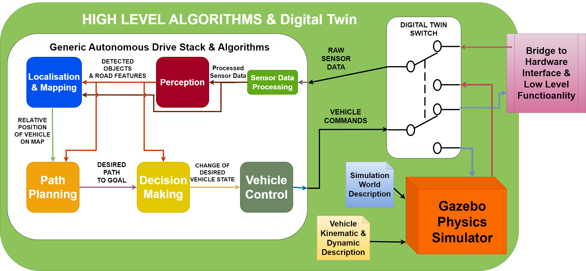
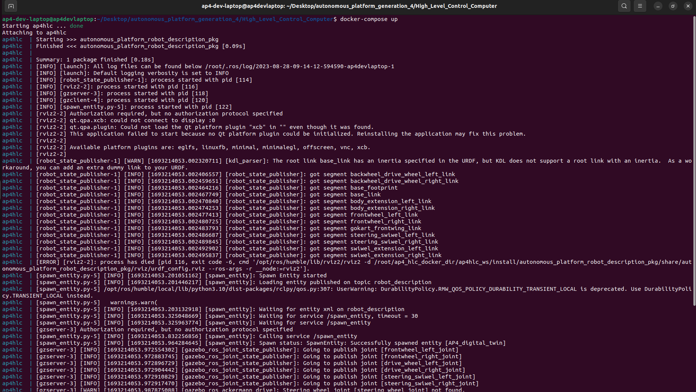
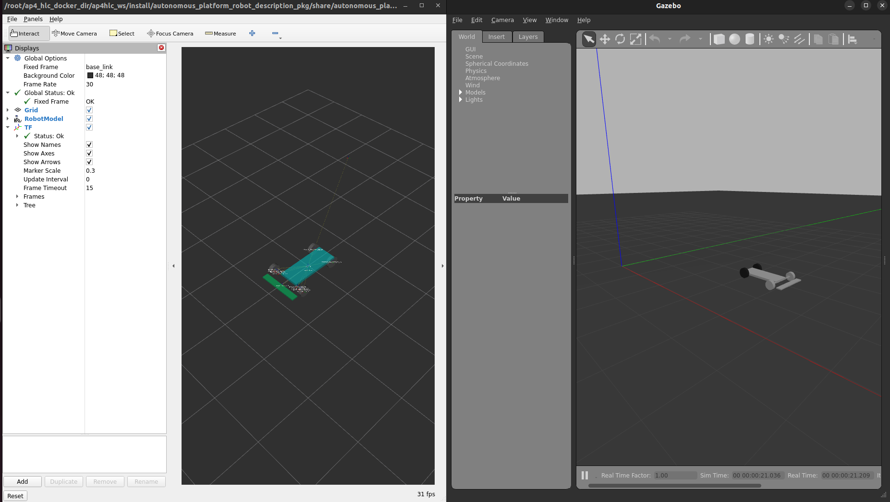
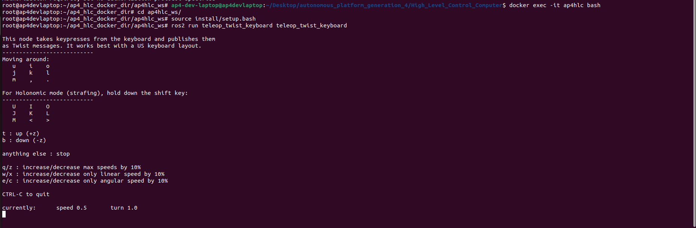
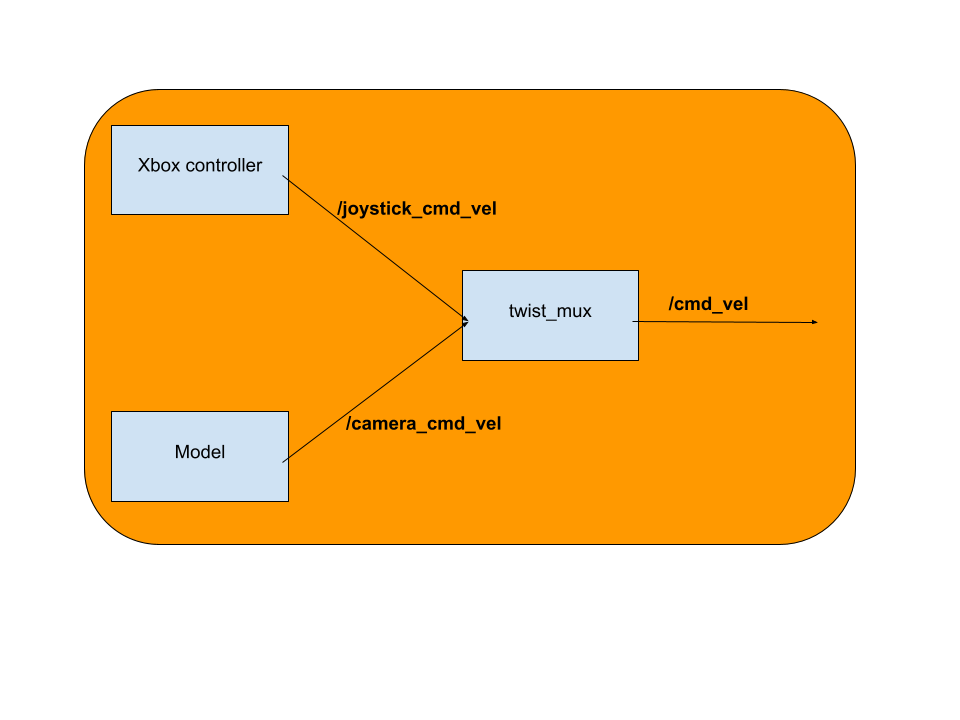

# High-Level Control Software

This directory contains the high level control software which is responsible for sending high level control commands to the low level control software.

## High-Level Control Hardware Requirements <a name="High-Level-Control-Hardware-Requirements"></a>

To run the high-level control software it is preferable to run it on Linux. (Tested on Ubuntu 22.04). The processor should of x86 type. It is preferable to have a dedicated graphics card if one has to run a lot of digital twin simulations.

See physics simulator Gazebo Simulator hardware requirements [here.](https://se.mathworks.com/help/robotics/ug/gazebo-simulation-requirements.html)

To run high-level control on windows the docker graphics passthrough methodology needs to be modified. Currently it has only been setup for Linux. There will also be a greater performance loss when running a linux based docker container on windows compared to linux.

The high level software is the highest level software layer, it is supposed to be hardware agnostic. It should not care what specific hardware is implemented on the physical autonomous platform.

The high level control software is supposed to tell the autonomous platform WHAT to do, whilst the low level control software is supposed to tell the platform HOW it should do it. This means that the algorithms developed / used in high level control software can be transferred to any physical platform as long as there exists an interface for it.

As an example: A high level software component wants the platform to move forward. It relays this on a generic ROS2 topic (i.e /cmd_vel) to the low level software, the low level software then processes it and sends commands specific to the physical platform to the embedded software layer. The low level software would then output hardware specific commands over the CAN bus network.



Above is a schematic diagram of how the software in high level control software should be designed. As of August 2023 only a simple digital twin is implemented so far.

### How To Start

<a name="How-To-Start"></a>

The high level software container should be started on the development laptop. NOT on the Raspberry Pi since it can not render the 3D gazebo simulation.

If any error occurs, `TEST_DEBUGING.md`, for troubleshooting.

Note: As of August 2023 it starts the digital twin software on ROS_DOMAIN_ID = 0 meaning it will not be able to interact with the physical platform even if the computers are located on the same wifi network. Hardware platform ROS2 network has ROS_DOMAIN_ID = 1.

Note: The host computer needs to be configured to pass graphical elements to the container. (before starting the container)

(Make sure your terminal path is located in this directory)

```bash
xhost +local:*
```

First, rebuild the container using

```bash
docker-compose build
```

The high level software container, with the configurations, can be started using

```bash
docker-compose up
```

The expected terminal output is:



Two new windows should open up, Gazebo and Rviz, and will look something like this:



The digital twin can be controlled (drive around manually) using the keyboard in a new terminal window.

Enter the running container

```bash
docker exec -it ap4hlc bash
```

Navigate to workspace, source environment variables

```bash
cd ap4hlc_ws
source install/setup.bash
```

Start tele-operation twist keyboard:

```bash
ros2 run teleop_twist_keyboard teleop_twist_keyboard
```

By using 'i', 'j', 'l', 'k' and ',' one can now control the digital twin.
See expected terminal output below.



A running container can be stopped by either 'Ctrl+C' in the terminal in which 'docker-compose up' was run. OR in a new terminal:

```bash
docker stop ap4hlc
```

## Simulation for imitation learning

The simulation used for imitation learning is a donkey car simulator and the setup can be seen in DONKEY_CAR_SETUP.md.

### Collecting data from simulation

Collecting data from the simulation can be done in the following way.

```bash
cd Imitation_Learning/simulation_donkeycar
conda activate donkey
python manage.py drive --js
```

the --js flag is for using the xbox controller, otherwise the car can be controlled from local host at: http://localhost:8887/drive

The simulation used for imitation learning is a donkey car simulator and the setup can be seen in `DONKEY_CAR_SETUP.md`.
The collected data is placed in `/simulation_donkeycar/data`.

See "training phase" to learn how to train the model using this data.

## Data collection and autonomous driving

The data collection is recording all the necessary data from ROS by subscribing to the topics. The current information being saved are the imu, color image, depth camera, steering angle and throttle signal. The data is saved with both ROS bag and with the script called `data_collection.py in /High_Level_Control_Computer/ap4_hlc_code/ap4hlc_ws/src/high_level_control`. ROS bag is recording all the data the topics receives while `data_collection.py` is synching the messages together. ROS bag can be used as a backup if the data is lost, how to replay the data and save it can be read in `Autonomous_Platform/README.md`.

The framework for autonomous drive is implemented in high level control. To get started, a model has to be trained for the gokart based on recorded data in `/High_Level_Control_Computer/ap4_hlc_code/ap4hlc_ws/src/imitation_learning/train_DAgger.py`, this can be done for both simulation and for real world tests. When a model is created it is saved to both `/High_Level_Control_Computer/ap4_hlc_code/ap4hlc_ws/src/imitation_learning/simulation_donkeycar` for testing in simulation and to `High_Level_Control_Computer/ap4_hlc_code/ap4hlc_ws/src/imitation_learning/models` for testing in real world environment with the gokart. The name of the model will depend on what inputs are selected in `train_dagger.py`.

To start the autonomous drive for the gokart or to collect more data for DAgger, start the high level docker, open a new terminal in `High_Level_Control_Computer` and run:

```bash
source start_data_collection.sh --param <param>
```
The params can either be:

- default - Collect data from driving the AP4, storing all actions and observations for training
- validation - Collect data from driving the AP4, storing all actions and observations for validation
- color - Starting high level model, setting the inputs to be color camera and imu and saving human interactions for training color HG-DAgger model
- depth - Starting high level model, setting the inputs to be color camera, depth camera and imu and saving human interactions for training depth HG-DAgger model
- orb - Starting high level model, setting the inputs to be color camera, orbs and imu and saving human interactions for training orb HG-DAgger model


This script starts the following in different terminals:

- Camera docker - starts to publishing information from the imu, depth camera and color camera to ROS.
- ROS bag - starts to record the information in ROS bag
- Data Collection - Recording and synching the data and then saving as a pickle file.
- Test script - Starts a test script to check the communication between RPi and laptop, checks for missing topics and nodes etc.
- High Level Model - Starts on (color, depth and orb), taking inputs from the sensors and predicting the actions.


When no more data should be collected it is important to close data_collection and ROS bag with CTRL+C for the data to be saved correctly!

The model will now start to publish the predicted actions to the topic /camera_cmd_vel in ros and the gokart will start to drive. The control of the gokart can always be overtaken by the user by using the Xbox controller. When the Xbox controller is used `data_collection.py` will start to record the data and save it in `/High_Level_Control_Computer/ap4_hlc_code/recorded_data/(orb, depth or color)` depending on the param chosen when the script was started. This is done to be able to update the policy of the model where it made bad predictions.

### Twist_stamper

The joystick_cmd_vel data published by the Hardware_Interface_Low_Level_Computer is of the message type twist and not twist_stamped. As this means the data does not contain a time stamp which is necessary for data_collection.py this is solved by the package twist stamper https://github.com/joshnewans/twist_stamper. Twist stamper offers two nodes: one for adding a timestamp and another for re-
moving a timestamp from a twist message. The timestamp addition node subscribes
to a topic, timestamps the received message, and publishes the stamped message to
a new topic. The twist_stamper not is automatically started via the hlc_startup.bash in the HLC. As in:

```bash
ros2 run twist_stamper twist_stamper --ros-args -r cmd_vel_in:=joystick_cmd_vel -r cmd_vel_out:=cmd_vel_stamped
```

### Twist_mux

To be able to take over the control manually twist_mux is used. Twist_mux takes in n number of twist messages, prioritize them and sends the highest prioritized message to `/cmd_vel`. Twist_mux is started automatically in hwi_startup.bash but can also be manually started in the high level control docker by running:

```bash
ros2 run twist_mux twist_mux --ros-args --params-file ./model/twist_mux_topics.yaml -r cmd_vel_out:=cmd_vel
```

Twist_mux takes in two topics for now which is /joystick_cmd_vel (commands from the Xbox controller) and /camera_cmd_vel (commands from model). Topics can be changed or added in `twist_mux_topics.yaml` in `../High_Level_Control_Computer/ap4_hlc_code/ap4hlc_ws/src/autonomous_platform_robot_description_pkg/high_level_control` (if twist_mux is started in high level docker) and in `../Hardware_Interface_Low_Level_Computer/ap4_hwi_code` for automatic start up.

The Xbox controller has the highest priority which means that the control from the model can be overridden at all times.



More information about twist_mux can be read here: [Link official twist_mux documentation.](https://wiki.ros.org/twist_mux)


## Extend High Level Software

This document aims to describe to process of how to extend the high level control software.

Before starting to develop and adding code to the high level control software you need to first make sure you need to add something here.

If you;

- Want to do something with the digital twin
- Work on high level hardware agnostic autonomous drive algorithms
- Evaluate autonomous drive algorithms
- Are NOT adding new hardware
- Are NOT interfacing with the physical platform

Then you are in the right spot!!

If not, take a look at `Hardware_Interface_Low_Level_Computer` or `CAN_Nodes_Microcontroller_Code`, maybe you intended to add functionality there!

### Prerequisites

In order to start adding functionality it is recommended to have a basic understanding of:

- C++ OR Python development
- docker containers (How to start, stop, restart and configure)
- Linux - The container software environment is mainly navigated in through a terminal
- Robot Operating System 2 (how to create packages and start new nodes)

Software wise, you need to have the following installed:

- docker
- git
- VSCode (recommended but any IDE may be suitable)

Hardware wise, it is recommended you have:

- Linux based x86 host computer, preferably with dedicated graphics (not a must)

### Add a New Functionality

First of all make sure you have read the general design principles document for autonomous platform located at `autonomous_platform/HOW_TO_EXTEND.md`. This document takes precedence over anything written in this document in order to unify the development process across all software layers.

Software functionality is created inside ROS2 packages. These can be seen as code libraries that are configured to run and perform a specific task within a ROS2 network.


# Training Phase

## Installing imitation learning library

Make sure that you are in the conda environment:

TODO : hopefully with docker commands and requirements.txt

```bash
pip install imitation
```

You might need to install stable baselines3 as well.

```bash
pip stable-baselines3
```

## Training imitation learning

### Simulation data

In the case of data from simulation the data is stored in `simulation_donkeycar/data`.
To test a trained model in simulation, place the trained model file in simulation_donkeycar and run the following commands.
collecting data from the simulation can be done in the following way.

```bash
python3 test_scripts/ppo_train.py --sim ~/projects/DonkeySimLinux/donkey_sim.x86_64 --test
```

The training can then be started by running `python train_DAgger.py simulation` .

### Real world

To train the imitation learning models from the data collected via `source data_collection.sh`, start the high-level docker by standing in High_Level_Control_Computer and running `docker-compose up` then in a new terminal run: 

```bash
source start_training --param <param>
```

The params can either be:

- color - Setting the inputs to be color camera and imu
- depth - Setting the inputs to be color camera, depth camera and imu
- orb - Setting the inputs to be color camera, orbs and imu
