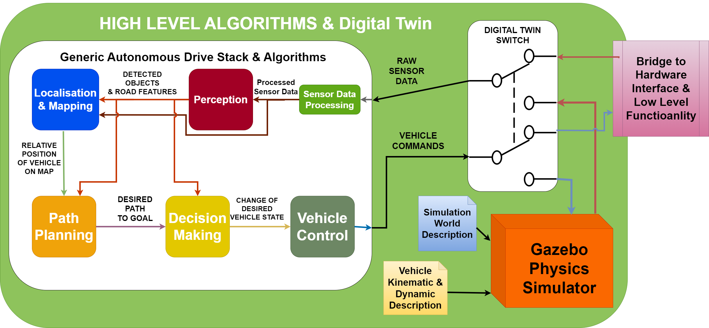
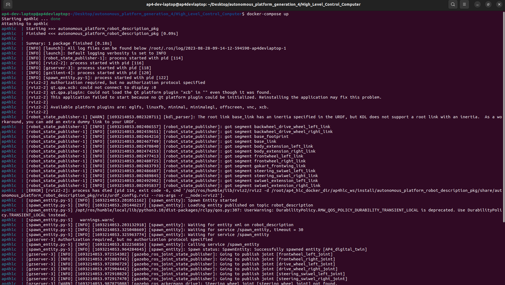
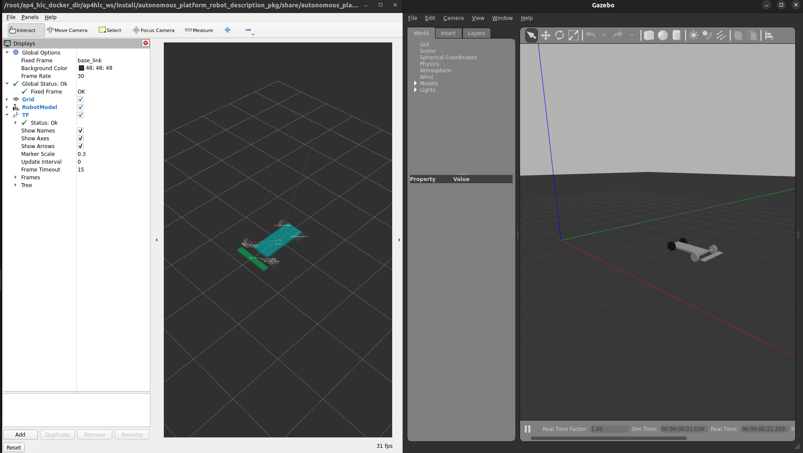
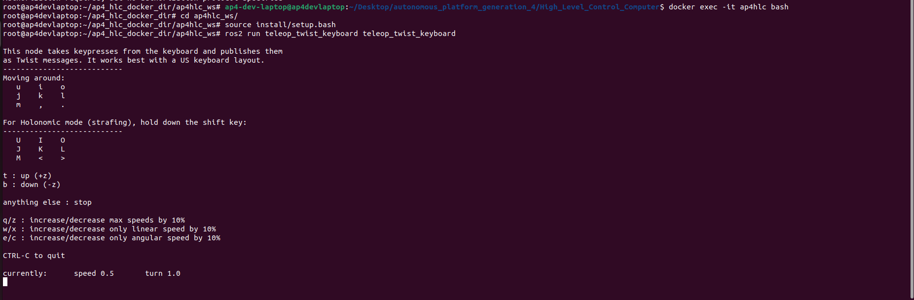
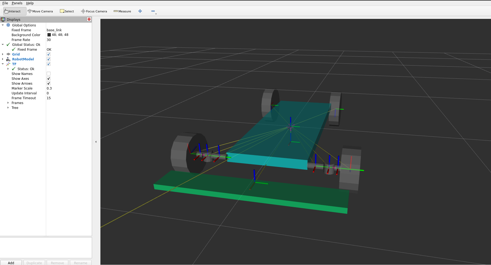
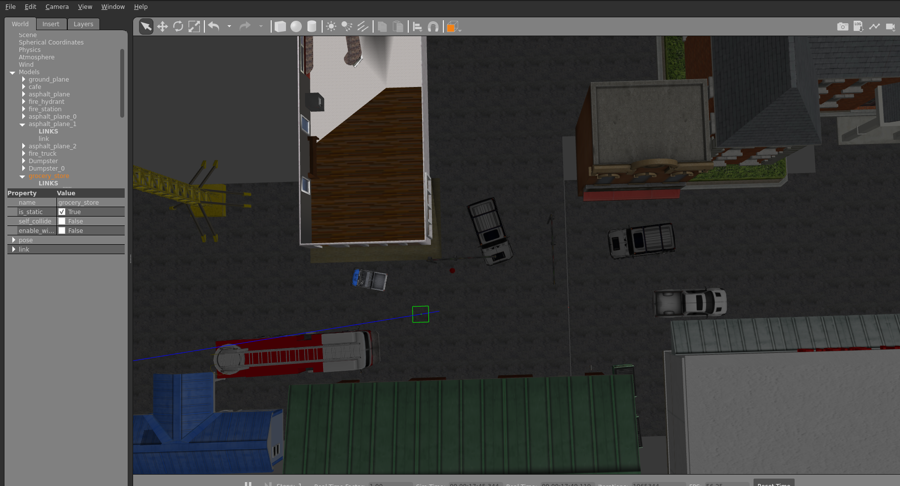
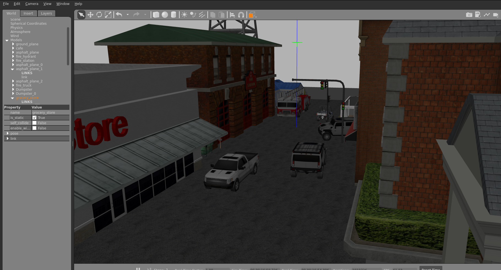

# High-Level Control Software
This directory contains the high level control software which is responsible for sending high level control commands to the low level control software. 


## High-Level Control Hardware Requirements <a name="High-Level-Control-Hardware-Requirements"></a>
To run the high-level control software it is preferable to run it on Linux. (Tested on Ubuntu 22.04). The processor should of x86 type. It is preferable to have a dedicated graphics card if one has to run a lot of digital twin simulations.

See physics simulator Gazebo Simulator hardware requirements [here.](https://se.mathworks.com/help/robotics/ug/gazebo-simulation-requirements.html)

To run high-level control on windows the docker graphics passthrough methodology needs to be modified. Currently it has only been setup for Linux. There will also be a greater performance loss when running a linux based docker container on windows compared to linux. 

The high level software is the highest level software layer, it is supposed to be hardware agnostic. It should not care what specific hardware is implemented on the physical autonomous platform. 

The high level control software is supposed to tell the autonomous platform WHAT to do, whilst the low level control software is supposed to tell the platform HOW it should do it. This means that the algorithms developed / used in high level control software can be transferred to any physical platform as long as there exists an interface for it.

As an example: A high level software component wants the platform to move forward. It relays this on a generic ROS2 topic (i.e /cmd_vel) to the low level software, the low level software then processes it and sends commands specific to the physical platform to the embedded software layer. The low level software would then output hardware specific commands over the CAN bus network.

 

Above is a schematic diagram of how the software in high level control software should be designed. As of August 2023 only a simple digital twin is implemented so far.


### How To Start
<a name="How-To-Start"></a>

The high level software container should be started on the development laptop. NOT on the Raspberry Pi since it can not render the 3D gazebo simulation.

If any error occurs, `TEST_DEBUGING.md`, for troubleshooting.


Note: As of August 2023 it starts the digital twin software on ROS_DOMAIN_ID = 0 meaning it will not be able to interact with the physical platform even if the computers are located on the same wifi network. Hardware platform ROS2 network has ROS_DOMAIN_ID = 1.

Note: The host computer needs to be configured to pass graphical elements to the container. (before starting the container)

(Make sure your terminal path is located in this directory)

```bash
xhost +local:*
```

First, rebuild the container using 
```bash
docker-compose build
```

The high level software container, with the configurations, can be started using 
```bash
docker-compose up
```

The expected terminal output is:

 

Two new windows should open up, Gazebo and Rviz, and will look something like this:

 

The digital twin can be controlled (drive around manually) using the keyboard in a new terminal window.

Enter the running container
```bash
docker exec -it ap4hlc bash
```
Navigate to workspace, source environment variables
```bash
cd ap4hlc_ws
source install/setup.bash
```

Start tele-operation twist keyboard:

```bash
ros2 run teleop_twist_keyboard teleop_twist_keyboard
```

By using 'i', 'j', 'l', 'k' and ',' one can now control the digital twin.
See expected terminal output below.

 


A running container can be stopped by either 'Ctrl+C' in the terminal in which 'docker-compose up' was run. OR in a new terminal:
```bash
docker stop ap4hlc
```

### Autonomous Driving Stack 
<a name="Autonomous-Driving-Stack"></a>

This has not been implemented as of August 2023.

In the future, the high level control software shall contain an autonomous drive stack. It would be the highest form of control software to the platform, taking in sensor data, processing it and deciding on an actuator output. There exists available AD driving stacks which one can use, i.e OpenPilot [(Link here)](https://github.com/commaai/openpilot). Hamid has previous experience with using OpenPilot. One could also develop some autonomous driving stack in-house or as a part of thesis project.


The idea would still be the same, sensor information and physical platform states would be received on standardized ros2 topics. The information would be processed in some ROS2 nodes and eventually the output would be a change of vehicle state. The output should follow ROS2 convention of controlling robots. I.e a new desired linear velocity and rotational velocity should be output on the `/cmd_vel` ROS2 topic.

For topic conventions see ROS2 topic message [Sensor Messages (link)]() and [Navigational Messages (link)]().

For quick reference

* (INPUT) Platform Odometry (Current position + Orientation) see ["/odom"](https://github.com/ros2/common_interfaces/blob/humble/nav_msgs/msg/Odometry.msg) 
* (OUTPUT) Velocity in 3D (linear + angular) [`/cmd_vel`](https://docs.ros2.org/latest/api/geometry_msgs/msg/Twist.html)
* (INPUT) Sensor readings. See common sensor topics [here](http://wiki.ros.org/sensor_msgs?distro=humble)

### Digital Twin
<a name="Digital-Twin"></a>
A simplified digital twin has been implemented as of August 2023.

An important part of the high level software control is the digital twin. It is a completely different component then the autonomous driving stack and should be agnostic to what AD stack is used. This means that any AD stack should be able to be tested on the digital twin. This is accomplished by using standard ROS2 topics as interfaces as briefly described in the previous section. Inputs to the digital twin would be sent over the `/cmd_vel` ROS2 topic, in the same way outputs (vehicle state and sensor readings) would be sent from the digital twin simulation over standard ROS2 topics. I.e "/odom" for vehicle state.

As of August 2023 the digital twin is run using the Gazebo Physics Simulator. [Link official gazebo documentation.](https://gazebosim.org/docs) It is a software that integrates seamlessly with ROS2 and has been used for a long time to simulate robots in complex environments. 

The code structure for the digital twin is as follows:
A ROS2 package has been created, autonomous_platform_robot_description_pkg, which contains the digital twin. 

```
 ┣  High_Level_Control_Computer
 ┃ ┣  ap4_hlc_code
 ┃ ┃ ┗  ap4hlc_ws
 ┃ ┃   ┗  src
 ┃ ┃      ┗  autonomous_platform_robot_description_pkg
 ┃ ┃         ┣  launch
 ┃ ┃         ┣  rviz
 ┃ ┃         ┣  src
 ┃ ┃         ┃  ┗ description
 ┃ ┃         ┃     ┣  ap4_robot_description.urdf
 ┃ ┃         ┃     ┣  gazebo_control.xacro
 ┃ ┃         ┃     ┣  gokart_chassi.urdf.xacro
 ┃ ┃         ┃     ┗  inertia_macros.xacro
 ┃ ┃         ┗  worlds
 ┃ ┃
 ┃ ┣   Dockerfile
 ┃ ┣   docker-compose.yaml
 ┃ ┗   README.md <-- You Are Here !!!
```

### Design Of Digital Twin
The digital twin of autonomous platform is created using Universal Robot Description Files (URDF) and xacro files. The digital twin is described in an xml type format and are located in `autonomous_platform\High_Level_Control_Computer\ap4_hlc_code\ap4hlc_ws\src\autonomous_platform_robot_description_pkg\src\description\`. 


These files describe everything from the physical platform properties to what sensors are simulated. How the platform is controlled can also be configured. The end result can be seen below, a simplified gokart platform with wheels that can be controlled.

 

### Sensor plugins
An important aspect of using Gazebo is the concept of plugins. Plugins allows for new functionality to be added to the digital twin. For example different vehicle movement controllers or virtual sensors.

As of August 2023 no sensors have yet to be added. Future sensors to add could be:

* [Camera](https://classic.gazebosim.org/tutorials?tut=ros_gzplugins)
* [Lidar](https://classic.gazebosim.org/tutorials?tut=ros_gzplugins)
* [Radar](https://classic.gazebosim.org/tutorials?tut=ros_gzplugins)
* [IMU](https://classic.gazebosim.org/tutorials?tut=ros_gzplugins)
* [Ultrasonic short range sensor](https://classic.gazebosim.org/tutorials?tut=ros_gzplugins)

### Gazebo worlds
In the same way as the digital twin could be configured, the simulated environment itself can be configured. This allows a developer to create interesting scenarios in which to place the autonomous platform.

Worlds can be created using the Gazebo graphical application and saved into the `worlds` directory. The digital twin can be configured to start in a specific world by configuring the launch file located in `launch` directory.

Gazebo has access to an exentsive library of 3D models which can be used to crate interesting environments. 

 

 


### Software Control Switch
<a name="Software-Control-Switch"></a>

This has not been implemented as of August 2023.

The idea of having a software control switch is for the autonomous driving stack algorithms to EITHER control the physical platform or the digital twin. And be able to switch seamlessly between them. The autonomous driving stacks could be quickly tested on a digital twin to make development faster and when the algorithms are in a mature state they could be tested on the physical platform.

It is therefore very important that the digital twin and physical platform have the same output (sensor readings / vehicle state). I.e on the same ROS2 topics. In the same way, the digital twin and the physical platform should be controlled in the same way in the high control software on `/cmd_vel` topic.

For future reference this switching of control could be actualized using [namespaces](https://docs.ros.org/en/foxy/Tutorials/Intermediate/Launch/Using-ROS2-Launch-For-Large-Projects.html#namespaces) or configuring different [ROS2 domain IDs](https://docs.ros.org/en/foxy/Concepts/About-Domain-ID.html). By setting the ROS2 DOMAIN ID for the AD nodes to the same ID as the physical platform commands would be forwarded to the low level software control. And by setting a different domain one could ensure that the commands are only sent between the digital twin and AD algorithms. ROS_DOMAIN_ID is specifically developed to prevent cross talk between different domains.


### Digital Twin Software Package Structure
The software for the digital twin is located in `autonomous_platform_robot_description_pkg`. Below follows a quick guide on what each subdirectory contains:

* launch - Contains launch files
* rviz - contains a parameter file which can be inserted into Rviz to show useful information upon startup
* worlds - save gazebo simulation environments (worlds) to be run later.
* /src/description: Contains the xacro and urdf files which describes how the digital twin is built up.

The launch file launch_digital_twin_simulation.launch.py launches the following nodes

* robot_state_publisher
* Rviz
* gazebo_node
* spawn_entity_node

The robot state publisher node, takes the robot description files and broadcasts them over the ROS2 network. The Gazebo physics simulator is then launched with a corresponding ROS2 node. Lastly, a spawn entity node is created, which spawns the digital twin inside the gazebo simulation using the information on the robot state publisher information topic. As the digital twin is inserted into the simulation, it spawns further nodes which makes it possible to control the digital twin using the /cmd_vel topic.

The digital twin is defined inside the description folder, it is built in modules with the ap4_robot_description.urdf as a base. Onto this base. The gokart_chassi.urdf.xacro describes the kinematics and dynamics of AP4. gazebo_controls.xacro describes how an ackermann drive plugin is used to control the joints of AP4.

Future sensors, such as cameras, should be added as xacro modules and included in the ap4_robot_description.urdf file.

### How to Connect to Physical Platform
<a name="How-to-Connect-to-Physical-Platform"></a>

The high-level control software is meant to be run in two modes; connected to the autonomous platform and completely detached.

The long term goal is that the high level control software should be able to interface with the low level control software running on the Raspberry Pi 4b. This is done through an ethernet connection, meaning it could be done both wirelessly and by wire. The two docker containers for high level software and low level software should therefore be started from devices located on the same network.

As of August 2023 this is NOT needed yet, since no Autonomous Driving algorithms have been implemented yet. But for future reference:

* Connect the development laptop to the AP4-ROUTER_2.4Ghz network. ssid and pw credentials can be found in root directory README file.
* Make sure the two docker containers are started
* Make sure high level software is running on ROS_DOMAIN_ID=1

This should be sufficient for the underlying ROS2 Data Distribution Service (DDS) to find ROS2 nodes available on the same network and same ROS_DOMAIN_ID.

### How to verify

If any error occurs, `TEST_DEBUGGING.md`, for troubleshooting.


### High Level Control Underlying Software Components <a name="High-Level-Control-Underlying-Software-Components"></a>
This section will describe what software components are used to construct the high level software and how they are used.

### Containerization <a name="Containerization]"></a>
An overview of containerization and how it works is explained in `SOFTWARE_DESIGN.md` located in root directory.

Note: Docker can be run on Windows, but certain commands/parameters used on AP4 are linux specific. I.e passing graphics to and from the container. It is has therefore only been tested and guaranteed to work on linux host computers.

Docker enables software to be collected and run from a virtual environment, similar to a virtual machine but with much less performance overhead compared to a virtual machine. Docker allows the virtual environment to be configured, i.e what operating system should be run and what software should be installed.

The environment in which the high level software is run in is described inside the `Dockerfile` located in this directory. In this file the virtual environment is configured as a base version of Ubuntu 22.04 with relevant linux packages installed. Robot Operating System 2 - Humble is installed.

The container is started using a set of configuration parameters, these are located in `docker-compose.yaml` in this directory. Configuration parameters can be for example to pass through graphical elements from the container to the host computer desktop.


### Robot Operating System 2 (ROS2) <a name="Robot-Operating-System-2-(ROS2)"></a>
Robot Operating System 2 (ROS2) is a framework / middleware developed to create very complex robotic software. This framework is used to split up computations into separate executions using "nodes". 

For an in depth explanation of Robot Operating System 2 (ROS2) and how it works see `SOFTWARE_DESIGN.md` in root directory.

The following subsection will describe how the high level software control is designed using the Robot Operating System Framework.

The idea with using ROS2 framework is that computational applications can be split up into smaller components that perform very specific tasks. I.e software related to taking a joystick input and outputting a desired velocity should have the minimum amount of dependencies as possible and not break any other dependencies for other software applications.

ROS2 package has to be created for this functionality. A package collects all the resources and dependency configurations for a specific function. I.e the package for the digital twin `autonomous_platform_robot_description_pkg` should be as standalone as possible. When adding future functionality, the digital twin package should be left as is, and instead a new package for the new specific functionality should be added.
