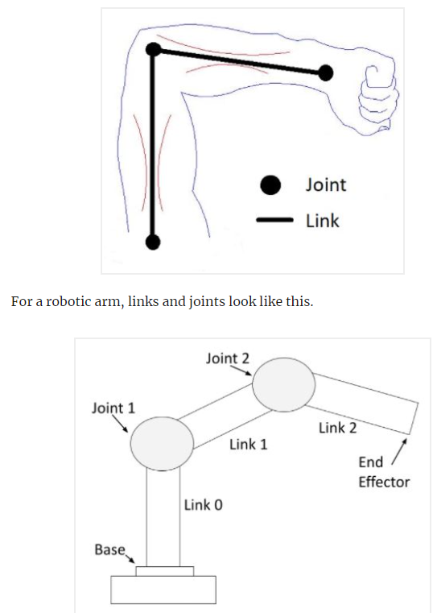
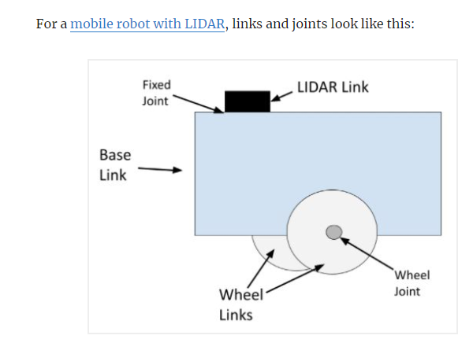
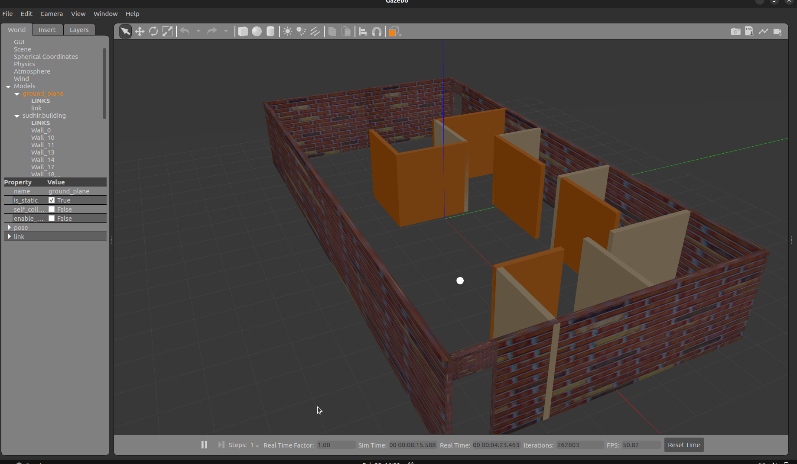
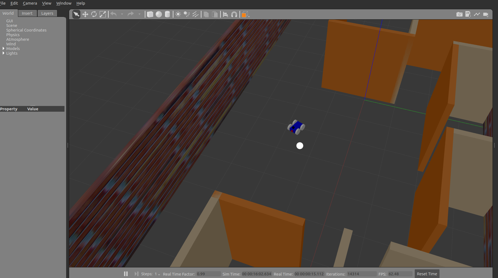
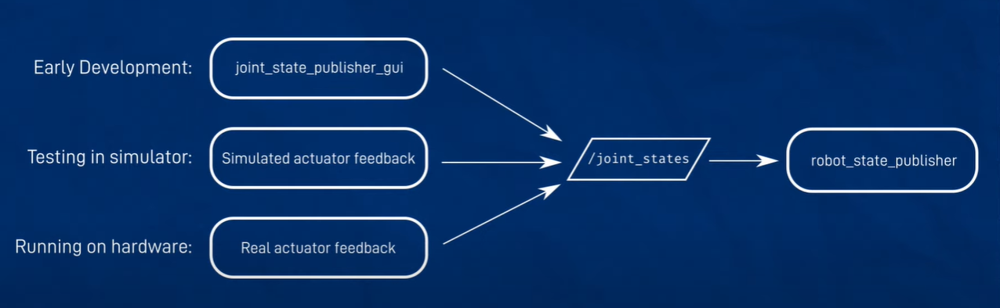
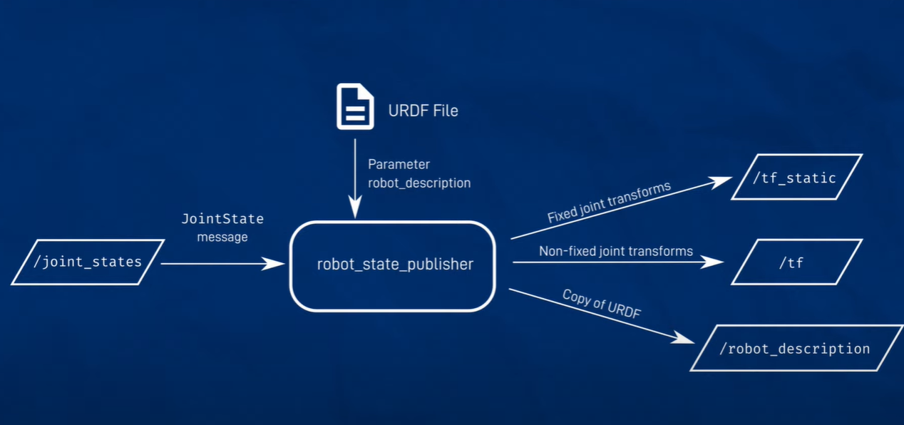
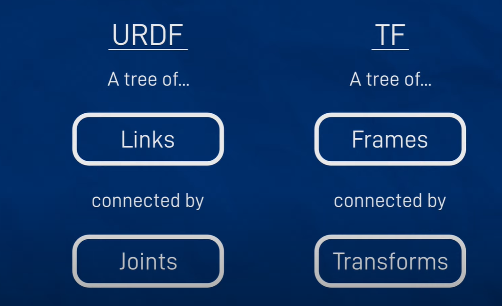
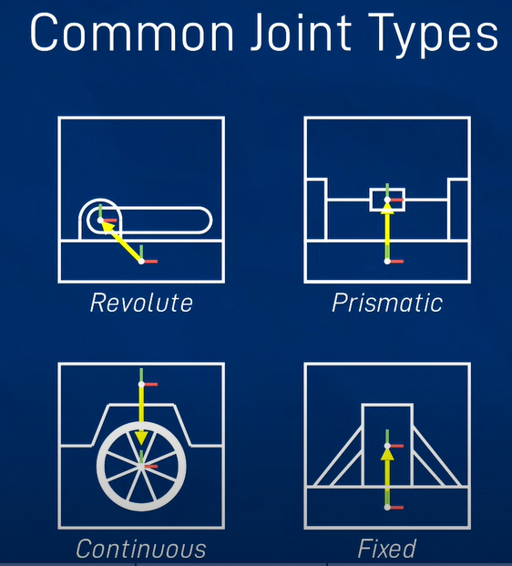

# Digital Twin Research

This document is meant to collect useful information regarding digital twins and how it could be used on autonomous platform generation 4.

## Why spend time creating a digital twin?

______________________________________________________________________

This could be a useful step in between programming the platform and testing its features on a track.

## How to create digital twins?

There are many possible options in order to create digital twin, i.e

- Matlab / Simulink Model
- Unity Game Engine Simulations
- Gazebo with ROS2 - Physics Engine that can interact with ROS2 through API

Having the pipeline

## Rullande anteckninggar

måste lägga till noise till digitala sensorer, annars blir de för bra

gazebo_ros_pkgs - standard ros package that makes bridge between simulation specific and non specific logic.

går att integrera ROS2 navigation stack

## Filetypes

There are many different filetypes mentioned across different tutorials.

- SDF: Simulation Description Format, describes objects in simulation, used by Gazebo
- URDF: ROS uses Universal Robot Description Format to model a robot, kinematics and dynamics.
- xacro: (XML Macro ): Combine different URDF files into one file.

## URDF / xacro file format

Here is a summary of how URDF files are structured. More details on this can be found here https://articulatedrobotics.xyz/ready-for-ros-7-urdf/.

Here is a resource on ROS link/joint naming conventions: https://ros.org/reps/rep-0105.html#relationship-between-frames

Here is the official ROS XML specifications: http://wiki.ros.org/urdf/XML
Here is a hands-on tutorial from the ROS documentation for creating URDF files with xacro macros as well: https://navigation.ros.org/setup_guides/urdf/setup_urdf.html

First comes the start and end tag, which defines the XML version used and the xml head for the robot. Where the ... is one puts the link and joint tags describing the robot

```xml
<?xml version="1.0"?>
<robot name="my_robot">
   ...
</robot>
```

There are then two types of tags that describes the robot. Link tags and joint tags.

Here is the general structure for a link tag:

```xml
<link name="wheel_link">
    <visual>
        <geometry>
        <origin>
        <material>
    </visual>

    <collision>
        <geometry>
        <origin>
    </collision>

    <inertial>
        <mass>
        <origin>
        <inertia>
    </inertial>
</link>

```

The visual tag simply defines how the joint should be illustrated. How collisions are defined with the joint is

```xml
<joint name="wheel__joint" type="continous">
    	<parent link="..."/>
    	<child link="..."/>
    	<origin xyz="0 0 0" rpy="0 0 0"/>
	</joint>

```

Valid joint types are fixed, prismatic, revolute and continous. Parent link is

## Going through tutorial / blog / article: How to Create a Simulated Movile Robot in ROS 2 Using Urdf

Link: https://automaticaddison.com/how-to-create-a-simulated-mobile-robot-in-ros-2-using-urdf/

URDF is a file format used to for robot modelling, or modelling anything that ROS(2) should control/ interface with.

## What is URDF?

URDF, or Universal Robot Description Format file is an XML file that describes how the robot would look like and behave in real life. ROS packages can use this information to simulate the robot in software.

The body of a robot consists of two different components:

1. Links
1. Joints

Links are rigid pieces, i.e the skeleton. And links are connected to each other by joints, which allows the links to move. Enabling motion between connected links. The article gives a good layman description of this using the following image.



The same reasoning would hold for a mobile robot, (or autonomous platform).



Note to self: Look into ROS2 Navigation stack

Important ROS2 packages:

1. Joint state publisher
1. xacro

## Going through tutorial: Build Robot using Robot Operating System (ROS2) and Gazebo https://bunchofcoders.github.io/basic_bocbot/

Documenting the steps done in the tutorial. The tutorial is for ROS2 eloquent, an older version. Any mention of "eloquent" should be replaced with "humble".

1. Create workspace in arbitrary folder > mkdir bocbot_ws/src
1. Source ros2 with: source /opt/ros/humble/setup.bash \<- This needs to be done in every new terminal opened

Now create a ros2 package to work in with

```bash
ros2 pkg create --build-type ament_cmake bocbot
```

Start creating a world file, describing the simulation world using xml syntax.

```bash
cd bocbot
mkdir worlds
cd worlds
touch bocbot_office.world
```

Gazebo uses SDF xml file format to save the simulation world. I now copy pasted the world data into bocbot_office.world file, as presented on the tutorial page.

The created world can now be opened (Whilst standing in the worlds folder)

```bash
gazebo bocbot_office.world
```



Useful links:

1. Tutorial build a world https://classic.gazebosim.org/tutorials?cat=build_world
1. Building editor https://classic.gazebosim.org/tutorials?cat=build_world&tut=building_editor

Note: I think we should create a map over the track at gokartcentralen to use in testing of algorithms.

Now to creat an robot to use in gazebo, ROS uses URDF description files. (Universal RObot Description Format) to model dynamic and kinematic aspects aspects of an robot. These properties are written in xml.

These files can become very large as the robot may contain many moving components, joints and links. Therefore one can use ¨xacro¨ files. (XML Macro). This allows one to combine different URDF files into one. These files are saved with the .xacro file extension.

In this tutorial two xacro files are created, one describing the robot itself and one describing the gazebo plugins.

To install ROS2 gazebo packages use

```bash
sudo apt install ros-humble-gazebo-ros-pkgs
```

What are Gazebo plugins? Gazebo plugins are pieces of code to interface with the gazebo simulation, in short. For instance one can use existing plugins to controll a differential driven robot, get camera output from gazebo into ROS2 topics and so on.

Note: We need to find a ackermann-steering drive pkg or bicycle drive pkg for the gokart.

Creating the urdf files:
The bocbot.gazebo file will define properties for gazebo controllers (plugins).

```bash
cd ~/bocbot_ws/src/bocbot
```

```bash
mkdir urdf
```

```bash
touch bocbot.gazebo
```

The bocbot.gazebo file contents were then copied from the tutorial into the file.

Now, define the robot description:

```bash
cd urdf
touch bocbot.urdf.xacro
```

the bocbot.urdf.xacro file contents were then copied from the tutorial into the files

Note: Link vs joint, what is the difference in bocbot.urdf.xacro ??

joints join together different links? I.e camera link is connected to chassis link through camera_joint?

### Invoking xacro from colcon build process

WHen building the bocbot pkg one needs to tell colcon (the software that builds the created ros2 software) to use the urdf and gazebo files created.

The 'CMakeLists.txt' needs to be modified to add the right build dependencies. The specific syntax can be found in the tutorial.

The 'CMakeLists.txt' should also be modified to 'compile?' the urdf, worlds and mesh into the installs folder.

Now one should be able to build the bocbot package.

```bash
source /opt/ros/humble/setup.bash
cd bocbot_ws
colcon build
```

Important note: One needs to install xacro library if it not already installed on computer.  https://get-help.robotigniteacademy.com/t/how-to-install-dependencies-in-docker-to-run-packages-from-this-course/21394

```bash
sudo apt install ros-humble-xacro
```

### Create a launch directory

In order to launch the robot in gazebo one needs to create a launch file in a the launch directory for the robot package.

```bash
cd ~/bocbot_ws/src/bocbot
mkdir launch
cd launch
touch world.launch.py
```

This launch file will do two things; 1. Launch Gazebo with predefined settings and in the world file we created. 2. call spawn_entity service from gazebo to spawn the defined robot into the world

Contents from the tutorial was pasted into the world.launch.py file.

The CMakeLists.txt needs to be configured to find this launch directory.

### startup the robot simulation

After building the workspace, source the install folder of the bocbot_ws

```bash
source install/setup.bash
```

Thereafter call on on the launch file. ros2 launch $<pkg name> <launch file>$

```bash
ros2 launch bocbot world.launch.py
```



## Other useful notes

Note to self: Look more into joint state publisher and how to integrate with autonomous platform 4





## Creating an URDF file (Unified Robot Description Format)

The URDF file describes the robot, with link and joint inheretance.

Resources on this topic:

1. URDF file tutorial and walkthrough https://www.youtube.com/watch?v=CwdbsvcpOHM
1. ROS Transform system (TF2): https://www.youtube.com/watch?v=QyvHhY4Y_Y8
1. Creating 3D model of robot with URDF: https://www.youtube.com/watch?v=BcjHyhV0kIs

### ROS Transform System - TF2

A quick comparison between URDF and the TF system



### Common Joint Types

- Revolute : Rotation around an axis, with fixed start and stop angles
- Continuous: Continuous rotation around an axis, no fixed limits, can spin freely forever
- Prismatic : linear translational motion
- Fixed: Child frame does not move in relation to the parent link



URDF is based on XML, series of ftags nested in one another

## Useful documentation tutorials to look through

- How to Simulate a Robot Using Gazebo and ROS 2 https://automaticaddison.com/how-to-simulate-a-robot-using-gazebo-and-ros-2/
- Open Source Robotics: Getting Started with Gazebo and ROS 2 https://www.infoq.com/articles/ros-2-gazebo-tutorial/ - generell info, går inte igenom detaljer
- ROS 2 integration overview https://classic.gazebosim.org/tutorials?tut=ros2_overview&cat=connect_ros - går igenom arbesprocess för gammal version av gazebo
- Build Robot using Robot Operating System (ROS 2) and Gazebo https://bunchofcoders.github.io/basic_bocbot/ går igenom steg för steg hur man skapar en digital robot i ros2 / gazebo, mkt mkt bra länk
- How to Create a Simulated Mobile Robot in ROS 2 Using URDF https://automaticaddison.com/how-to-create-a-simulated-mobile-robot-in-ros-2-using-urdf/
- Making a Mobile Robot #13 - Using ros2_control on a real robot https://articulatedrobotics.xyz/mobile-robot-13-ros2-control-real/ MYCKET BRA KOLLA PÅ I SENARE SKEDE
- Tool for visualizing and creating URDFs in web browser : https://mymodelrobot.appspot.com/5629499534213120
- Create your own urdf file - ROS wiki official documentation http://wiki.ros.org/urdf/Tutorials/Create%20your%20own%20urdf%20file?fbclid=IwAR2bpaNYBcZkReqXX470GEitHRhQkD4QNROZfB0IaEuH-rHlIHK_LBqaxaA
- ROS2 official guide for
- ROS official xacro good to know information. I.e how to define xacro constants and functions. http://wiki.ros.org/urdf/Tutorials/Using%20Xacro%20to%20Clean%20Up%20a%20URDF%20File
