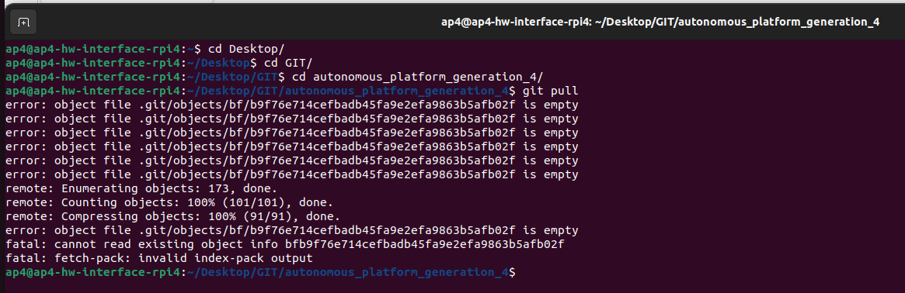
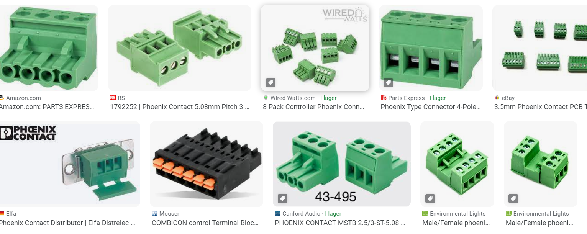

## Known issues

### Priority : Fix known Bugs / Issues <a name="Known-Bugs-/-Issues"></a>

There are some known bugs and issues and should have priority

- Battery voltage drops during load and steering control is lost
- Lost wifi connection during test day @ gokartcentralen
- Raspberry Pi 4b SD card gets filled with junk files and breaks hardware interface software.

It is a known problem that the raspberry pi 4b fills up with junk files and slows down the raspberry pi and eventually break things. Docker caches also grow in size over time. Possible solution get a bigger SD card? Find how to periodically remove junk files?

- Raspberry Pi 4b corrupted files

Over time files on the SD card gets corrupted and affects behavior.
Common problems are that the docker container cannot be built. A cause for this may be the shutdown procedure of the raspberry pi. Unplugging it to power down may not be optimal. Need to find a solution for properly safely powering down the raspberry pi. Terminal output below.



See TEST_DEBUGGING.md to see how it is currently resolved.

- Low voltage input to the raspberry pi makes it slow and unresponsive

Needs to be resolved properly. Could become a problem once more data is sent to and from the hardware interface code.

- PlatformIO build fails when repository is cloned to a path containing a whitespace

Opening the embedded ECU software in platformIO and trying to build it fails when repository filepath has whitespace in it. See error output below. This was when trying to build firmware for SPCU.

Filepath to SPCU was `C:\Users\erimag\OneDrive - Infotiv AB\Skrivbordet\git\autonomous_platform\CAN_Nodes_Microcontroller_Code\SPCU`

```bash
Linking .pio\build\bluepill_f103c8\firmware.elf
arm-none-eabi-g++: error: Infotiv: No such file or directory
arm-none-eabi-g++: error: AB/Skrivbordet/git/autonomous_platform/CAN_Nodes_Microcontroller_Code/SPCU/.pio/build/bluepill_f103c8/firmware.map: No such file or directory

[.pio\build\bluepill_f103c8\firmware.elf] Error 1
```

I tried the solution presented in this [forum post](https://community.platformio.org/t/spaces-in-path-still-cause-problems-with-g/18214) but could still not get it to work. Temporary solution, clone the repository to a filepath without whitespace?

If there is any error related to long path, open shell as administrator, configure git to use long path names, or else some files will be missed when cloning the repository

```bash
git config --system core.longpaths true
```

## Future work <a name="Future-Work"></a>

As the thesis of 2023 concluded there several functionalities that could not be implemented due to time restrictions. Therefore for future work we suggest:

### Improving Generic ECU nodes with PCB

The generic ECU base hardware should be looked over and iterated over. The I/O proposed should be kept the same to keep compatibility with the rest of the system.

Many loose / Unlabeled Wires coming out from the back of ECU. Hard to follow existing implementation. Cables can be shock loosed by accident very easily.

- Possible solution: Add a 'Phoenix' style connector to the back of the ECU. Standardized connector type and easily available to buy. Would allow for ECU to be easily removed. A specific phoenix connector which fits into the existing size constraints of the ECU needs to be found. Existing CAD model of ECU HW Node needs to be adjusted accordingly. Existing nodes should be upgrades first. Tommy at Infotiv has a product manual with different types of Phoenix Connectors which can be ordered by Infotiv.



### Power module

By Power Module it is referring to the battery and Power Supply Unit (PSU).

The power module created during the thesis is sufficient for testing AP4 without anyone sitting in the gokart. During the test day at gokartcentralen (Spring 2023) it was found that the friction of the road surface made the power module insufficient when sitting in the gokart and running from battery power. The power spiked and blew a fuse. On a more slippery surface, such as in the office one could sit in the gokart and drive around without problem.

The voltage from the battery is not regulated, meaning that when the battery depletes the voltage to all the components decreases. Ideally the voltage to the system should remain at a constant 12v.

Current issues with Power Module:

Voltage to the AP4 components drops as battery SoC drops. Could be a cause to unexplained behavior during test day. I.e wifi router stopped working after 3 hours.

- Possible solution: Install a voltage regulator coming out from the battery such that the output voltage from the power module is at a constant 12v regardless of the SoC of battery.

Monitoring power drain during runtime of platform.

- Possible solution: Connect the Voltage sensors and Current Sensor to a ECU and send information to the Central Computer. The hardware for this is installed to battery inside the power module box but has not been connected. By reading voltage and current consumption continuously it could provide useful information to the tests performed and send an alarm when the voltage of the battery gets too low.

Analysis of power consumption of platform is insufficient. Platform blew a fuse unexpectedly whilst sitting in the gokart on a rough surface and turning the steering. The existing analysis (22/8-23) can be found in the thesis report in the 'Images' folder.

- Possible solution: Do a new power requirement analysis of the platform. Taking current spikes into account. Implement changes to the platform to avoid future problems.

### High Level Control Software

The high level control software is very much unfinished. So far a docker container has been setup with the correct environment and software installed.

For future work regarding the digital twin, see __Digital Twin__ section below.

### Digital Twin

The digital twin implemented in spring 2023 is a simple twin created in Gazebo and not very well tuned. The movement dynamics do not behave as the physical AP4 platform does. This needs to be tuned. The dynamics of the physical platform should be investigated, noted down and transferred to the digital twin.

Investigating integration of AP4 into CARLA or other simulations could also be done. As long as the simulation software can integrate with Robot Operating System 2 it should work.

Infotiv already has experience using CARLA for vehicle scenario simulation. Therefore to ease future development of digital twin it could be interesting to transfer the digital twin to the CARLA simulator instead of Gazebo.

- Possible solution:  [ROS bridge installation for ROS2 - Carla Documentation](https://carla.readthedocs.io/projects/ros-bridge/en/latest/ros_installation_ros2/) Note: This is for a previous version of ROS2, AP4 builds on ROS2 Humble so a fix for this needs to be found.

### Mounting High Performance Computer on AP4

During spring 2023, the high performance computer was specified as the development laptop. It was sufficient for testing and connecting wirelessly to the hardware interface (Raspberry Pi 4b). When future AD/ADAS algorithms gets implemented it would be beneficial to have this computing unit mounted permanently onto the platform. This would remove any latency / range issues caused by the platform being controlled over wifi.

Find a suitable Intel NUC mini PC and mount onto the back of Autonomous Platform Generation 4. Install the software currently running on the development laptop onto it.

### Sensor Measurements <a name="Sensor-Measurements"></a>

Any Autonomous Drive (AD) or Advanced Driver Assistance System (ADAS) needs sensory input in order to understand its environment and make decision on. As of (22/8-23) the platform does not have such functionality

#### Velocity

A crucial component of any autonomous vehicle is knowing its own state, its velocity is one of such states. During July 2023 Seamus and Alexander started to work on measuring the velocity.

### Camera

A camera sensor can be used to identify obstacles around AP4.

A USB camera (logitech c920) has been bought and mounted to the front of the platform but has not been connected. Some investigation on how to connect is has been done during spring 2023.

The USB hub needs to be connected to the Raspberry Pi 4b (Hardware interface) and onto it the camera needs to be connected. Software wise, a suitable ROS2 camera package should be installed into the low level container. It needs to be configured (through ROS2 launch scripts) to start when the ROS2 software starts up.

Possible suitable ROS2 Camera packages:  https://index.ros.org/r/v4l2_camera/

The output from the camera package software would then be a video stream on a known ROS2 topic. This would then need to be processed through some Machine Learning stack to extract useful information (Detected objects, depths, distance, position on road). A ROS2 package would have to be created which listens to the video stream topic and does the computing. Providing the output from the machine learning algorithm on a new ROS2 topic.

### IMU

An Inertial Measurement Unit (IMU) provides information such as linear acceleration and rotation. This information can be useful to determine the orientation and acceleration of the autonomous platform.

This requires an IMU sensor to be integrated onto the platform. See `HOW_TO_EXTEND.md` for general procedure of connecting a new functionality.

### Sensor Fusion

Sensor fusion is the process of combining multiple sensor values in order to get a better approximation of the vehicle state. The information from the sensors above, Camera, Velocity, Lidar and Radar can be combined using sensor fusion algorithms in order to get a better overview of the environment around the autonomous platform.

This can be suitable as a thesis project as it is an advanced topic.

### Testing out existing Autonomous Drive algorithms

When sensors have been integrated onto the platform and sensor data has been processed it can then be used in AD/ADAS algorithms to control the vehicle given its current state.

There exists ready solutions such as OpenPilot.

Software wise, sensor information on topics needs to be routed to the decision making software. Hamid has great knowledge on how to use OpenPilot.

This was investigated somewhat during the 2023 spring thesis, it was found that OpenPilot ran on Ubuntu 20.04 whilst the software for AP4 runs on ubuntu 22.04. Therefore ROS2 Humble could not be installed in the same container as Openpilot and communication between the decision making software and AP software could not be established.

- Possible solution:
  Due to time constraints this could not be investigated further during the masters thesis spring 2023. Possible solutions to the problem presented could be to install ROS2 from source in the OpenPilot docker container, or installing OpenPilot from source in a new docker container running ubuntu 22.04. This has to be investigated further before ruling OpenPilot out as a unsuitable AD software for AP4.

Other alternatives to OpenPilot should be investigated, else it could be interesting to develop an simplified autonomous drive stack in-house at Infotiv.

### Integrating sensors used in the automotive industry

See `HOW_TO_EXTEND.md` on how to integrate sensors which needs to be connected using microcontroller.

For a list of sensors to possibly integrate see [above](#sensor-measurements) in 'Sensor Measurements'.

Important note added: Once embedded sensors have been implemented according to `HOW_TO_EXTEND.md` information will be available on topic /GET\_<FRAME ID>\_\<SIGNAL_NAME>. This information will then need to be transferred to known standard name topics to make the information flow compatible with the information sent from the digital twin.

I.e velocity commands to the platform should be sent on /cmd_vel {x, y, z, Rx, Ry, Rz} and needs to be converted into commands which can are sent to the platform. I.e "/SET_0x3e8_Act_SteeringPosition", "/SET_0x3e8_Act_ThrottleVoltage" and  "/SET_0x3e8_Act_BreakVoltage". This is performed inside "xbox_controller_feed_forward_ctrl_pkg" (NOTE this package should probably be renamed). Given information on /cmd_vel topic, it is processed and used to control a P-Control, which in turn outputs information on the three topics that are sent to the actuators on the CAN bus.

In a similar way, future sensor information on "/GET\_\<FRAME ID>\_\<SIG NAME>" should be processed to output the sensor information on according to naming conventions. This would be done by creating a new package which creates a node. The node would listen to `/GET_\<FRAME ID>\_\<SIG NAME>`, process it (scale, offset, etc) and output the new information on topic `/imu` for example. The output topic should be structured according to how common sensor packages in ROS2 does it, to keep compatibility.

And for velocity specifically, a new ROS2 package should be created, which starts a ROS2 node. It would listen to information on `/SET_0x5dc_Get_Velocity` and output onto `\odom` topic. The output should be on the `\odom` topic using [nav_msgs/msg/Odometry](https://docs.ros2.org/foxy/api/nav_msgs/msg/Odometry.html) type message.

<!-- Note: This should probably be moved to a more appropriate spot in documentation and not future work -->

### Naming of sensor messages convention (sensor interfaces)

[See article link here](https://navigation.ros.org/setup_guides/sensors/setup_sensors.html) under "Sensor Introduction"

There exists a few common packages which specify how sensor messages should be mapped:

[Full list of ROS2 interfaces can be found here](https://github.com/ros2/common_interfaces)

- [sensor_msgs](https://github.com/ros2/common_interfaces/tree/rolling/sensor_msgs) Examples: Imu, Camera, Joystick, LaserScan, etc
- [radar_msgs](http://wiki.ros.org/radar_msgs)
- [vision_msgs](http://wiki.ros.org/vision_msgs)

### Naming of navigational messages convention (interface)

There exists corresponding interfaces (a given standard) for information sent over the ROS2 network regarding navigation.

Some navigational interfaces are:

- [nav_msgs](https://github.com/ros2/common_interfaces/tree/rolling/nav_msgs) Example: Odometer interface which represents a current Pose (Position+Orientation) and Velocity

<!-- -->

The goal is to have sensor information from the physical platform have the same data structure and format as the digital twin. And by following a provided standard it allows for easier cross compatibility between created software packages and existing software packages.

See IMU sensor ROS2 topic format [here.](https://subscription.packtpub.com/book/iot-and-hardware/9781783554713/10/ch10lvl2sec100/simulating-imu-on-gazebo)

Sensors which require more data throughput, such as cameras/lidars are often bought as existing solutions and provide USB interface. These can be integrated with AP4 by connecting the sensors to the hardware interface using USB. Software wise there exists ROS2 packages for the commonly used automotive sensors which needs to be installed and configured.

### Automatic and dynamic generation of ROS2 package 'can_msgs_to_ros2_topic_pkg'

This is the ROS2 software package responsible for translating incoming CAN bus data on the Raspberry Pi 4b Hardware_Interface_Low_Level_Computer Linux SocketCAN into useful data on ROS2 topics. Currently it is written by hand and has to be updated every time a new frame or signal is added into the CAN_DB.dbc file for information to flow through the software layers from embedded to low level software. This is a tedious process and can cause a lot of headache if one is not familiar with C++ or the ROS framework.

Future work could therefore be to write a parser (in python?) to automatically generate this package (mainly C++ main.cpp code) using the information stored in the CAN_DB.dbc file.

The current work process is described in `Hardware_Interface_Low_Level_Computer` README file.

One possible issue/problem is how to select what ROS2 common datatype to use. Maybe look into https://docs.ros.org/en/foxy/Concepts/About-ROS-Interfaces.html - Look at Field types. I.e a double in C++ should be defined as a float64 in a ROS2 message.

Autogenerating this code could save a lot of time and headache (Once it has been tested and verified properly). It would also be easier for future AP4 members to add functionality. Messages would only need to be defined in the CAN_DB.dbc file and everything from the embedded structures to the ROS2 interface would be generated automatically.

### Configure docker containers to run on Windows

As of August 2023 the docker containers for autonomous platform are configured to be started on a linux host machine. This is how they are currently configured.

- `High_Level_Control_Computer` container : Starts a graphical simulation of the digital twin. Is meant to run on any linux computer with 3D graphics capability. Is meant to be portable and be started by any member wanting to develop higher level algorithms with the option to run it without being connected to the physical platform.

- `Hardware_Interface_Low_Level_Computer` : Starts the software responsible for interfacing with and controlling the hardware platform. Is meant to be run on a Raspberry Pi 4b connected to the platform.

<!-- -->

To make future development of AD/ADAS algorithms more streamline and more accessible it would be useful to start the high level software container on Windows host machines as well.

A new configuration of the docker-compose file located at `High_Level_Control_Computer` would need to be added. Passing graphical elements out from the container works a bit different on Windows than on a linux host machine. One suggestion would be to use X11 server to display the container desktop GUI inside a web browser. See https://medium.com/geekculture/run-a-gui-software-inside-a-docker-container-dce61771f9 for instructions regarding this option.

### Remote flashing of ECU software over CAN bus

Suggested by Hamid during a meeting, noted down by Erik.

It is quite a bit of a headache to flash the ECUs with new software. If multiple ECUs would have to be re-flashed for some reason it can take quite some time and lead to user errors when moving cables around. When flashing using the ST-Link v3 internal power cables have to be plugged out temporary. This is cumbersome and may lead to user error.

An interesting future work would therefore be to look into flashing the ECUs over the existing CAN bus network remotely.

By flashing over CAN bus, all ECUs can be upgraded automatically when a change have to be pushed. This could in the long term save a lot of time and make the development process pipeline easier to use.

A project with good potential for this functionality can be found [here](https://github.com/crycode-de/mcp-can-boot). It is a software that installs a custom boot-loader onto the embedded microcontroller. This needs to be investigated further to see if it is possible to flash an STM32 bluepill STM32F103C8T6 microcontroller or if can be only be done on other specific hardware.

ECUs on the CAN network could then potentially be flashed by using the sister-repository linked [here](https://github.com/crycode-de/mcp-can-boot-flash-app). This would ideally be run on the Raspberry Pi 4b hardware interface computer

The AP4 CAN bus library used for communication may have to be changed out for the one proposed on the github page mentioned above.

Here is a list of other similar projects, none specifically for the STM32F103xx though.

- [marcinbor85/can-prog](https://github.com/marcinbor85/can-prog)  - should be looked into
- [Hoernchen20/st-can-flash](https://github.com/Hoernchen20/st-can-flash).
- [effenco/stm32-can-bootloader](https://github.com/effenco/stm32-can-bootloader)
- [matejx/stm32f1-CAN-bootloader](https://github.com/matejx/stm32f1-CAN-bootloader)
- [Someone successfully implemented STM32103xx bootloader - blogpost](https://stackoverflow.com/questions/61243660/stm32103-custom-bootloader-jump-to-main-firmware-issue)
