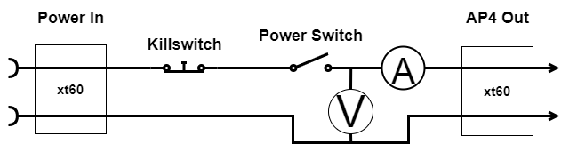
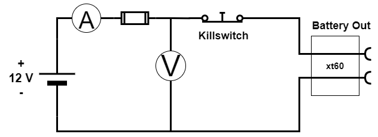
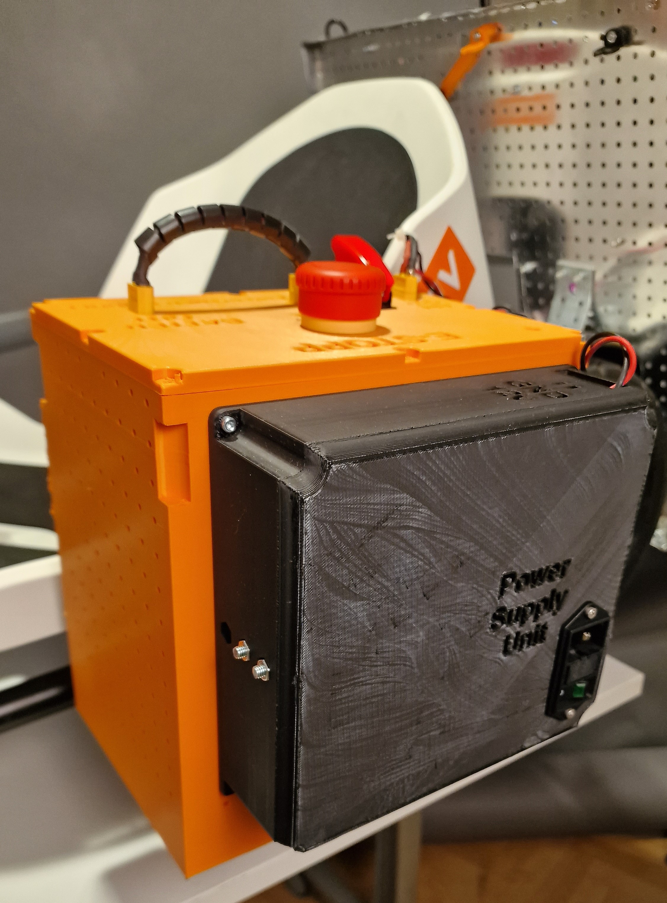
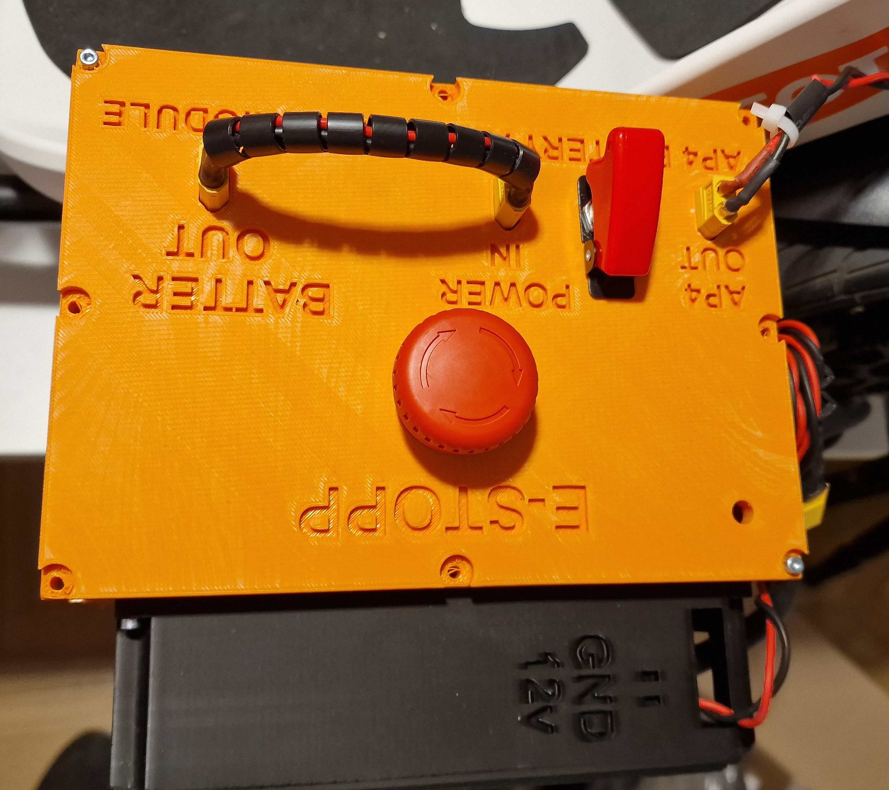

# Power Module

The power consumption of the implemented AP4's hardware has been calculated in  the table below. The values have been derived from each component's product manual, which can easily be found on the internet. The values are based on the nominal values in order to define overall power consumption. Some components have been neglected such as the losses in cables, wires and switches. The power calculation follows the well-known electrical direct current power formula: `P = U . I [W]` where `U` is the voltage and `I` is the current.

| Component             | Voltage                  | Current  A | Quantity | Power W |
| --------------------- | ------------------------ | ---------- | -------- | ------- |
| Raspberry Pi 4b       | 5                        | 1.01       | 1        | 5.1     |
| DC-Motor EMG49        | 24                       | 2.1        | 1        | 50.4    |
| Cooling Fan           | 12                       | 0,095      | 2        | 2.28    |
| Bluepill              | 5                        | 0.035      | 1        | 0.175   |
| MCP2515, CAN module   | 5                        | 0,05       | 1        | 0,25    |
| MCP4725, DAC          | 5                        | 0,05       | 2        | 0,05    |
| Router                | 12                       | 1          | 1        | 12      |
| Camera, Logitech c920 | 5                        | 0.5        | 1        | 2.5     |
|                       | Total Power Consumption: | 73.2       |          |         |

The power module consists of three components, a battery, a battery charger and a power supply unit (PSU). Furthermore, there is a user interface including a power switch, emergency kill switch and outlets that select which power source that should be used for the autonomous platform. Also, there are voltage- and current measurement units mounted, but they are not implemented in software or physically connected to an ECU. The complete electrical circuit of the power module and a rendered illustration of the CAD files for the power module can be seen in here:

### Battery and Charger

The battery chosen is a 12 V lead acid battery from Biltema. The battery is typically used for lawnmowers and similar machines. The corresponding battery charger selection is based on compatibility with the battery, also from Biltema. The battery capacity is 30 Ah and weighs about 8kg. Thus from the derived system current consumption the theoretically run-time of the system will be:
`t = 30/8.33 = 3.6 hours`

Having a power supply unit (PSU) connected to the electrical grid will enable the use of AP4 in a controlled environment. This can be done inside of a lab with the AP4 raised, so no wheel contact on the surface. Thus enabling the testing of higher levels of algorithms without the movement and unnecessary use of the battery that will shorten its lifespan.

### User interface

The electrical circuit for the user interface and connected sensors and the schematic of the power module can be seen in the images below. The user interface includes three different outlets in order to select which power source that should be used. These outlets are called,  battery out,  power in,  AP4 out.  Battery out is directly connected to the battery terminals, with the kill switch in series.

Power in outlet will power the whole platform. The  power in is connected to the kill switch, power switch and fuses, then passed out to  AP4 out that is connected to the rest of AP4. The selection of power source is based on which source either PSU or battery is connected to the  power in outlet. For example, the PSU could power the platform whilst the battery is charged at the same time.

