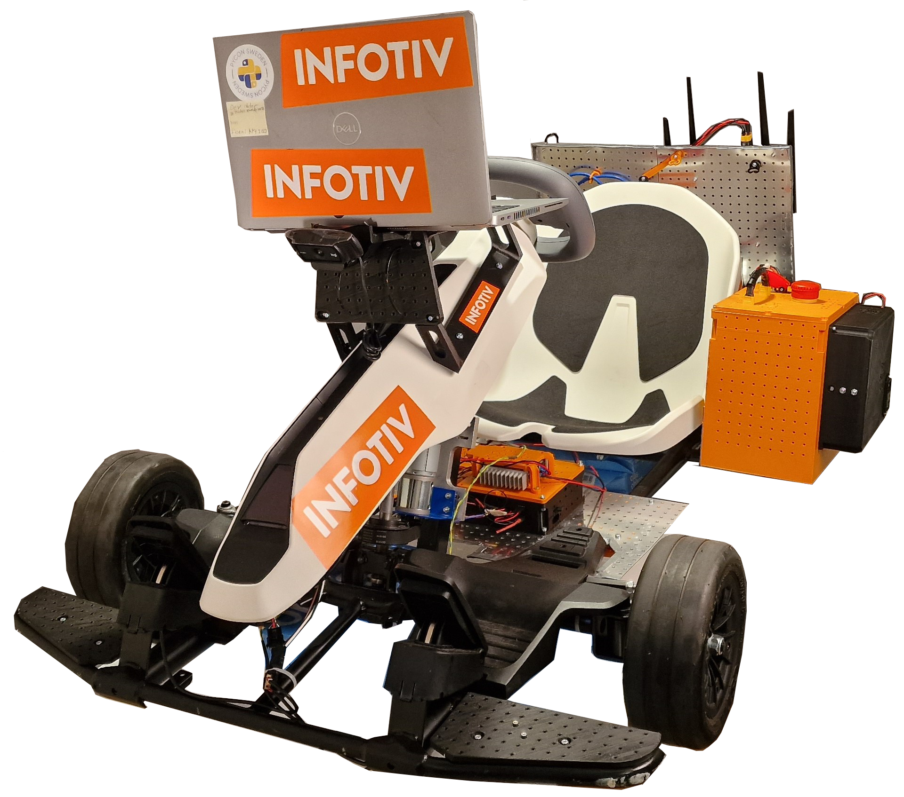
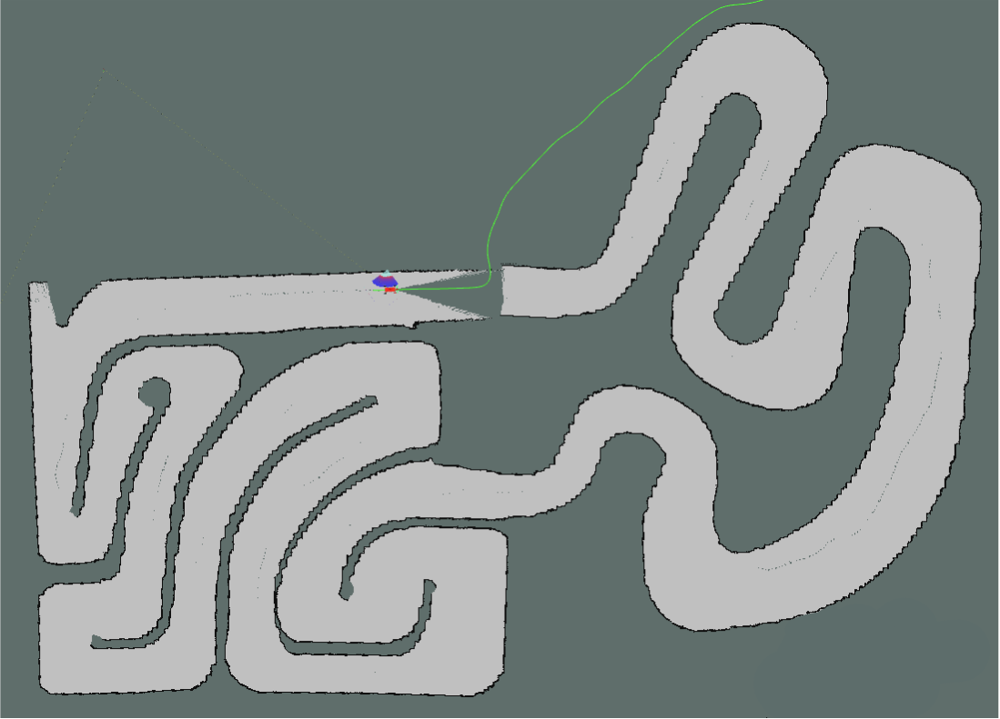

# Autonomous Platform (Gen4)

[](https://github.com/infotiv-research/autonomous_platform)

[ Link to the github repo](https://github.com/infotiv-research/autonomous_platform)

```bash
$ git clone --recurse-submodules http://gitlab.infotivlab.se/internal-development/autonomous_platform.git # Internally
$ git clone --recurse-submodules https://github.com/infotiv-research/autonomous_platform
```

This is the repository for Autonomous Platform at Infotiv Technology Development.

- The beginning of the fourth generation of Autonomous Platform was created by **Fredrik Juthe** and **Erik Magnusson** as part of a master thesis at Chalmers University of technology spring 2023 under supervision of **Hamid Ebadi**. The master thesis designed the system E/E architecture and implemented a base on which future functionality could be added to. A published version of the thesis with the title of **"Design of a modular centralized E/E and software architecture for a small-scale automotive platform"** is accessible in [in this link  ](Master_Thesis2023.pdf).

- The implementation of software pipeline for Imitation Learning for achieving autonomous driving using both behavioral cloning (BC) and Human Gated Dataset Aggregation (HG-DAgger) is done by **Arvid Petersén** and **Johan Wellander**  under supervision of **Hamid Ebadi** as a part of a master thesis with the title of **Autonomous Driving via Imitation Learning in a Small-Scale Automotive Platform - a Comparison Between BC, HG-DAgger, and the use of Various Inputs**  that is accessible [in this link  ](Master_Thesis2024.pdf).

- The implementation of a LiDAR using SLAM for autonomous navigation of the AP4 is done by **David Espedalen** and **Anton Stigemyr Hill** under supervision of **Hamid Ebadi** as a part of a master thesis with the title of **Implementation of LiDAR and SLAM on a Small-Scale Autonomous Platform - Investigation of how LiDAR can be used to Simultaneously Localize a Vehicle and Map its Surroundings using SLAM** that is accessible [in this link  ](Master_Thesis2025.pdf).

[](Master_Thesis2025.pdf)
[](Master_Thesis2024.pdf)
[](Master_Thesis2023.pdf)

[Video Demo- Imitation Learning](https://www.youtube.com/watch?v=8izLmmYHW0s) ([raw footage](https://www.youtube.com/watch?v=A2l_nDKsU7g)):

[](https://www.youtube.com/watch?v=8izLmmYHW0s)

- The __latest public__ version of documentation and source code for Autonomous Platform (AP) project is available in the following address: [https://infotiv-research.github.io](https://infotiv-research.github.io) and [https://github.com/infotiv-research](https://github.com/infotiv-research).
- The printer friendly version of this document is [available in this link ](AutonomousPlatform.pdf).

## Introduction

Autonomous Platform (generation 4) project is a platform on which internal and external research projects can be tested on. (i.e Autonomous Drive algorithms) and to expand the knowledgeable in different aspects of software and hardware system development. The purpose of this repository is to collect all the software components in one mono-repository, meaning all software (& hardware design) for the different components is placed in a single repository. Any future work on autonomous platform should be integrated into one of the repositories sub directories. This means that any future development or research can always refer back to previous work, making it a viable long term project at Infotiv AB.



## Features and Capabilities <a name="Features-Capabilities"></a>

Below, the capabilities and functions of autonomous platform generation 4 are summarized.

### Drive by wireless controller

AP4 is capable to be remotely controlled using an xbox 360 controller.  The xbox wireless adapter should be connected to the Raspberry Pi 4b usb port.

### Remote access to platform & software

A wifi router is mounted on the back plate, this allows developers to connect to the software whilst it is running to monitor internal states. High-level software can stream commands to the low-level software remotely.

### Accelerating, Brake & Steering

The platform can be driven forwards, backwards and can be steered. This is done programmatically, meaning "Drive by Wire". Joysticks commands from the xbox controller can therefore be configured to control the platform. In the same way it is trivial to take commands from Autonomous Drive algorithms to control the platform.

The steering signals and throttle signals are currently being without the turbo option in teleop_twist_joy, meaning the signal may be sent at 70% of the maximum value from the xbox controller to the AP4. This could be explored and maybe changed change, however that would maybe mean that there will be a need to retrain the imitation learning models from scratch to be abel to handle the increased speed.

### Scalability

The idea with autonomous platform generation 4 is that it should be a scalable base platform on with future functionality should be added onto. Scalability and modularity is therefore a key concept for the platform.

Hardware wise, every component can be mounted where it is deemed appropriate using a pre defined hole pattern. It is possible to move existing hardware as time goes on. New hardware can be added as long as it uses the pre defined hole pattern present on the metal sheets.

Embedded sensors can be added using ECUs following a set template. These can then be added to the existing system without breaking backwards compatibility using a defined CAN bus network. High data throughput sensors can be added to the platform using USB connection.

The software is built to be scalable and modular. The software structure is described in detail below. The software is deployed inside docker containers, making it easily deployable and scalable. The controlling software is written using the Robot Operating System 2 (ROS2) Framework. This allows developers to easily add onto existing software.

### Power Module

Consists of a led acid battery and a power supply unit, both can be connected to power the autonomous platform. Meaning the platform can be powered whilst driving around from battery. Whilst in a lab environment power can be supplied to the platform through a wall socket.

### Digital Twin <a name="Digital-Twin"></a>

The digital twin is implemented in the high-level software. It is described in detail in `High_Level_Control_Computer/README.md`. It is automatically started when the high-level docker container is started.

### Imitation Learning

Imitation learning is used to learn driving in an environment by observing an expert and by imitating its behavior

## System Architecture <a name="System-Architecture"></a>

The autonomous platform has three different software components:

- High-level control
- Low-level control
- Embedded control

High-level is supposed to be run on a high performance computer and can be run without being connected to the rest of the system. Low-level control is run on the Raspberry Pi 4b mounted on the hardware platform. The embedded control is run on the ECU nodes mounted to the platform. Software in high-level and low-level are communicating using the Robot Operating System (ROS2) framework. Software in the embedded control is written using the Arduino framework.


The three software components are connected through hardware and software links. High-level and low-level software is connected using an ethernet interface, meaning the two softwares should be run whilst connected to the same network. The low-level control is connected to the embedded control through a CAN bus network. A custom CAN library and interface has been created to link the embedded control with the low-level control.


### High-level control

The high-level software consists of three components, an autonomous driving algorithm and a digital twin interface with the Gazebo physics simulator and a switch which sends commands to either the digital twin or the physical platform. As of June 2023 only a simple digital twin is implemented in this software layer. Starting up the high-level control container will start up Gazebo and Rviz. See `FUTURE_WORK.md` for what could be implemented.


In the illustration above, three components can be seen. Autonomous driving stack, digital switch and gazebo physics simulator. These components should be implemented as a set of ROS2 computational nodes. Note: This is the intended structure but has not been implemented yet.

- __Autonomous Drving Stack__ is the proposed set of algorithms which takes in sensor information and responds with suitable actuator control commands.
- __Digital Twin Switch__ is the proposed software switch that is supposed to re-route AD commands to either the physical platform or the digital twin. In the same way, sensory data should be routed from the physical platform or digital twin. The same actuator commands and sensor data type should be used on the digital twin as the physical platform. This ensures that proposed AD algorithms can first be tested on the digital twin and then seamlessly be tested on the physical platform.
- __Gazebo Physics Simulator__ Is the proposed digital twin simulation environment. It integrates seamlessly with the ROS2 framework. The physical dimensions and driving dynamics can be configured in xml format. Different simulation environments can be setup and saved as world files. Meaning different AD scenarios can be tested easily.

The high level control folder, `High_Level_Control_Computer` consist of a docker container and a folder with software. The software can start a simple digital twin of Autonomous platform Generation 4. The folder contains a `docker-compose` file which starts a docker container and mounts the `ap4_hlc_code` folder in the container. A ROS2 launch file is then run which starts up the digital twin. The container can be started on any device supporting graphics, i.e a laptop.

### Low-level control

The low-level software is responsible for taking platform commands sent from higher-level software and convert it into commands which are sent to the actuators. It is implemented on a Raspberry Pi 4b. A simple vehicle control converts commands sent on `\cmd_vel` ROS2 topic into ROS2 topics which gets relayed to the embedded control. In the same way the low-level software is responsible for taking any sensor input and passing it forwards to higher-level software. A custom package to convert ROS2 topics into CAN bus has been created, making it simple to interface high-level software with the embedded control software.

The hardware interface folder, `Hardware_Interface_Low_level_pc` , contains a `docker-compose` file which starts a docker container and mounts the `ap4_hwi_code` folder in the container. A ROS2 launch file is then run which starts up software that interfaces with hardware. This software is specific for the hardware mounted on autonomous platform, therefore it can only be started properly on the Raspberry Pi 4b mounted onto the platform.


### Embedded control

The embedded software is implemented on the ECUs placed on the platform. This firmware acts as an interface between hardware (actuators or sensors) and pass data to and from the low-level software.
Currently a single embedded software is implemented, Steering and Propulsion Control Unit (SPCU).


`CAN_Nodes_Microcontroller_Code` folder contain PlatformIO projects for each ECU, that is the embedded software running on the generic ECUs. An example of ECU is the SPCU (Steering, Propulsion Control Unit).Furthermore here is the CAN database and the corresponding CAN-library located.

### Autonomous Driving

The autonomous driving (AD) is implemented using the [Imitation library](https://imitation.readthedocs.io/en/latest/) where the structure for Behavioral Cloning (BC) and Human Gated Dataset Aggregation (HG-DAgger) are developed for this project. All of the AD is handled by the high-level docker and the overall structure of the implementation can be seen below.


### Training Data

To collect data from training and test drive rosbag2 can be found in [High_Level_Control_Computer/IMITATION_LEARNING.md](High_Level_Control_Computer/IMITATION_LEARNING.md)
To collect data from training and test drive rosbag2 is used. The data collection is done in the High Level Planner Docker and specifically in the folder bagfiles_2024, within source. With the High Level Control Docker running, the directory is accessed as follows.

Attention: To download and train [data and the model](https://huggingface.co/datasets/hamidebadi/autonomous_platform_gokartcentrallen_imitation_learning_dataset) either follow [huggingface instruction](https://huggingface.co/docs/hub/repositories-getting-started) or after adding your SSH public key to your user settings  , request for permission and clone the repo as a [submodule](/.gitmodules) by adding `--recurse-submodules` when you clone the repository. All recorded data used for training and validation in the project can be found [here.](https://huggingface.co/datasets/hamidebadi/autonomous_platform_gokartcentrallen_imitation_learning_dataset)

Examples of the data can be seen below:

- Orb positions overlay on color image
- View from depth camera


## Start AP4 <a name="How-to-start-Autonomous-Platform-Generation-4"></a>

Below follows a quick guide on how to start autonomous platform generation 4 and control it using an xbox 360 controller.

- Connect xbox wireless adapter to Raspberry Pi 4b
- Connect Power source: (Battery or PSU) to POWER IN plug.
- Release Emergency stop
- Flip start switch
- Turn on Nine-bot segway (on backside of platform) Segway will beep once.

System will now boot up. The wheels will move back and forth.

- Wait 60 seconds (hardcoded in the SPCU ECU unit)

The platform should beep again after waiting 60 seconds and turn right to left, meaning it is ready to use.

The platform should be controllable using the xbox controller. By holding down the right bumper button and moving the left joystick the front wheels should move and back wheels turn forwards.

- Turn of the AP4 through flipping back the start switch

## Connect wireless or wired and start AP software stack

To check that the software is up and running as expected one can connect to the platform wirelessly or wired and monitor the ROS2 network. On an external computer (dev-laptop or other linux computer) start the high-level software container. Make sure the computer is connected to the same wifi network as the Raspberry Pi, or is wired connected to the AP4 router.

NOTE: User credentials are available only in the infotiv internal gitlab repository.

In a new terminal, start the docker container:

```bash
cd High_Level_Control_Computer
docker-compose build
docker-compose up -d
docker exec -it ap4hlc bash
```

The low-level software components should be visible to the high level software components. This can be checked with

```bash
ros2 node list
```

The expected output will be something like this:


Information sent between nodes (such as sensor data or CAN bus traffic) can be monitored using

```bash
ros2 topic echo <topic_name>
```

For a list of active ROS2 topics, the following command can be used.

```bash
ros2 topic list
```

If the topics and nodes show up, the system has started correctly and can be controlled by either an xbox control or the autonomous navigation using ther LiDAR and SLAM.

## Start the autonomous navigation of AP4 using LiDAR and SLAM

To setup and start the autonomous navigation of the AP4 on the gokart track the previous step of connecting the laptop to the Raspberry Pi needs to be done. When the AP4 is started and the laptop and the Raspberry Pi are on the same network, we can start the autonomous navigation.

First, ensure the laptop and the Raspberry Pi has the same timestamp, do this by enter the Raspberry Pi via SSH from the laptop.

```bash
ssh ap4@IP_for_RbPI
Password: AP42023
```

In the same terminal, enter the HWI docker

```bash
docker exec -it ap4hwi /bin/bash
```

In another terminal, enter the HLC docker

```bash
docker exec -it ap4hlc /bin/bash
```

In both dockers type

```bash
date
```

Run both terminals at the same time, if they show the same time you are good to move forward, but if they show different time do the following.

Run this command in both terminals at the same time

```bash
sudo date --set "25 Sep 2025 15:00:00"
```

Now when the laptop and the Raspberry Pi has the same date and time, we can run the autonomous drive software.

In the HLC docker on the laptop run:

```bash
ros2 launch autonomous_platform_robot_description_pkg launch_robot.launch.py
```

Now RViz2 should open and show the AP4 with the current mapped area. To begin navigate, press the `2D Goal Pose` button in Rviz and choose a goal point for the AP4. Now the gokart should move autonomously to the goal.

There are some issues with the navigation of the AP4 in the physical environment that limits the AP4 to drive one full lap around the track. These issues are described in the `ISSUES_AND_FUTURE_WORK.md`

Here is an example of the AP4 driving autonomously in the Gokartcentralen track. The first image is the simulation and the second image is the physical environment at the actual gokart track at Gokartcentralen in Kungälv. As seen, the gokart doesn't manage to drive one lap around the track in the physical environment, these issues are described in `ISSUES_AND_FUTURE_WORK.md`.




## Repository overview

The repository consists of three directories containing software (with a few subdirectories each):

- [`CAN_Nodes_Microcontroller_Code`](CAN_Nodes_Microcontroller_Code/)
- [`Hardware_Interface_Low_Level_Computer`](Hardware_Interface_Low_Level_Computer/)
- [`High_Level_Control_Computer`](High_Level_Control_Computer/)

Within these directories, there exists useful documentation regarding each software component and sub components.

- [`CAN_Nodes_Microcontroller_Code/README.md`](CAN_Nodes_Microcontroller_Code/README.md)
- [`CAN_Nodes_Microcontroller_Code/CAN_LIBRARY_DATABASE/README.md`](CAN_Nodes_Microcontroller_Code/CAN_LIBRARY_DATABASE/README.md)
- [`Hardware_Interface_Low_Level_Computer/README.md`](Hardware_Interface_Low_Level_Computer/README.md)
- [`High_Level_Control_Computer/README.md`](High_Level_Control_Computer/README.md)
- [`High_Level_Control_Computer/IMITATION_LEARNING.md`](High_Level_Control_Computer/IMITATION_LEARNING.md)
- [`High_Level_Control_Computer/DONKEY_CAR_SETUP.md`](High_Level_Control_Computer/DONKEY_CAR_SETUP.md)

The documentation is split up into smaller parts to keep information manageable and separated according to what can be relevant at a given time. The major documentation files located in the root directory of the repository are:

- [`README.md`](README.md) : The documentation you first see when you open the gitlab, this document.
- [`SOFTWARE_DESIGN.md`](SOFTWARE_DESIGN.md) : A quick introduction to important software and frameworks used on AP4 and how to install the required software. In illustration of how the network of hardware is connected is also can be found there.
- [`HARDWARE_DESIGN.md`](HARDWARE_DESIGN.md) : An introduction to hardware that is used on AP4 and how to add a new one.
- [`HOW_TO_EXTEND.md`](HOW_TO_EXTEND.md) : Are you a new team member? Look at this file for a quick introduction to the project and how to get going. It also has a general design principles for the project to keep in mind when adding new functionality.
- [`TEST_DEBUGGING.md`](TEST_DEBUGGING.md) : Contains a list of known errors when working with AP4 and how to solve them
- [`ISSUES_AND_FUTURE_WORK.md`](ISSUES_AND_FUTURE_WORK.md) : A Comprehensive list of known bugs & issues and possible future work to be done on the platform.
- [BOM](Resources/BOM) contains a list of decided upon requirements and specifications which the autonomous platform should follow. A complete bill of materials (hardware components) can be found in this file. It contains items, what purpose they serve, where they can be bought and a total estimated cost.
  As of *June 2023* the total cost is 16500 SEK to build the base platform and have spare parts over.

## Thanks

[](https://www.infotiv.se)
[](https://www.chalmers.se)
[](https://gokartcentralen.se/)

We would like to extend thanks [Gokartcentralen in Kungälv](https://gokartcentralen.se/kungalv/)
for generously allowing us to drive, test, and validate our go-kart at their track.
Without [Gokartcentralen](https://gokartcentralen.se/) and the helpful individuals working there, this project
would not have turned out as it did.
