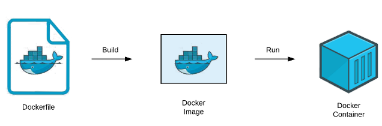
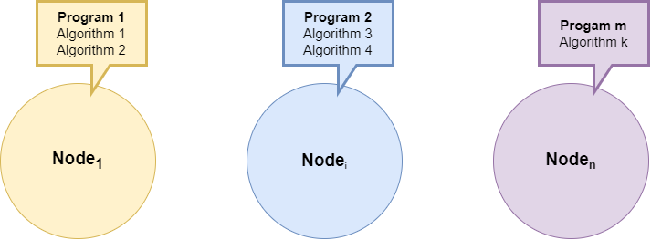
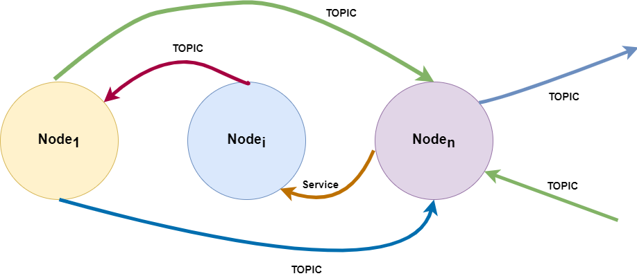
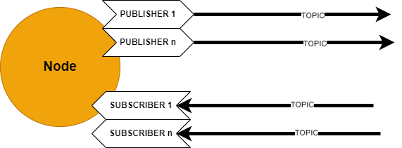
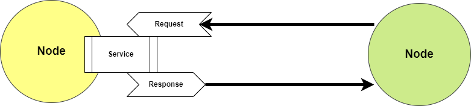
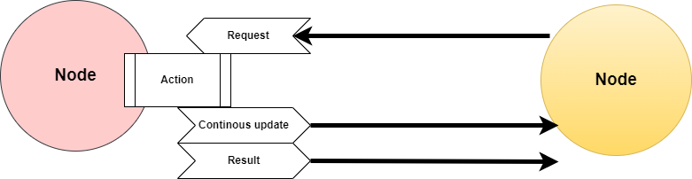

## Software Components

The procedure of installing some software will be mentioned in this section.
You need:

- Preferably have a linux based computer if you want to run code.
- If you only want to read through the documentation, staying in the browser is sufficient.
- OR if you only want to download and look through the repository a Windows host computer is sufficient.

### Information and Background

This README file is meant to collect information about all the software components used to construct Autonomous Platform Generation 4 or any tools used in this project. A lot of Software is used both in `Hardware_Interface_Low_Level_Computer` and `High_Level_Control_Computer`, and instead of explaining the same thing twice it can be collected here. It will also give new members of the project a structured document to read through.

This is meant to give new members a quick overview and explain the most important concepts related to the autonomous platform project.

The software and components that will be described in detail in this document are

- [VSCode](#VSCode) IDE
- [Linux Ubuntu 22.04](#linux-ubuntu-2204)
- [Git](#Git)
- [Containerization](#Containerization)
- [Robot Operating System 2 (ROS2)](<#Robot-Operating-System-2-(ROS2)>)
- [PlatformIO & VSCode](<>)
- [Jenkins](<>)

### IDE <a name="VSCode"></a>

The recommended Integrated Development Environment (IDE) is Visual Studio Code (VSCode). It is a free versatile IDE with many useful plugins. The built in file explorer makes navigation of the AP4 repository very easy.

See installation guide [here](https://code.visualstudio.com/) for Windows / Linux.

Visual Studio Code supports the use of plugins, referred to as extensions. These can be installed simply inside VSCode by navigation to the extensions tab. (Tab with four small squares to the left)

The recommended list of extensions are:

- C/C++
- Python
- PlatformIO

### Linux Ubuntu 22.04 <a name="Linux-Ubuntu-2204"></a>

The project software is meant to be run on Linux Ubuntu 22.04, therefore it is good to have basic understanding on how to use linux. (Good ability to google linux commands and copy paste commands is recommended!)

A linux for beginners guide related to development using Robot Operating System Framework can be found [here](https://www.theconstructsim.com/robotigniteacademy_learnros/ros-courses-library/linux-for-robotics/). It is an online interactive tutorial suitable for a project member which has NEVER worked in linux before. If you know how to navigate using the linux terminal and copy paste commands, skip this!

### Git <a name="Git"></a>

Autonomous Platform Generation 4 uses the "MonoRepo" mantra. Everything related to AP4 is collected inside ONE repository called `autonomous_Platform_Generation_4`. If you manage to clone this onto a computer you have everything you need to get started.

Installing Git through command line is preferred. See the official guide [here](https://git-scm.com/book/en/v2/Getting-Started-Installing-Git) and choose appropriate operating system. Running the code has not been tested on Windows machines but it is still possible to read through the documentation and inspect files on  a Windows device.

### Containerization <a name="Containerization"></a>

The High level and low level software runs inside a docker containers (on the Development laptop and Raspberry Pi 4b). [Official Docker Page](https://docs.docker.com/get-started/overview/). It is similar to a Virtual Machine, in that it can run software in a separate compartment from the host computer software. It does not take up as much resources as a VM and is much faster to spin up (start). Docker containers uses the following components to create containers.



Dockerfile: [Dockerfile Official Documentation](https://docs.docker.com/engine/reference/builder/). A dockerfile is a text file describing the software environment which will be run in the container. For example, running Ubuntu as a base with with X,Y standard linux packages installed onto it. So every library or package one would install on a linux desktop version, one could define in this file. This dockerfile can then be built into a docker image. (everytime a container is rebuilt, anything saved in it is LOST). See `Hardware_Interface_Low_Level_Computer/dockerfile` for an example of a dockerfile.Therefore software should be written outside the container and passed into the container through volumes. See `Hardware_Interface_Low_Level_Computer/docker-compose` how this is performed by mounting volumes.

A docker image can then be spun up which creates a container.

A container can be spun up with several configurations commands. [List of commands](https://docs.docker.com/engine/reference/commandline/run/). For example, it is possible to mount volumes (directories) into the container.

#### Installation of Docker

See official guide [here](https://docs.docker.com/engine/install/) Choose appropriate operating system.

As of August 2023 AP4 containers have only been configured to run on a Linux Host computer.

### Containers

The containers for autonomous platform contains two docker related files, __dockerfile__ and __docker-compose__. The dockerfile describes the software environment (ubuntu 22.04 Jammy) with additional software and onto this the ROS2 framework and additional libraries are installed. The docker-compose file uses the dockerfile to launch a container with a set of parameters. For example, passing in and out graphical elements, and passing created software (as a directory) (performed by mounting a volume) into the container. In the docker-file a command which runs when starting the container can be defined. This can be useful to call a startup script that would run inside the container when starting it. This is done using the command: keyword.

Note: Docker can be run on Windows, but certain commands/parameters used on AP4 are linux specific. I.e passing graphics to and from the container. As of August 2023 it is therefore only possible to run the high level software on linux. See 'FUTURE_WORK.md' for instructions on how to possibly solve this issue.

The container, with the configurations, can be started using: (Terminal path has to be located in the directory where the dockerfile and docker-compose is located at)

```bash
docker-compose up
```

Note: The host PC needs to be configured to pass graphical elements to the high level computer container. (before starting the container)

```bash
xhost +local:*
```

It is possible to enter a running container environment using

```bash
docker exec -it <container-name> bash
```

Running containers can be listed using

```bash
docker container ps
```

A running container can be stopped by either 'Ctrl+C' in the terminal in which 'docker-compose up' was run. OR in a new terminal:

```bash
docker stop <container-name>
```

### Robot Operating System 2 (ROS2) <a name="Robot-Operating-System-2-(ROS2)"></a>

Robot Operating System 2 (ROS2) is a framework / middleware developed to create very complex robotic software. The first version was released around 2007 and its successor, ROS2 was released around 2019. The version used for AP4 is ROS2-humble. [ROS2 Humble Docs](https://docs.ros.org/en/humble/index.html). ROS2 Humble has an End of Life (EOL) of [2027](https://docs.ros.org/en/humble/Releases.html). Future work should still use Humble as it has the most availible packages. Different distributions of ROS are NOT compatible. In theory it is possible to bridge a ROS1 distribution with a ROS2 distribution using ROS bridge if a package does not exist for ROS2, this is not implemented on AP4. [ROS bridge link](https://industrial-training-master.readthedocs.io/en/melodic/_source/session7/ROS1-ROS2-bridge.html)

ROS2 has tier 1 support for Linux Ubuntu 22.04. And tier 3 support for Linux 20.04, on autonomous platform generation 4 Ubuntu 22.04 is used.

ROS2 applications can be written in either C++ or Python. There are tutorials for both versions. Different nodes (Computational applications) written in separate languages can still communicate with another using the ROS2 API & Framework. Therefore, use what programming language you are most comfortable with. In applications where execution speed is of outmost importance, using C++ can be preferred. But for testing new concepts or developing high level control algorithms Python is more than sufficient. Even if something is written in Python it still has to be compiled into a ROS2 package before it can be run.

#### ROS2 Useful commands quick reference

A common methodology to debug software written for the ROS2 framework is to observe the behavior through a terminal window. Here is a list of useful ROS2 commands for quick reference in the future.

#### Commonly used commands to debug

Source underlying ros2 environment variables

```bash
source /opt/ros/humble/setup.bash
```

Sourcing environment variables specific to a workspace (open terminal in workspace directory)

```bash
source install/setup.bash
```

List what topics are currently being broadcasted to on the ROS2 network.

```bash
ros2 topic list
```

Read in thermal what is broadcasted onto a specific topic

```bash
ros2 topic echo ${topic_name}
```

Publish data onto a specific ros2 topic. If environment variables are sourced tab autocomplete works.

```bash
ros2 topic pub ${topic name} ${message type} ${message data}
```

List active nodes on ROS2 network

```bash
ros2 node list
```

Display useful information about a specific node.

```bash
ros2 node info ${node name}
```

#### Visualization

Visualize the ROS2 network of nodes and topics in a GUI.

```bash
ros2 run rqt_graph rqt_graph
```

Plot data sent over different topics. Useful for I.e plotting requested velocity vs measured velocity to debug system and observe behavior. Any numerical data sent over a topic can be plotted.

```bash
ros2 run rqt_plot rqt_plot
```

#### Saving data sent on topics

Save topic information transmitted over the ROS2 network. [Documentation here](https://docs.ros.org/en/foxy/Tutorials/Beginner-CLI-Tools/Recording-And-Playing-Back-Data/Recording-And-Playing-Back-Data.html). Record what is transmitted over a specific topic (Ctrl + C to stop recording):

```bash
ros2 bag record -o ${your bag file name} ${topic name 1} ${...} ${topic name n}
```

Display information regarding the bagfile that was previously recorded

```bash
ros2 bag info ${bag file name}
```

To record all information sent over all topics in the ROS2 network

```bash
ros2 bag record -o ${your bag file name} -a
```

The information recorded can be played back and will be outputted to the ROS2 network on the same topics that they were recorded on, using:

```bash
ros2 bag play ${bag file name}
```

#### Available ROS2 Resources <a name="Additional-ROS2-Resources"></a>

Here are resources on ROS2 which can be useful for future work.

- Beginner level [Interactive ROS2 tutorial](https://www.theconstructsim.com/robotigniteacademy_learnros/ros-courses-library/ros2-basics-course/) with online excercies. VERY USEFUL

- Beginner Tutorial: [Writing a simple publisher and subscriber (Python)](https://docs.ros.org/en/foxy/Tutorials/Beginner-Client-Libraries/Writing-A-Simple-Py-Publisher-And-Subscriber.html)

- Beginner Tutorial: [Writing a simple publisher and subscriber (C++)](https://docs.ros.org/en/foxy/Tutorials/Beginner-Client-Libraries/Writing-A-Simple-Cpp-Publisher-And-Subscriber.html)

- [ROS_DOMAIN_ID](https://docs.ros.org/en/humble/Concepts/About-Domain-ID.html)

- [ROS2 Interfaces](https://docs.ros.org/en/humble/Concepts/About-ROS-Interfaces.html) Fields and datatypes in ROS2 topics.

- [Official How-to Guides](https://docs.ros.org/en/humble/How-To-Guides.html) For common problems when developing software in ROS2 framework.

- [ROS2 On Raspberry Pi](https://docs.ros.org/en/humble/How-To-Guides/Installing-on-Raspberry-Pi.html) @TODO MOVE THIS POINT TO LOW LEVEL SOFTWARE

- [API Documentation](https://docs.ros.org/en/humble/API-Docs.html)

Here is a hands on video series on how ROS2 was used to create a mobile robot and a digital twin. It goes through the basics and then moves on to cover the advanced aspects of ROS2.  [Link - Articulated Robotics](https://www.youtube.com/watch?v=2lIV3dRvHmQ&list=PLunhqkrRNRhYYCaSTVP-qJnyUPkTxJnBt) Many of these concepts are used on Autonomous Platform Generation 4.

#### ROS2 Concepts <a name="ROS2-Concepts"></a>

There are a few concepts which are very important to understand in order to understand how the high-level software is constructed on AP4. The official ROS2 documentation is a useful tool [ROS2 Beginner: CLI tools](https://docs.ros.org/en/humble/Tutorials/Beginner-CLI-Tools.html).

#### Node

[ROS2 Nodes official Documentation](https://docs.ros.org/en/humble/Tutorials/Beginner-CLI-Tools/Understanding-ROS2-Nodes/Understanding-ROS2-Nodes.html)



Nodes are where the software applications are written. Each node can be seen as a program (written in C++ or Python) performing some task. Weather it be processing information or interfacing with some hardware/software component. A node can perform multiple tasks and supports parallelization if configured correctly. [See Execution Management](https://docs.ros.org/en/humble/Concepts/About-Executors.html)



Nodes can communicate with other nodes using Topics, Services or Actions. This means sending information between them using a standardized communication interface. It is up for the developer to structure how information should be received and sent from nodes. This is done in the nodes themselves.

The communication between different ROS2 components on a network uses [DDS Middleware.](https://docs.ros.org/en/foxy/Concepts/About-Different-Middleware-Vendors.html)

#### Topic

[ROS2 Topic Official Documentation](https://docs.ros.org/en/humble/Tutorials/Beginner-CLI-Tools/Understanding-ROS2-Topics/Understanding-ROS2-Topics.html)



Topics are the means in which different Nodes can send and receive specific information. Information can be broadcasted using publishers and listen to using subscribers. These communication channels are called topics, each topic contains a topic name and a data field. The topic name determines what channel it will be sent over and the data field contains the information itself.

[List of generic built in topic data types](https://docs.ros.org/en/humble/Concepts/About-ROS-Interfaces.html). Custom data field types, containing multiple values sent in a single message can be created by a developer. [Link how-to](https://docs.ros.org/en/crystal/Tutorials/Custom-ROS2-Interfaces.html)

```
Topic name
    data
```

Topics are broadcasted over the whole ROS2 network by publishers, meaning any other Node on the network can listen to any publisher. In order to direct data to a specific node, a developer must create a subscriber in the desired node, which listens to the correct topic name.

Note: There exists multiple [Quality of Service](https://docs.ros.org/en/rolling/Concepts/About-Quality-of-Service-Settings.html) parameters which can be configured. These can tell the DDS middleware what topics should be priotized when sending over the ROS2 framework. As of June 2023 these are set as standard priority.

#### Services

[ROS2 Services Official Documentation](https://docs.ros.org/en/humble/Tutorials/Beginner-CLI-Tools/Understanding-ROS2-Services/Understanding-ROS2-Services.html)



Services work much like the topics, but there is a key difference. a node can request information (structured as a topic) from one node, and is guaranteed to receive information back.

Request functionality has to be created by the developer and is not something that is automatically built into a node. See tutorial [C++](https://docs.ros.org/en/foxy/Tutorials/Beginner-Client-Libraries/Writing-A-Simple-Cpp-Service-And-Client.html), [Python](https://docs.ros.org/en/foxy/Tutorials/Beginner-Client-Libraries/Writing-A-Simple-Py-Service-And-Client.html)

#### Actions

[ROS2 Actions Official Documentation](https://docs.ros.org/en/humble/Tutorials/Beginner-CLI-Tools/Understanding-ROS2-Actions/Understanding-ROS2-Actions.html)



#### Launch files

A launch file can be run in order to start several nodes at the same time. Launch files from existing packages can be called from within a launch file.

[ROS2 Documentation: Creating a launch file](https://docs.ros.org/en/foxy/Tutorials/Intermediate/Launch/Creating-Launch-Files.html).

[Call launch files from inside launch files](https://answers.ros.org/question/306935/ros2-include-a-launch-file-from-a-launch-file/)

#### Creating a ROS2 software package

In ROS2 a package is a form of library with functionality. Software inside a package is related to one function, therefore ROS code is very decentralized. This is very useful since existing packages can started separately and mixed together depending on application needs. Existing software packages can run parallel with custom user developed plugins to create new functionality. New packages can also be built on top of existing packages by defining dependencies.

A package can contain code for several nodes. So it does NOT have to be one node per package.

See a list of available ROS2 (version = Humble) packages [here](https://index.ros.org/packages/page/1/time/). Make sure filter is set to 'Humble'.

#### Structure of a ROS2 package

The file structure of a ROS2 workspace is standardized and can look something like like this: (don't worry most of the files in a package are automatically generated). All created packages are stored in the 'src' directory in the ROS2 workspace folder. Packages written in Python and C++ differ somewhat in content. Below is illustrated how to packages, one written in C++ and one written in Python are located in the filesystem.

```
 ┗  ros_ws
    ┗  src
        ┣ example_pkg_1 (C++) 
        ┃    ┣  launch (Optional)
        ┃    ┣  src
        ┃    ┃  ┗    <CODE>
        ┃    ┃  
        ┃    ┣   CMakeLists.txt
        ┃    ┗   package.xml
        ┃
        ┗  example_pkg_2 (Python)
             ┣  launch (Optional)
             ┣  resource
             ┣  test
             ┣  example_pkg_2
             ┃  ┣  __init__.py
             ┃  ┗   <CODE>
             ┃
             ┣    package.xml
             ┣    setup.cfg
             ┗    setup.py
```

#### Creating a ROS2 package

The official ROS2 guide can be found [here](https://docs.ros.org/en/foxy/Tutorials/Beginner-Client-Libraries/Creating-Your-First-ROS2-Package.html). The steps are summarized below. Packages can EITHER use CMake or Python depending on what programming language you want to use. You cannot mix programming languages within a package.

In order to create a package you need to be located inside a ROS2 workspace. For autonomous platform 4 this has already been setup. For curious members the documentation on how to create a ROS2 workspace can be found [here](https://docs.ros.org/en/foxy/Tutorials/Beginner-Client-Libraries/Creating-A-Workspace/Creating-A-Workspace.html).

### PlatformIO & VSCode

PlatformIO is a Visual Studio Code (VSCode) extension.

In order to program the STM32F103C8T6 (Bluepill) microcontroller used for the embedded software a software driver is needed.

**Windows:**\
STSW-LINK009.
ST-LINK, ST-LINK/V2, ST-LINK/V2-1, STLINK-V3 USB driver signed for Windows7, Windows8, Windows10

Driver can be downloaded [here](https://www.st.com/en/development-tools/stsw-link009.html). It enables a windows computer to use the ST-Link v3 programmer which is used to program the bluepill microcontroller boards.

## Project standards and conventions

### Git commit messages

The project is using [conventional commits](https://www.conventionalcommits.org) as a commit standard meaning the commit messages are structured using the following standard:

```bash
<type>[optional scope]: <desription>

[optional body]

[optional footer(s)]
```

Types can be found under the summary section on [https://www.conventionalcommits.org](https://www.conventionalcommits.org).

Each section should be separated with a blank line.

The footer **SHALL** contain the Azure task ID using the following format `Azure-ID: xxxx`.

With conventional commits, a version can automatically be determined and assigned based on the "type" of commit made. The version follows the [Semantic Version (SemVer)](https://semver.org) specification.

### Merge commits

When merging locally the commit message will be declined by the commit-msg git hook. This can be overwritten by using the `--no-verify` option. In PyCharm this can be found by:

1. Navigating to the `Git` menu
1. Clicking on `Merge`
1. Clicking on the `Modify options` dropdown and selecting the `--no-verify` option

### Documentation

Documentation is done in a markdown file. Try to keep our documentation close to your code. Keep the documentation short and clear.

- `#` : Only used once for the tile of the project
- `##` : usually once in each markdown file and usually share semantic with the markdown filename.
- `###` : Different topics, try to split your documentation into at least 4 topics
- `####` : sub topics. Try to avoid when you can use simple paragraphs

## Automated Testing (CI/CD)

This document aims to describe how various software components on AP4 could be tested in jenkins. As of August 2023 no tests are implemented, instead this document collects useful links and resources that might lead to future automated software tests.

There are three layers of software that needs to be tested:

- Embedded Software in ECUs : Uses PlatformIO environment / framework
- hardware interface and low level software : Uses ROS2 framework
- high level control software and digital twin : Uses ROS2 framework

### Resources for automated testing of ROS2 software - Jenkins

- [Jenkins Basic for Robotics](https://app.theconstructsim.com/courses/jenkins-basics-for-robotics-77/) Online course on how to test ROS software using Jenkins
- [How to setup the Jenkins master](https://docs.ros.org/en/eloquent/Contributing/CI-Server-Setup.html) for ROS (note outdated version of ROS but should exist similar for newer version)

### Resources for automated testing of embedded software platformio with Jenkins

A simple hardware test platform would need to be constructed and connected to the jenkins server as i understand it.

- [Callet91/DEMO_Jenkins_PlatformIO](https://github.com/Callet91/DEMO_Jenkins_PlatformIO) online github repository with step by step guide on how to setup platformIO and jenkins

### Offline local PlatformIO software tests

PlatformIO developed code could be tested offline on a local host computer connected to the micro-controller.

- [Unit Testing of a “Blink” Project](https://docs.platformio.org/en/latest/tutorials/core/unit_testing_blink.html) - Needs to be connected to hardware card?
- [Unit Testing](https://docs.platformio.org/en/stable/advanced/unit-testing/index.html) PlatformIO official guide

## Component Communication

The image below illustrate how a speed sensor sends data to `High_Level_Control_Computer` and further to development PC.


The diagram below shows different types of communication channels and IP address for different components.

```
             ┌───────────────────────────────────────────────┐
             │                  Laptop                       │
             │           High_Level_Control_Computer         │
             └────────────────────────┬──────────────────────┘
                                      │ 192.168.0.154
             ROS (Ethernet Network)   │
                                      │                       ┌───────────────────┐
                                ┌─────┴─────┐                 │                   │
                                │  Router   ├────────────────►│   Wifi Internet   │
                                └─────┬─────┘                 │                   │
                                      │ 192.168.0.1           └───────────────────┘
             ROS (Ethernet Network)   │
                                      │ 192.168.150.110
             ┌────────────────────────┴──────────────────────┐
             │      Hardware_interface_Low_Level_Computer    │
             │              Raspberry PI 4                   │
             └───────────────────────┬───────────────────────┘
                                     │ GPIO
                             ┌───────┴────────┐
                             │ RS485 CAN HAT  │
                           ┌─┤                ├─┐
                           │ │     MCP2515    │ │
                           │ └────────────────┘ │
     CAN network           │                    │
              ┌────────────┴───┐          ┌─────┴──────────┐
              │     MCP2515    │          │     MCP2515    │
              └────────┬───────┘          └───────┬────────┘
┌──────────────────────┴──────────┐    ┌──────────┴──────────────────────┐
│          STM32 Blue Pill        │    │         STM32 Blue Pill         │
│       Propulsion/Steering       │    │          Speed sensor           │
└─────────────────────────────────┘    └─────────────────────────────────┘
```

Illustration done using asciiflow online editor. (If any future changes has to be done)
