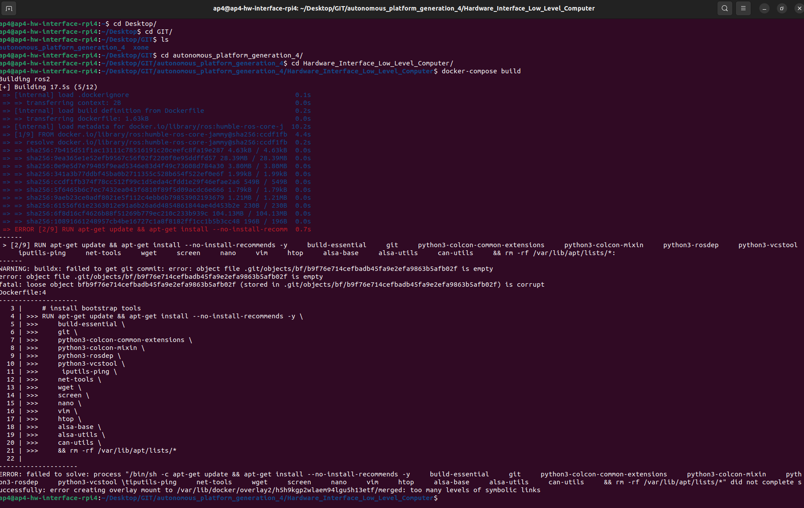
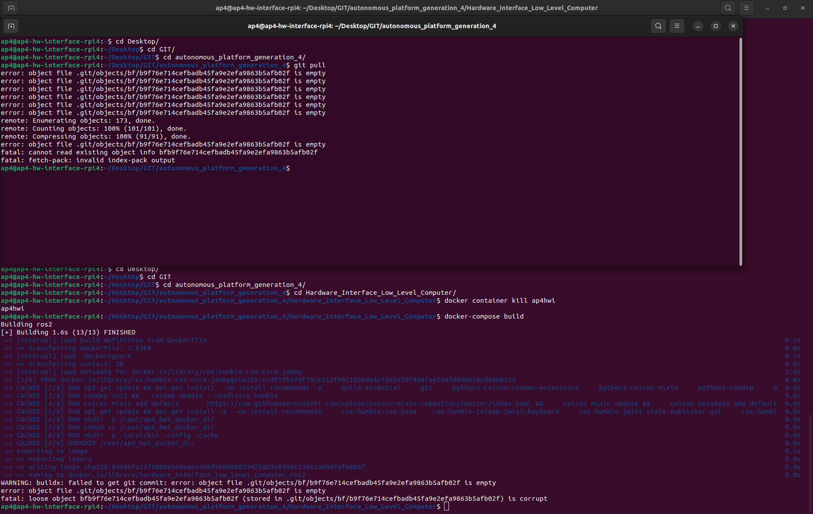
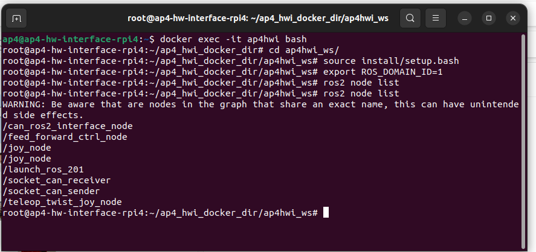
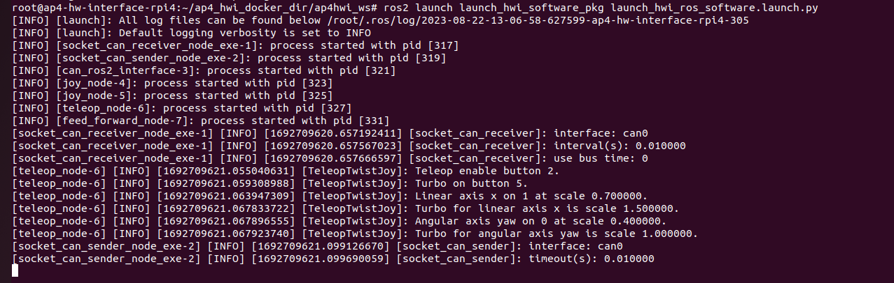

# Testing, Debugging, Known Issues and Future Work

## Test and debugging (System level)

This document collects known problems and issues with the autonomous platform and how to resolve them.

If the existing documentation could not provide a sufficient solution for a problem. Please add your problem and new solution to this document. It will help future members of this project.

### Possible Errors When Starting AP4

Problem: Steering works but not propulsion?

Solution(s): Check that segway is turned on (and charged), check that the the propulsion can be controlled manually by pressing the pedals. The back wheels should spin.

Problem: Segway is beeping? and wheels are turning backwards

Solution: the segway is in reverse mode, quickly press the brake pedals twice. The beeping should stop and segway should move forward when pressing the accelerator pad.

Problem: Segway is beeping and a yellow/orange light flashes on the front console / nose.

Solution: The batteries for the front black box circuits need to be replaced. Open the black compartment on the nose and replace the 6 AA batteries.

Problem: Neither steering or propulsion works.

Solution: Wait for two minutes, The hardware interface software on the raspberry pi could take a while to boot up

Problem: Neither steering or propulsion works after waiting 2 minutes after power ON.

Solution: Connect a screen (portable small screen) and keyboard + mouse to the raspberry pi to verify that it has booted up properly.

Sub-problem: Raspberry Pi could not boot up? Or stuck on boot-up sequence?

Solution: Fix errors using command line, try rebooting system. Follow steps down below to make sure the system is working correctly if the raspberry pi has successfully booted up.

1. Check that the Hardware_Interface docker container is running on the Raspberry Pi
   In a terminal:

```bash
docker container ps
```

Expected output should look something like this, the important thing is that the container is up and running.

```bash
CONTAINER ID   IMAGE COMMAND CREATED STATUS PORTS NAMES

xxxx   hardware_interface_low_level_computer_ros2   xxxx   10 seconds ago   Up 10 seconds             ap4hwi
```

If the container has not started there are two possibilities: 1. The container is still being built (could take a lot of time if new changes have been pulled). 2. The startup service has not been started properly (could have failed due to docker building errors) [systemd service guide](https://www.shubhamdipt.com/blog/how-to-create-a-systemd-service-in-linux/)

The startup service will run the 'testing.bash' script located in `Hardware_Interface_Low_Level_Computer` once called.

In a terminal check that the service has been started

```bash
sudo systemctl status startup_lowlevel.service
```

output:


In the terminal it would explicity say if something has failed and the service did not start properly. Note that it says ERROR in the screenshot above. Something is therefore wrong!

### Docker Container starting/Building

If the docker container is not built properly none of the hardware interface software will start properly.

Try rebuilding the docker container:

```bash
cd Desktop
cd GIT
cd autonomous_platform
cd Hardware_Interface_Low_level_Computer
docker-compose build
```

If this fails, there could be something wrong with the dockerfile or docker-compose file.

One possible error is "error creating overlay mount...". See image below.



This could occur because a specific docker layer could not be built. Try pruning the existing docker caches and rebuilding. (This will take some time on Raspberry Pi hardware, enter the commands and grab some coffee!!) Rebuilding a docker container without any saved caches takes about 10 minutes.

```bash
docker system prune
```

```bash
docker-compose build
```

Another error that has previously occurred can be seen in the image below.

 Some files in the repository have been corrupted.

To verify that local files are corrupt in the autonomous_platform repository enter the directory and try pulling changes. In a new console:

```bash
cd Desktop
cd GIT
cd autonomous_platform
git pull
```

The output will be something like:


To resolve this issue, delete the corrupted files and pull from gitlab. According to [this](https://stackoverflow.com/questions/4111728/how-do-i-deal-with-corrupted-git-object-files) forum post.

In the repository directory run the following commands:

```bash
find .git/objects/ -size 0 -delete
git pull
```

### Testing and Debugging Components

2. Make sure CAN bus messages are sent and received on linux SocketCAN interface
   On the raspberry Pi desktop. Open a new terminal and dump CAN messages

```bash
candump can0
```

Expected output (or similar). The import thing is that can messages are received.

```bash
  can0  7D0   [8]  00 00 00 00 00 00 00 00
  can0  7D0   [8]  00 00 00 00 00 00 00 00
  can0  7D0   [8]  00 00 00 00 00 00 00 00
  can0  7D0   [8]  00 00 00 00 00 00 00 00
  can0  7D0   [8]  00 00 00 00 00 00 00 00
  can0  7D0   [8]  00 00 00 00 00 00 00 00
  can0  5DC   [8]  00 00 00 00 00 00 00 00
  can0  7D0   [8]  00 00 00 00 00 00 00 00
  can0  7D0   [8]  00 00 00 00 00 00 00 00
  can0  7D0   [8]  00 00 00 00 00 00 00 00
  can0  7D0   [8]  00 00 00 00 00 00 00 00
  can0  7D0   [8]  00 00 00 00 00 00 00 00
  can0  7D0   [8]  00 00 00 00 00 00 00 00
  can0  7D0   [8]  00 00 00 00 00 00 00 00
```

If nothing shows up, it means that there is either something wrong with the CAN bus hardware, or in the low-level software.
If the command could not be run, it means that the startup service did not complete and initialize the right commands. (such as sudo ip link set can0 up type can bitrate 1000000) Try rerunning the startup service script by restarting the service.

```bash
sudo systemctl daemon-reload
```

```bash
sudo systemctl enable startup_lowlevel.service
```

The next step is to enter the low level software and rerunning the same command. The output should be the same as above. If this it works it means that the linuxsocketcan has been passed through properly.

```bash
docker exec -it ap4hwi bash
```

```bash
candump can0
```

3. Check that the ROS2 nodes have been launched correctly

First enter the docker hwi container environment

```bash
docker exec -it ap4hwi bash
```

Secondly, enter the correct directory, source environment variables and set the correct environment variables

```bash
cd ap4hwi_ws
source install/setup.bash
export ROS_DOMAIN_ID=1
```

To check which ROS2 nodes are up and running, enter

```bash
ros2 node list
```

The expected output (as of 22/8-2023):



If the correct ROS2 nodes have not been started, check that the container built successfully. Try rebuilding the container manually. Make sure the Raspberry Pi has internet access.

IF the container has started properly yet no ROS2 node is up, it can mean that the ROS2 software packages could not be built. To check this, try building them manually and running the ROS2 launch file.

Enter the docker container

```bash
docker exec -it ap4hwi bash
```

Navigate into the ROS2 workspace

```bash
cd ap4hwi_ws
```

Source ROS2 environment

```bash
source /opt/ros/humble/setup.bash
```

Build the low level software ROS2 components

```bash
colcon build
```

It will explicitly output in the terminal how many packages succeeded / failed. A C / Python output will be noted in the terminal. If any of packages failed, resolve the issue wich is presented in the terminal.

Source new ROS2 environment

```bash
source install/setup.bash
```

set environment variable

```bash
EXPORT ROS_DOMAIN_ID=1
```

Run the ROS2 launch file which starts up the software nodes

```bash
ros2 launch launch_hwi_software_pkg launch_hwi_ros_software.launch.py
```

The output should look something similar to this once the startup script has been run:



Try restarting the container and verify that the corrected nodes has been started successfully as described above.

```
VERY IMPORTANT: MAKE SURE THAT THE hwi_startup.bash script is actually run when the container is spun up. Look into the docker-compose file in `Hardware_Interface_Low_Level_Computer` directory. 


There is a command argument. command: xxxxxx

!!!!!!!!!!!!!!!!!!!!!!
MAKE SURE THAT #command: /bin/bash -c "./hwi_startup.bash" IS UNCOMMENTED
!!!!!!!!!!!!!!!!!!!!!!

Whilst debugging code it can be useful to comment this line out but the software will not start up when the container is started. It will cause a lot of confusion.
```

This is the expected output when the container is manually started:


4. Check communication between low-level-software and SPCU

If the expected ROS2 nodes have been started correctly and the platform still cannot be controlled. Verify that the velocity command from `\cmd_vel` topic is being published on.

```bash
ros2 topic echo /cmd_vel
```

Next, verify that the vehicle controller is outputting desired set voltages for pedals and steering

```bash
ros2 topic echo @TODO ACC + BREAK + STEERING ANGLE
```

Next Verify that the SPCU software and low-level software can communicate. The low-level software can request a ping signal from the ECUs on one topic and receive ping confirmations on another. The ping will be sent over the CAN
