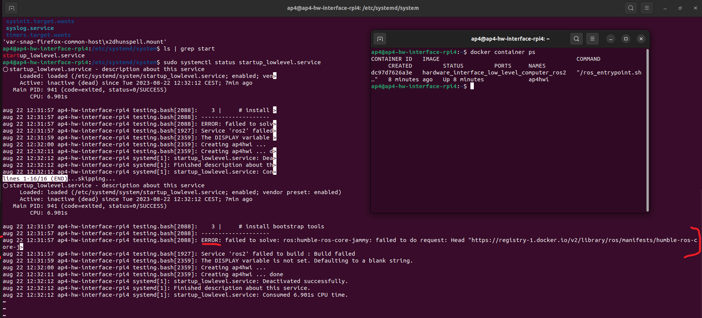
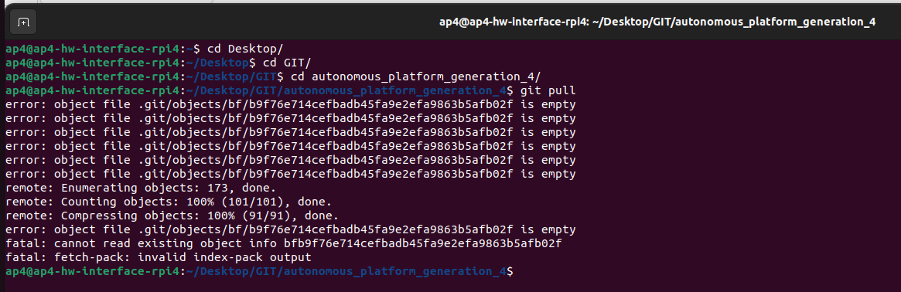

# Testing, Debugging, Known Issues and Future Work

## Test and debugging (System level)

This document collects known problems and issues with the autonomous platform and how to resolve them.

If the existing documentation could not provide a sufficient solution for a problem. Please add your problem and new solution to this document. It will help future members of this project.

### Possible Errors When Starting AP4

Problem: Steering works but not propulsion?

Solution(s): Check that segway is turned on (and charged), check that the the propulsion can be controlled manually by pressing the pedals. The back wheels should spin.

Problem: Segway is beeping? and wheels are turning backwards

Solution: the segway is in reverse mode, quickly press the brake pedals twice. The beeping should stop and segway should move forward when pressing the accelerator pad.

Problem: Segway is beeping and a yellow/orange light flashes on the front console / nose.

Solution: The batteries for the front black box circuits need to be replaced. Open the black compartment on the nose and replace the 6 AA batteries.

Problem: Neither steering or propulsion works.

Solution: Wait for two minutes, The hardware interface software on the raspberry pi could take a while to boot up

Problem: Neither steering or propulsion works after waiting 2 minutes after power ON.

Solution: Connect a screen (portable small screen) and keyboard + mouse to the raspberry pi to verify that it has booted up properly.

Sub-problem: Raspberry Pi could not boot up? Or stuck on boot-up sequence?

Solution: Fix errors using command line, try rebooting system. Follow steps down below to make sure the system is working correctly if the raspberry pi has successfully booted up.

1. Check that the Hardware_Interface docker container is running on the Raspberry Pi
   In a terminal:

```bash
docker container ps
```

Expected output should look something like this, the important thing is that the container is up and running.

```bash
CONTAINER ID   IMAGE COMMAND CREATED STATUS PORTS NAMES

xxxx   hardware_interface_low_level_computer_ros2   xxxx   10 seconds ago   Up 10 seconds             ap4hwi
```

If the container has not started there are two possibilities: 1. The container is still being built (could take a lot of time if new changes have been pulled). 2. The startup service has not been started properly (could have failed due to docker building errors) [systemd service guide](https://www.shubhamdipt.com/blog/how-to-create-a-systemd-service-in-linux/)

The startup service will run the 'testing.bash' script located in `Hardware_Interface_Low_Level_Computer` once called.

In a terminal check that the service has been started

```bash
sudo systemctl status startup_lowlevel.service
```

output:


In the terminal it would explicity say if something has failed and the service did not start properly. Note that it says ERROR in the screenshot above. Something is therefore wrong!

### Docker Container starting/Building

If the docker container is not built properly none of the hardware interface software will start properly.

Check that the router has internet connection

Try rebuilding the docker container:

```bash
cd Desktop
cd GIT
cd autonomous_platform
cd Hardware_Interface_Low_level_Computer
docker-compose build
```

If this fails, there could be something wrong with the dockerfile or docker-compose file.

One possible error is "error creating overlay mount...". See image below.


This could occur because a specific docker layer could not be built. Try pruning the existing docker caches and rebuilding. (This will take some time on Raspberry Pi hardware, enter the commands and grab some coffee!!) Rebuilding a docker container without any saved caches takes about 10 minutes.

```bash
docker system prune
```

```bash
docker-compose build
```

Another error that has previously occurred can be seen in the image below.

 Some files in the repository have been corrupted.

To verify that local files are corrupt in the autonomous_platform repository enter the directory and try pulling changes. In a new console:

```bash
cd Desktop
cd GIT
cd autonomous_platform_generation_4
git pull
```

The output will be something like:



To resolve this issue, delete the corrupted files and pull from gitlab. According to [this](https://stackoverflow.com/questions/4111728/how-do-i-deal-with-corrupted-git-object-files) forum post.

In the repository directory run the following commands:

```bash
find .git/objects/ -size 0 -delete
git pull
```

### Testing and Debugging Components

2. Make sure CAN bus messages are sent and received on linux SocketCAN interface
   On the raspberry Pi desktop. Open a new terminal and dump CAN messages

```bash
candump can0
```

Expected output (or similar). The import thing is that can messages are received.

```bash
  can0  7D0   [8]  00 00 00 00 00 00 00 00
  can0  7D0   [8]  00 00 00 00 00 00 00 00
  can0  7D0   [8]  00 00 00 00 00 00 00 00
  can0  7D0   [8]  00 00 00 00 00 00 00 00
  can0  7D0   [8]  00 00 00 00 00 00 00 00
  can0  7D0   [8]  00 00 00 00 00 00 00 00
  can0  5DC   [8]  00 00 00 00 00 00 00 00
  can0  7D0   [8]  00 00 00 00 00 00 00 00
  can0  7D0   [8]  00 00 00 00 00 00 00 00
  can0  7D0   [8]  00 00 00 00 00 00 00 00
  can0  7D0   [8]  00 00 00 00 00 00 00 00
  can0  7D0   [8]  00 00 00 00 00 00 00 00
  can0  7D0   [8]  00 00 00 00 00 00 00 00
  can0  7D0   [8]  00 00 00 00 00 00 00 00
```

If nothing shows up, it means that there is either something wrong with the CAN bus hardware, or in the low-level software.
If the command could not be run, it means that the startup service did not complete and initialize the right commands. (such as sudo ip link set can0 up type can bitrate 1000000) Try rerunning the startup service script by restarting the service.

```bash
sudo systemctl daemon-reload
```

```bash
sudo systemctl enable startup_lowlevel.service
```

The next step is to enter the low level software and rerunning the same command. The output should be the same as above. If this it works it means that the linuxsocketcan has been passed through properly.

```bash
docker exec -it ap4hwi bash
```

```bash
candump can0
```

3. Check that the ROS2 nodes have been launched correctly

First enter the docker hwi container environment

```bash
docker exec -it ap4hwi bash
```

Secondly, enter the correct directory, source environment variables and set the correct environment variables

```bash
cd ap4hwi_ws
source install/setup.bash
export ROS_DOMAIN_ID=1
```

To check which ROS2 nodes are up and running, enter

```bash
ros2 node list
```

The expected output (as of 22/8-2023):


If the correct ROS2 nodes have not been started, check that the container built successfully. Try rebuilding the container manually. Make sure the Raspberry Pi has internet access.

IF the container has started properly yet no ROS2 node is up, it can mean that the ROS2 software packages could not be built. To check this, try building them manually and running the ROS2 launch file.

Enter the docker container

```bash
docker exec -it ap4hwi bash
```

Navigate into the ROS2 workspace

```bash
cd ap4hwi_ws
```

Source ROS2 environment

```bash
source /opt/ros/humble/setup.bash
```

Build the low level software ROS2 components

```bash
colcon build
```

It will explicitly output in the terminal how many packages succeeded / failed. A C / Python output will be noted in the terminal. If any of packages failed, resolve the issue wich is presented in the terminal.

Source new ROS2 environment

```bash
source install/setup.bash
```

set environment variable

```bash
export ROS_DOMAIN_ID=1
```

Run the ROS2 launch file which starts up the software nodes

```bash
ros2 launch launch_hwi_software_pkg launch_hwi_ros_software.launch.py
```

The output should look something similar to this once the startup script has been run:


Try restarting the container and verify that the corrected nodes has been started successfully as described above.

```
VERY IMPORTANT: MAKE SURE THAT THE hwi_startup.bash script is actually run when the container is spun up. Look into the docker-compose file in `Hardware_Interface_Low_Level_Computer` directory. 


There is a command argument. command: xxxxxx

!!!!!!!!!!!!!!!!!!!!!!
MAKE SURE THAT #command: /bin/bash -c "./hwi_startup.bash" IS UNCOMMENTED
!!!!!!!!!!!!!!!!!!!!!!

Whilst debugging code it can be useful to comment this line out but the software will not start up when the container is started. It will cause a lot of confusion.
```

This is the expected output when the container is manually started:


4. Check communication between low-level-software and SPCU

If the expected ROS2 nodes have been started correctly and the platform still cannot be controlled. Verify that the velocity command from `\cmd_vel` topic is being published on.

```bash
ros2 topic echo /cmd_vel
```

Next, verify that the vehicle controller is outputting desired set voltages for pedals and steering

```bash
ros2 topic echo @TODO ACC + BREAK + STEERING ANGLE
```

Next Verify that the SPCU software and low-level software can communicate. The low-level software can request a ping signal from the ECUs on one topic and receive ping confirmations on another. The ping will be sent over the CAN


## TIPS AND TRICKS

This is a logbook to continuously document what has been done. Could probably be copied
if documentation is needed somewhere.

**21/01-2025**

**Before starting we would advise to copy the SD card for safety in case something goes wrong. This is done by imaging.**

______________________________________________________________________

### Copy SD-card

**If you are on linux follow these steps, otherwise there are options for windows called Win32
Disk Imager and DD for Windows however i don't know how safe these are and they require
admin privileges.**

open terminal and to find SD-card enter the following:\
`sudo fdisk -l`

We saw:\
<span style="font-family: 'Roboto Mono', monospace;"><pre>
Device    Boot Start   End	      Sectors	 Size	 Id	   Type\
/dev/sda1  *   2048    526335     526335	 256M 	 C	   W95  FAT32 (LBA)\
/dev/sda2      526336  249737182  249210847	 118.8G  83	   Linux
</pre></span>

So SD card is /dev/sda (\*1 and \*2 are partitions)

Unmount the device by:\
`sudo umount /dev/sda`

Create an image of the SD-card. OBS make sure you have enough space, it will copy empty space aswell:\
`sudo dd if=/dev/sda of~/sd-card-copy.img bs=1M status=progress`

This takes a while

______________________________________________________________________

### Trouble with internet

Apparently if the router is on, it overwrites the Wifi connection. Either use wifi connection alone or with cable connected to WAN. Otherwise it won't connect to the internet even though you are still able to ping devices on the same WiFi.

______________________________________________________________________

### Access Raspberry Pi via SSH

**This can make it easier to pull from git and access the Raspberry withouth needing to move from and to it**
open a terminal on the Raspberry and install the necessary file by entering:\
`sudo apt install openssh-server`

Check the status by entering:\
`sudo systemctl status ssh`

It should return something like this:

<span style="font-family: 'Roboto Mono', monospace; font-size: 1em;"><pre>ssh.service - OpenBSD Secure Shell server\
Loaded: loaded (/lib/systemd/system/ssh.service; enabled; vendor preset: enabled)\
Active: active (running) since Mon 2020-06-01 12:34:00 CEST; 9h ago
</pre></span>

Dissable the firewall to be able to connect from another computer by entering:\
`sudo ufw allow ssh`

To connect to the Raspberry via another compouter, we first need the raspberry pi's "\<ip_address>" and "\<user>"
To find these write the following:

for  "\<user>", enter:\
`whoami`\
for "\<ip_address>", enter:\
`ifconfig`

You should see many outputs something similar to:

<span style="font-family: 'Roboto Mono', monospace; font-size: 1em;"><pre>
wlan0: flags=4163/\<UP,BROADCAST,RUNNING,MULTICAST/>  mtu 1500\
`inet 192.168.1.150`  netmask 255.255.255.0  broadcast 192.168.1.255\
inet6 fe80::7a8:fdc8:4fdf:d6f2  prefixlen 64  scopeid 0x20/<link/>\
ether dc:a6:32:7c:40:aa  txqueuelen 1000  (Ethernet)\
RX packets 5258  bytes 1564626 (1.5 MB)\
RX errors 0  dropped 5  overruns 0  frame 0\
TX packets 2106  bytes 563087 (563.0 KB)\
TX errors 0  dropped 0 overruns 0  carrier 0  collisions 0\
</pre></span>

You can also check the "\<ip_address>" by checking WiFi-settings->settings
in our case "\<user>"=ap4 and "\<ip_address>"=192.168.1.150 however these may change.

Open a terminal on **the computer you want to access the Raspberry from** and enter:\
`ssh <user>@<ip_address>`

Enter password if necessary, AP42023 in our case.

Now you are in!

______________________________________________________________________

### See ROS2-topics on Raspberry Pi

**To see the ROS2 topics on the raspberry on the Gokart, the below steps are a guide on how to get access to the topics and the workspace from the ROS2 environment.**

First you need the "\<container_name>", find this by opening a terminal on the Raspberry and entering:\
`docker ps`

This should open something similar to:\
<span style="font-family: 'Roboto Mono', monospace; font-size: 1em;"><pre>CONTAINER ID  IMAGE  	    COMMAND 	          CREATED    STATUS    PORTS NAMES\
f0c3b88eb9dc  ros2_image   "/ros_entrypoint.sh"   5 min ago  Up 5 min        ap4hwi</pre>
</span>

Where you find "\<container_name>" under NAMES, in our case it was ap4hwi.

Now enter:\
`docker exec -it <container_name> /bin/bash`

This should open the container as an interactive shell where you can access the ROS2 environment.

To see the topics, enter:\
`ros2 topic list`

This should return all active topics which should look something like the following:

<span style="font-family: 'Roboto Mono', monospace; font-size: 1em;"><pre>/GET_cmd_vel\
/Get_position\
/joystick_cmd_vel\
/etc…
</pre></span>

To see the values or whats happening in a topic enter:\
`ros2 topic echo <topic_name>`

Now you should get some output. I would recommend the topic /joystick_cmd_vel which is quite interactive.

______________________________________________________________________

### Merge your git branch into main branch

**Here is a guide for how you can merge your branch to the main branch on gitlab.**

Open the terminal and locate your local git repo and enter:\
`cd <your_local_repo_directory>`

Check if there are uncommitted changes by entering:\
`git status`

To switch to the main branc,h enter:\
`git checkout main`

To pull the latest changes from remote main, enter:\
`git pull origin main`

Now to merge your branch into main, enter:\
`git merge <your_branch_name> -m "merge message"`

And lastly to push the merged changes to the remote repository, enter:\
`git push origin main`

______________________________________________________________________

### rqt_graph on raspberry

**To get the rqp_graph command display show on the raspberry pi you need to make sure the display settings are the same on both the raspberry and the docker. In the docker-compose.yaml file they are set to the same, however, on startup the raspberry display is set to `<empty string>` which makes it non compatible.**

Open a terminal on the raspberry and enter:\
`export DISPLAY=:0`

Now start the docker, and in the same terminal as before enter:\
`xhost +local:docker`

If the docker now has the same display port you should be good to go. check this by entering:\
`echo $DISPLAY`

If you started the docker after you set the display, this should output:\
<span style="font-family: 'Roboto Mono', monospace; font-size: 1em;"><pre>:0
</pre></span>

Otherwise in the docker terminal enter:\
`export DISPLAY=:0`

Now you can run the command rqt_graph to see how nodes are communicating visually

______________________________________________________________________

### rqt_graph on raspberry

**To get the rqp_graph command display show on the raspberry pi you need to make sure the display settings are the same on both the raspberry and the docker. In the docker-compose.yaml file they are set to the same, however, on startup the raspberry display is set to `<empty string>` which makes it non compatible.**

Open a terminal on the raspberry and enter:\
`export DISPLAY=:0`

Now start the docker, and in the same terminal as before enter:\
`xhost +local:docker`

If the docker now has the same display port you should be good to go. check this by entering:\
`echo $DISPLAY`

If you started the docker after you set the display, this should output:\
<span style="font-family: 'Roboto Mono', monospace; font-size: 1em;"><pre>:0
</pre></span>

Otherwise in the docker terminal enter:\
`export DISPLAY=:0`

Now you can run the comman drqt_graph to see how nodes are communicating visually

______________________________________________________________________

### Work with docker

**Here is a quick guide on how to work with the necesarry docker commands to get started.**\
To work with docker you need to find the dockerfile and/or docker-compose.yaml file you wish to edit. If you want to edit the software which connects the hardware, cd to "\<Hardware_Interface_Low_Level_Computer>". There open a terminal.

Normally the hardware docker should run on startup so if you want to make changes make sure the docker is down. Do this by entering:\
`docker-compose down`

Now do the changes you want to either the docker-compose.yaml or the dockerfile file and run the docker by entering:\
`docker-compose up -d`

The "\<-d>" stands for detached and starts the service in the background so you can still use your terminal, if this is not what yuo want runt the same command without "\<-d>". The docker should now be running.

If there occurs some errors try by solving entering:\
`docker-compose down --volumes --remove-orphans`

and\
`docker-compose build --no-cache`

and then run the docker again.

______________________________________________________________________

### ROS2 node

**To create a ROS2 node some things have to be setup. First you need ROS2 installed, this can be done on windows but it's easier on linux. This guide will focus on working with ROS2 on the Raspberry which already has ROS2 installed.**

The ROS2 environment is set up in the docker so enter the docker first by entering:\
`docker exec -it <container_name> /bin/bash`

CD to your soruce directory which in my case is "\<root@ap4-hw-interface-rpi4:~/ap4_hwi_docker_dir/ap4hwi_ws/src>" and create a package by entering:\
`ros2 pkg create <my_pkg_name> --build-type ament_python --dependencies rclpy`

Now you have to change permissions so others you can push it to hit by entering:\
`chmod 777 <my_pkg_name>`

Now go to the directory the python files are to be created in. This is "\<my_pkg_name>/\<my_pkg_name>" so enter:\
`cd <my_pkg_name>/<my_pkg_name>`

Create a python file by entering:\
`touch <filename.py>`

You also have to make it an executable by entering:\
`chmod +x <filename.py>`

You can check that it has become an executable by entering `ls` and if "\<filename.py>" is highlighted in green, it is done.\
Now you can write your code in the "\<filename.py>" file. When that is done, don't forget to add any imports to the `packages.xml` file and add your entrypoints to the`setup.py` file.

Add packages by adding:\
`<depend>import_to_add</depend>`\
under the "<license>licenses</license>" line.

Add entrypoints by adding:

<pre style="font-family: 'Roboto Mono', monospace; font-size: 1em;">
<code>
entry_points={
    'console_scripts': [
        "example_node1 = my_pkg_name.filename1:main",
        "example_node2 = my_pkg_name.filename2:main"
    ],
}
</code>
</pre>

When this is done you can build your work space by cd to your work space directory and entering:\
`colcon build`

When this is done you need to source your variables by entering:\
`source ~/ap4_hwi_docker_dir/ap4hwi_ws/install/setup.bash`

Thi also depends on your container name and my followed from the docker environmkent mentioned above.

Now you can finally run your ROS2 node by entering:\
`ros2 run <pkg_name> <node_name>`

______________________________________________________________________


## Wiring modifications


Instruction:

The connectors used in this place are JST XH connectors.

They can be found (during the writing of this text) in the lab and crimped with the tool on the picture that also can be found in the lab.


A better result is obtained when the lead pin is put in the smalled slot. THat requires a little bending of the clamps that are meant for the insulation part of the wire.

## Front control module


The Front control module is a control module, mounted on top of the steering column.
Reads status from the brake and accelerator pedal and communicates that to the ninebot engine.
Actuates a head lamp, controlled from the ninebot engine.

IT communicates both wired and wireless with the Ninebot Engine.

THe wired interface contains a wake up signal.
Other communication is wireless.

Ratio:
Unplugging the wired interface does not interfere with operation of the motor. Gas and brakepedal work as usual when disconnected.
Possibly the wire is only used to wake up the front control module.